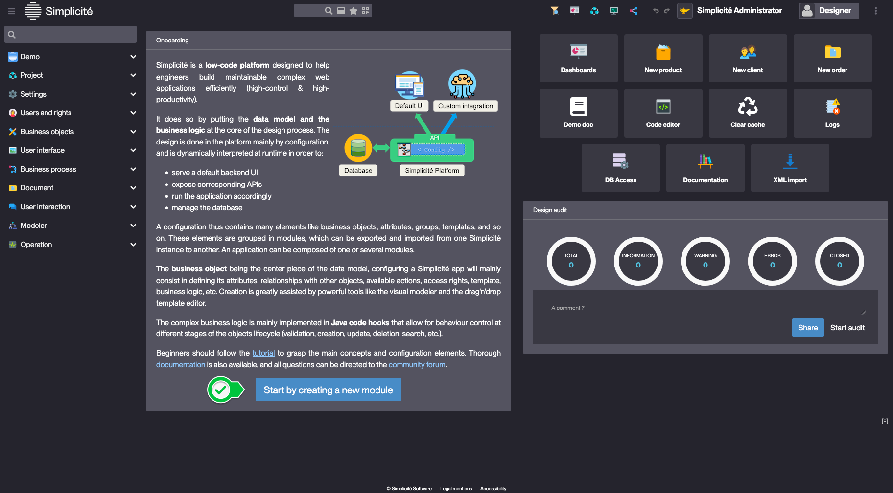

Creating a module
====================

A module in Simplicité is the fundamental unit that encapsulates all configuration objects of an application, serving as its exportable configuration package... [Learn more](/lesson/docs/core/objects/module)

Building the "Order Management" Training App
---------------------------

Start the process from Simplicité's home page :

- Creating the module
    - name: **Training**
    - prefix: **trn** *(the prefix enables automatic syntaxtic conventions to the naming of your objects)*  
- Creating a group of rights
	- name: **TRN_SUPERADMIN** *(if you entered a prefix in the previous step, the platform will suggest a group name that respects the conventions)*  
- Creating a domain (menu)
    - name: **TrnDomain**
- Creating a scope: *the scope allows to set up different user "caps". For instance an administrator will be able to use a "basic user" cap, change scope with the dedicated button and use his "administrator" cap, enabling him to perform all operations.*
    - icon: click the magnifying glass and choose an icon for the scope.
