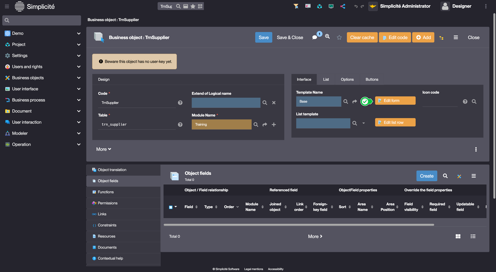

# Building the "Order Management" Training App : Creating a Field

> Prerequisite : [A business object (TrnSupplier) must be created before starting this lesson](/lesson/tutorial/getting-started/object)

## What is a Field ?

In Simplicité, fields are configurable attributes of business objects (mandatory, type, etc.). They have a logical name (used in code) and a physical name (for database columns). When linked to an object, it creates a database column and allows parameter overrides... [Learn more](/lesson/docs/core/attribute)

## Creating a Field

To create a field, follow the steps below :

1. Click **Edit form** on the Business object's form (this will open the **template editor**)
	> The template editor is also available via the Modeler, for more information see the [Accessing the template editor via the Modeler](/lesson/docs/core/objects/business-objects#creation-assistant-via-the-modeler)
    <!---->
2. Select the first **Template**
3. Hover over the empty **Field Area** and click on the `+`
    > For more information about Field Areas, see [Field Area](lesson/docs/core/objects/field-area)

    
    
4. Click **Field**
5. Click **+ Create field**
6. Click **Short text**
7. Fill in the Field fields like so :
    - Label : **Name**
    - Logical name : **trnSupName** *should be auto-completed* 
    - Physical name : **trn_sup_name** *should be auto-completed*
8. Click **Save**

The field **trnSupName** has been added to the object **TrnSupplier** and the template has the **Name** input visible on it.

[The next step to building the "Order Management" Training App is creating a test User](lesson/tutorial/getting-started/user)