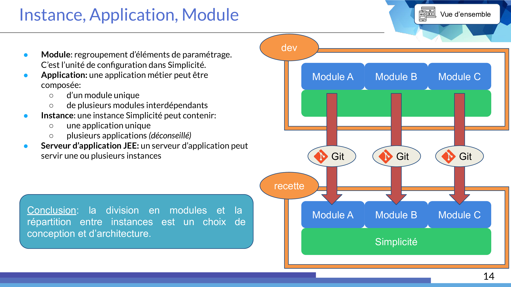

<!-- <h1>Testing githook + sync</h1> -->
Creating a module
====================

Simplicité is configured via **configuration objects** that provide the description of the application. These objects are business objects, fields, templates, actions, etc. **All the configuration objects are part of a module, corresponding to the export unit**. E.g. Developers create their application on a development instance and export their module on a production instance.

Each configuration of an app starts with the creation of a module. To facilitate the first steps, a module creation process is available on the homepage, it allows to create a module, groups, a domain and a scope. 

The set of configuration objects and their relations form the **metamodel**. To obtain a given result, there are several ways to navigate the application, it is the understanding of the metamodel that helps you find your way around the configuration of an application. The purpose of this training is to present and explain this metamodel.

Exercise
---------------------------

Start the process that includes the following steps:

- Creating the module
    - name: **Training**
    - prefix: **trn** *(the prefix enables automatic syntaxtic conventions to the naming of your objects)*  
- Creating a group of rights
	- name: **TRN_SUPERADMIN** *(if you entered a prefix in the previous step, the platform will suggest a group name that respects the conventions)*  
- Creating a domain (menu)
    - name: **TrnDomain**
- Creating a scope: *the scope allows to set up different user "caps". For instance an administrator will be able to use a "basic user" cap, change scope with the dedicated button and use his "administrator" cap, enabling him to perform all operations.*
    - icon: click the magnifying glass and choose an icon for the scope.
