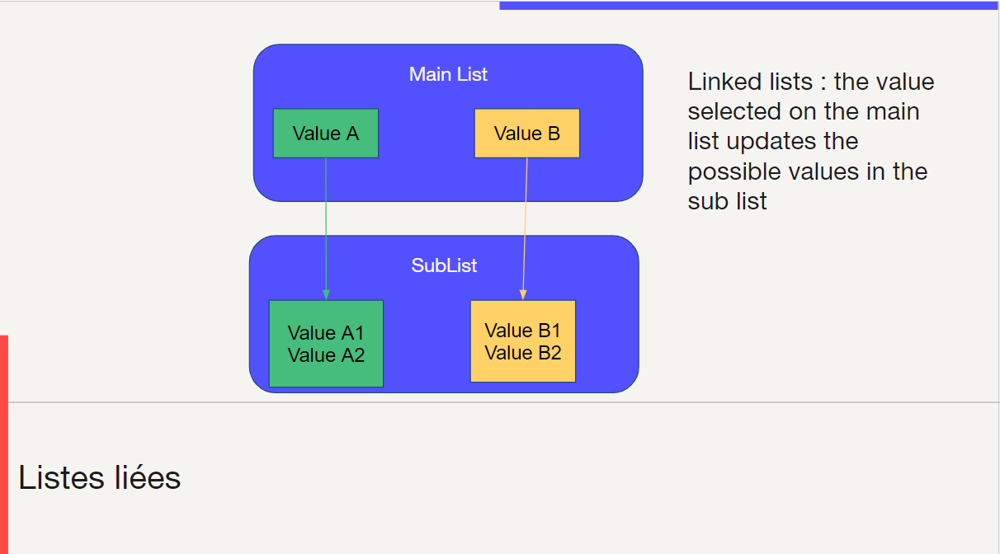

Linked lists
====================

Definition
---------------------------

Linking lists allows to dynamically change the possible values in a list (the **sub list**) according to the selected value of another list (the **main list**).

Configuration
---------------------------

1. create a main list (simple enum field), with the main options (for ex. `A, B`)
2. create a sub list (simple enum fied), with all the possible options (for ex. `A1, A2, B1, B2`)
3. in the "List of Values" menu, and copy the sublist to create as many list as there are main options (for ex. SUBLIST_A, SUBLIST_B), and remove the list codes that are not relevant for this sublist
4. in the "Linked List" menu, create one entry per option, associating each main option to its sub list

Available examples
---------------------------

- Simplicité engine : **Field**
    - Type => Rendering
    - Type => Search enabled
- Demo app : **Contact**
    - Type => Subtype

Exercise
---------------------------

Create a linked list on `TrnOrder` :

- Main List "Shipping type" 
    1. Letter
    2. Package
- Sublist "Shipping subtype"
    1. Green Letter
    2. Letter with AC
    3. Package 24h
    4. Package 1 week
