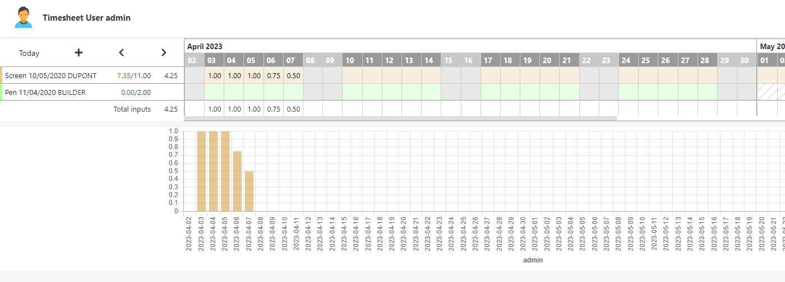

Feuille de temps - Timesheet
====================

Les feuilles de temps ou Timesheet sont paramétrables depuis le Menu **Interface/Feuille de temps** en V5, **Interface utilisateur/Affichage d'objets/Feuille de temps** 
Elles permettent de saisir jusqu'à 3 données  (quantité, nombre de jours ...etc) sur un objet pour une période donnée.  
Le paramétrage se construit sur un objet métier qui est une relation N,N entre 2 objets et qui comporte des dates.
Le cas d'usage adressé est le suivi des affectations de charges, la réservation de ressources...etc.

Le paramétrage consiste à désigner l'objet, saisir les foreign keys des 2 objets puis définir les champs date portant sur la période, et le(s) champ de saisie 1, 2, 3.

Une fois le paramétrage effectué, un bouton **Génerer** permet de créer l'objet qui va stocker les données saisies.

L'objet timesheet généré contient  :
- tsh_month et tsh_year : le mois et l'année
- tsh_total1, tsh_total2... suivant le nombre d'attributs de saisie dans le timesheet  
- tsh_status lorque l'on veut ajouter un diagramme d'état au timesheet  
- tsh_parent_id qui identifie l'objet d'affectation lié au timesheet. Ceci permet de faire une jointure avec les ressources de l'affectation.

La feuille de temps utilise une instance particulière de l'objet.  
Les hooks **initTimesheet**, **pre/postSaveTimesheet** permettent de surcharger le comportement standard du timesheet.  

Les champs de saisie ne serviront que pour la feuille de temps. On peut mettre un attribut numérique n'appartenant pas à l'objet relation N,N.

Exercice
====================
Une fois la commande dans l'état Envoyée, elle est affectée à un utilisateur afin qu'il traite la commande (Préparation du colis à envoyer, recherche du produit, Envoi ...etc). Pour comptabiliser le temps de traitement on laisse l'utilisateur en charge de la commande la possibilité de saisir le temps de traitement sur la commande.
Faire une feuille de temps pour la saisie des temps pendant une période donnée (période accordée d'1 semaine par exemple si il y a une erreur dans le stock et que le produit doit être de nouveau commandé auprès du fournisseur).
- Créer ou utiliser l'objet qui hérite de l'utilisateur système (SimpleUser)
- Créer l'objet `TrnOrderSimpleUser` représentant l'affectation d'un utilisateur à une commande composé de ses attributs propres suivants :
	- Date de début
	- Date de fin
- Créer un attribut de type entier sans l'associer à un objet existant. L'utiliser uniquement comme champ de saisie dans le timesheet.  
- Paramétrer votre feuille de temps `TrnTimeSheetAffect` puis  
- vider le cache pour voir l'icône apparaître sur le formulaire de la commande ou sur le formulaire de l'utilisateur.
