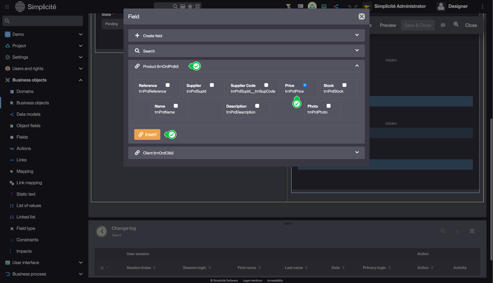
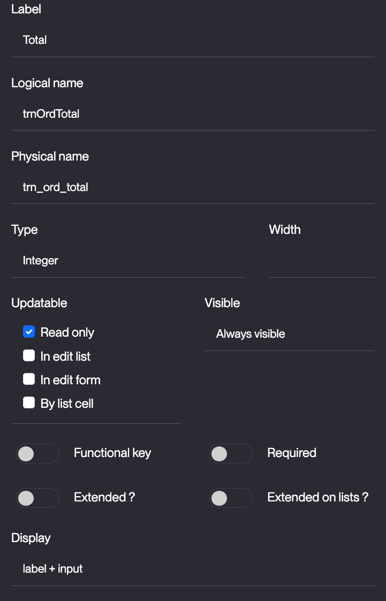
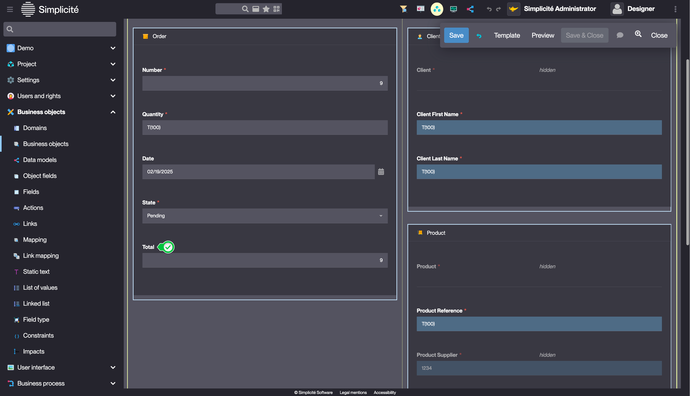
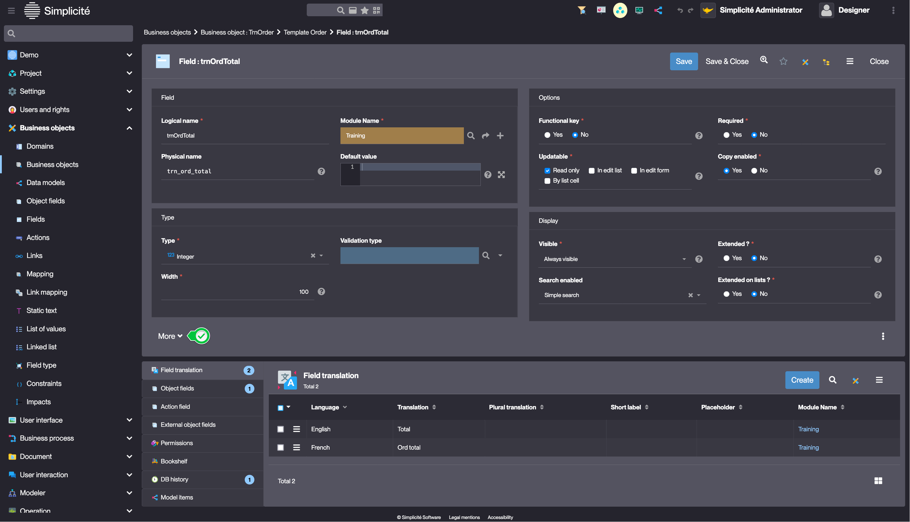
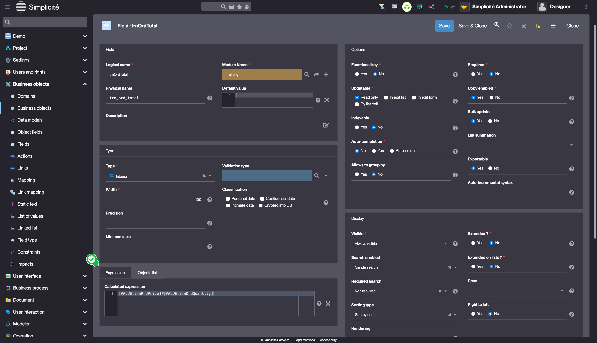
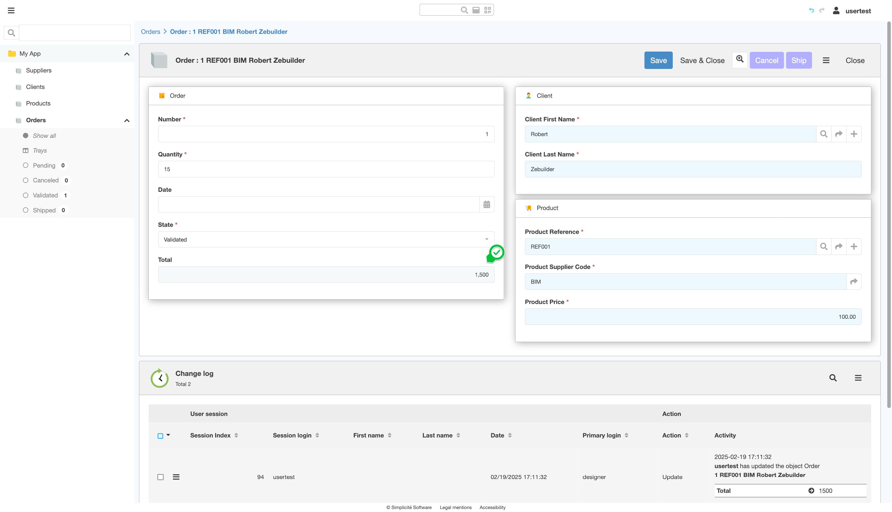

# Building the "Order Management" Training App : Adding a Calculated field

> Prerequisite : [The Supplier, Product, Client and Order objects are linked together](/lesson/tutorial/expanding/relations)

## What is a Calculated field ?

A Calculated field, is a Field for which it's value is automatically calculated by the platform...[Learn more](/lesson/docs/platform/businessobjects/fields#calculated-fields)

## Adding a "Total" Calculated field to the Order Business object

The "Total" Calculated field will display the Order's total : `Product price x Order quantity`

### Add the Product price Field to the Order Business Object 

Start by adding the **Product price** field in the [previsoulsy](/lesson/tutorial/expanding/fieldarea#adding-the-product-fields-to-the-product-field-area) created "Product" Field Area :
1. In the **Business objects > Business objects** menu, open **TrnOrder**
2. Click **Edit form** on the Business object's form 
3. Just like for [adding a new Field](/lesson/tutorial/getting-started/attribute), hover over the "Product" Field Area, and click the `+` button
4. Click **Field**
5. Open the **Product** panel, select **Price** and click **Insert**  
    
    > This view also allows to add multiple fields from other linked objects

### Add the Total Field

1. Add a **integer** field to the **TrnOrder** Business object in the [previsoulsy](/lesson/tutorial/expanding/fieldarea#structuring-the-order-template) created "Order" Field Area
    > For a detailed guide on how to add a field, see [Getting started : Create field](/lesson/tutorial/getting-started/attribute)
2. Fill in the Field information like so : 
    - Label : **Total**
    - Logical name : **trnOrdTotal**
    - Physical name : **trn_ord_total**
    - Updatable : **Read only**  
    
3. Click on the field's label  
    
    > This opens the Field's definition
4. On the Field's form, click **More**  
    
5. In the **Expresison** tab fill in **Calculated expression** so :
    - `[VALUE:trnPrdPrice]*[VALUE:trnOrdQuantity]`  

6. Click **Save**

## Test the Calculated field with the usertest User

To test the Calculated field, follow the steps below :

1. Clear the platform's cache and log in using *usertest*
    > For a detailed step-by-step, see : [Testing the User](/lesson/tutorial/getting-started/user#activating-and-testing-the-user)
2. Open or create an order
3. Change the value in the **Quantity** field
4. Click **Save**

    <b>Expected result :</b>
    
The "Total" field is automatically updated

    

