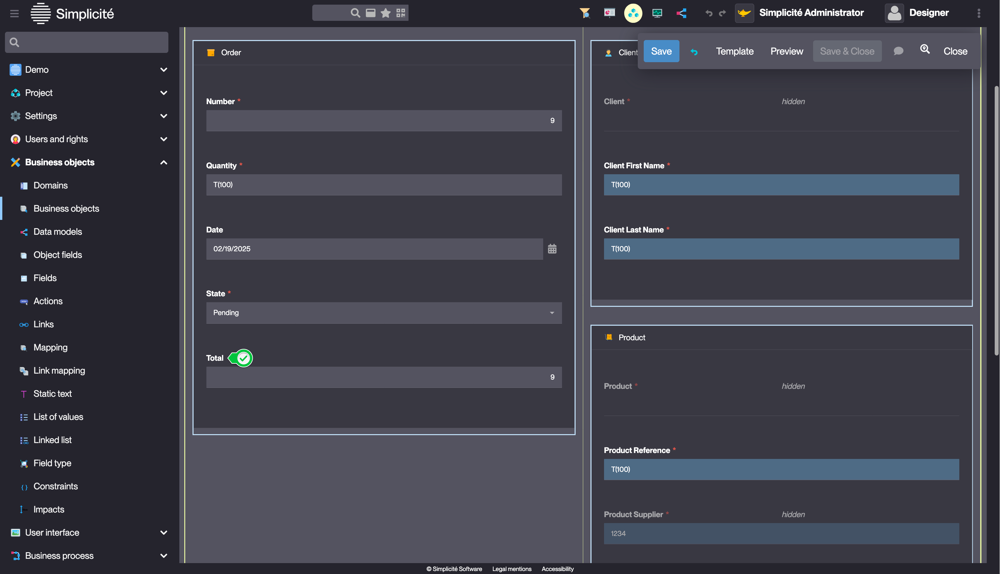
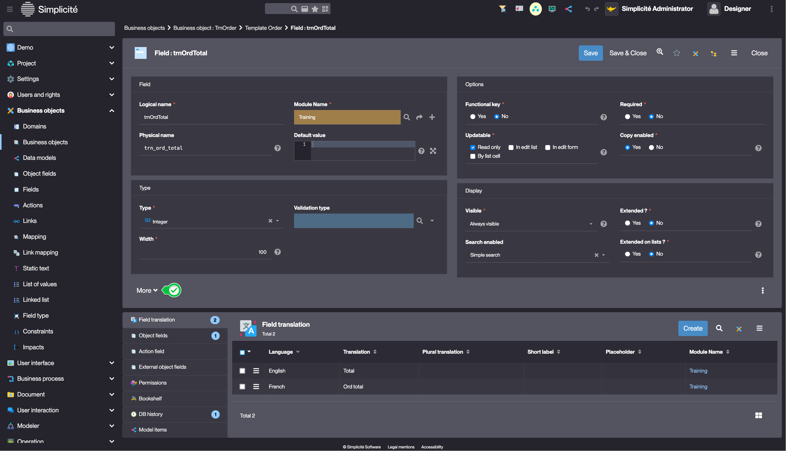
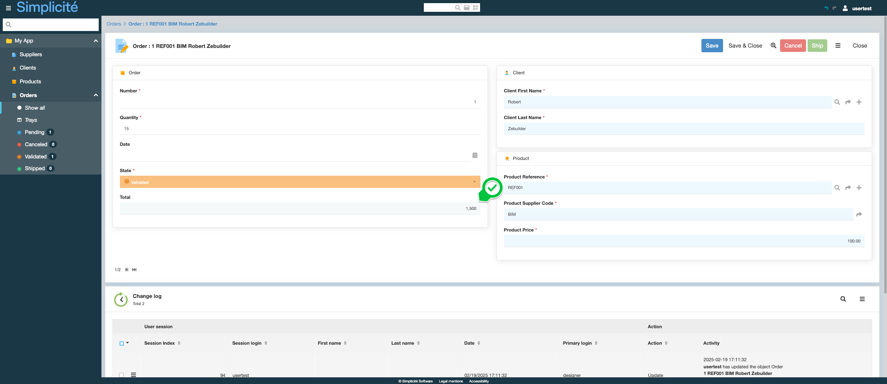

<!--

Introduction
====================

Fields calculated through an expression
====================

The simplest type of customization is the calculated field. This is a field whose value will depend **on other fields in the same business object**. In some cases, it may be useful to join fields from related objects just to be used for calculated fields. For example, in the exercise, we will calculate the total price of the order by multiplying the product's price by the number of items ordered. So the product's price will need to be *part of the order for the value to be available*.

Persistence
---------------------------

A calculated field can be persistent or not, depending on whether the field has a physical name or not. Indeed, if there is no physical name, then there is no associated column in the database, and Simplicité will calculate the value each time it is displayed. If there is a physical name, then Simplicité will store the result of the calculation in the database each time the business object is saved.

The upside of the non-persistent field is that there is no need to worry about keeping it up to date, in our example if the product price is updated, as it is calculated each time it is displayed.

The downside of non-persistent fields is precisely their calculation each display time it is displayed, which can be costly for displaying or exporting a list (especially if it is a complex calculation), but also their unavailability for data aggregation functionalities (sums in a list, group by in a list, cross-tabulations, etc.) because they are done by SQL queries.

Simplicité Expressions
---------------------------

A certain number of configuration fields, such as the *Calculated Expression* field, are **Executed Fields**. Before using them, it is worth understanding how they work.

The contents of these executed fields are executed on the server side using the Rhino library, which is an implementation of JavaScript (ES6) written in Java. Rhino allows scripts to be executed in a Java application without first compiling them. However, since the scripts are executed on the server, they have access to the entire Simplicité Java API.

Prior to execution by Rhino, Simplicité also pre-processes the executed fields to transcribe Simplicité expressions (bracketed syntax) into JavaScript code.

Some expressions are available in all executed fields, others are only available in specific executed fields.

Be careful to differentiate the following elements:
- **exectured field:** field of some configuration objects that results in a Rhino execution and gives access to the whole Simplicité API
- **expression Simplicité:** Simplicité syntax transformed into javascript code to simplify the content of the executed fields
- **expression calculée:** this is an *executed field* of the "Attribute" configuration object that automatically calculates the value of the field

Exercise
====================

- If not already done, add the product price back to the order (*NB: if you forget to add a field back during the relationship creation process, it is always possible to add it back later, by setting the object attribute manually, or simply by using the template editor*)
- Add a `trnOrdTotal` field to the order
- Make it a **persistent** calculated field (*if the product price changes later, we don't want to impact the orders already placed*), read-only, with the following expression:

```
[VALUE:trnPrdPrice]*[VALUE:trnOrdQuantity]
```

- check it works by saving a command (for a persistent calculated field, the calculation is done **when saving**)

-->

# Building the "Order Management" Training App : Adding a Change Log

> Prerequisite : [The Supplier, Product, Client and Order objects are linked together](/lesson/tutorial/expanding/relations)

## What is a Calculated field ?

A Calculated field, is a Field for which it's value is automatically calculated by the platform...[Learn more](/lesson/docs/platform/business-objects/fields#calculated-fields)

## Adding a "Total" Calculated field to the Order Business object

The "Total" Calculated field will display the Order's total : `Product price x Order quantity`

### Add the Product price Field to the Order Business Object 

Start by adding the **Product price** field in the [previsoulsy](/lesson/tutorial/expanding/field-area) created "Product" Field Area :
1. In the **Business objects > Business objects** menu, open **TrnOrder**
2. Click **Edit form** on the Business object's form 
3. Just like for [adding a new Field](/lesson/tutorial/getting-started/attribute), hover over the "Product" Field Area, and click the `+` button
4. Click **Field**
5. Open the **Product** panel, select **Price** and click **Insert**  
    
    > This view also allows to add multiple fields from other linked objects

### Add the Total Field

1. Add a **integer** field to the **TrnOrder** Business object in the [previsoulsy](/lesson/tutorial/expanding/field-area) created "Order" Field Area
    > For a detailed guide on how to add a field, see [Getting started : Create field](/lesson/tutorial/getting-started/attribute)
2. Fill in the Field information like so : 
    - Label : **Total**
    - Logical name : **trnOrdTotal**
    - Physical name : **trn_ord_total**
    - Updatable : **Read only**  
    
3. Click on the field's label  
    
    > This opens the Field's definition
4. On the Field's form, click **More**  
    
5. In the **Expresison** tab fill in **Calculated expression** so :
    - `[VALUE:trnPrdPrice]*[VALUE:trnOrdQuantity]`  

6. Click **Save**

## Test the Calculated field with the usertest User

To test the Calculated field, follow the steps below :

1. Clear the platform's cache and log in using *usertest*
    > For a detailed step-by-step, see : [Testing the User](/lesson/tutorial/getting-started/user#activating-and-testing-the-user)
2. Open or create an order
3. Change the value in the **Quantity** field
4. Click **Save**

<div class="success">
    <b>Expected result :</b>
    <p>The "Total" field is automatically updated</p>
    
</div>