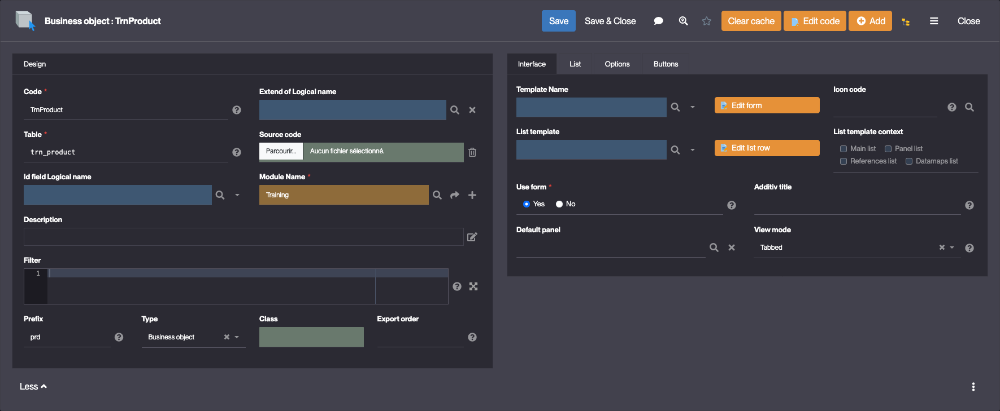
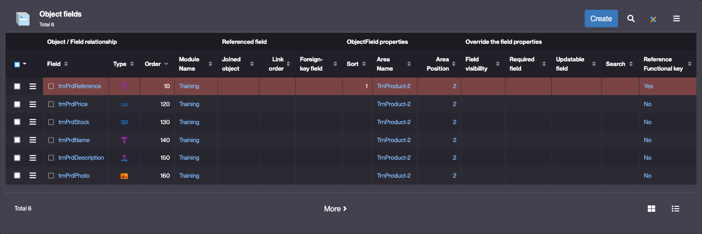
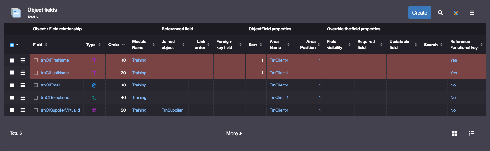
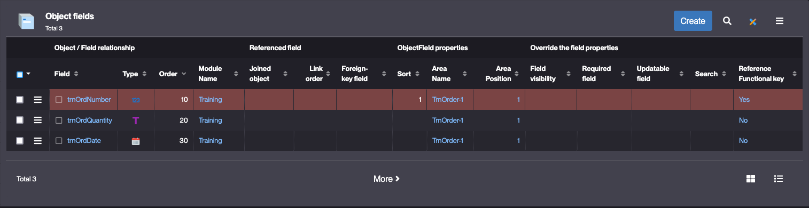
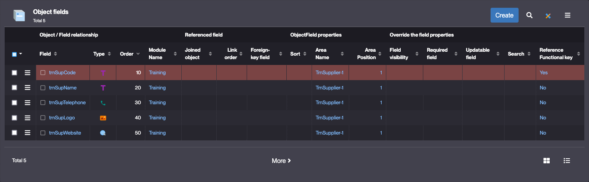

# Building the "Order Management" Training App : Adding objects

> Prerequisite : All of the steps in **Getting started** are completed

## Create the Product Business object

### Product definition
Follow the steps in [Getting started : Create object](/lesson/tutorial/getting-started/object) to create the Product Business object with the following properties :
- Code : **TrnProduct**
- Table : **trn_product**
- Module : **Training**
- Prefix : **prd**

### Product fields 
Follow the steps in [Getting started : Create field](/lesson/tutorial/getting-started/attribute) to add the following fields to the Product Business object : 

| Label | Type | Logical name | Physical name | Functional Key | Required |
| ----- | ---- | ------------ | ------------- | -------------- | -------- |
| **Reference** | Short text | trnPrdReference | trn_prd_reference | yes | yes |
| **Price** | Decimal (double) | trnPrdPrice | trn_prd_price | no | yes |
| **Stock** | Integer | trnPrdStock | trn_prd_stock | no | yes |
| **Name** | Short text | trnPrdName | trn_prd_name | no | no |
| **Description** | Long text | trnPrdDescription | trn_prd_description | no | no |
| **Photo** | Image | trnPrdPhoto | trn_prd_photo | no | no |

> The object's functional key is highlighted in red

## Create the Client Business object

### Client definition
Follow the steps in [Getting started : Create object](/lesson/tutorial/getting-started/object) to create the Client Business object with the following properties :
- Code : **TrnClient**
- Table : **trn_client**
- Module : **Training**
- Prefix : **cli**

### Client fields 
Follow the steps in [Getting started : Create field](/lesson/tutorial/getting-started/attribute) to add the following fields to the Client Business object : 

| Label | Type | Logical name | Physical name | Functional Key | Required |
| ----- | ---- | ------------ | ------------- | -------------- | -------- |
| **First Name** | Short text | trnCliFirstName | trn_cli_first_name | yes | yes |
| **Last Name** | Short text | trnCliLastName | trn_cli_last_name | yes | yes |
| **Email** | Email | trnCliEmail | trn_cli_email | no | no |
| **Telephone** | Phone number | trnCliTelephone | trn_cli_telephone | no | no |
| **Address** | Long text | trnCliAddress | trn_cli_address | no | no |

## Create the Order Business object

### Order definition
Follow the steps in [Getting started : Create object](/lesson/tutorial/getting-started/object) to create the Order Business object with the following properties :
- Code : **TrnOrder**
- Table : **trn_order**
- Module : **Training**
- Prefix : **ord**

### Order fields 
Follow the steps in [Getting started : Create field](/lesson/tutorial/getting-started/attribute) to add the following fields to the Order Business object : 

| Label | Type | Logical name | Physical name | Functional Key | Required |
| ----- | ---- | ------------ | ------------- | -------------- | -------- |
| **Number** | Integer | trnOrdNumber | trn_ord_number | yes | yes |
| **Quantity** | Short text | trnOrdQuantity | trn_ord_quantity | no | yes |
| **Date** | Date | trnOrdDate | trn_ord_date | no | no |

## Complete the Supplier Business object

### Supplier fields
Follow the steps in [Getting started : Create field](/lesson/tutorial/getting-started/attribute) to add the following fields to the Supplier Business object : 

| Label | Type | Logical name | Physical name | Functional Key | Required |
| ----- | ---- | ------------ | ------------- | -------------- | -------- |
| **Name** | Short text | trnSupName | trn_sup_name | no | no |
| **Telephone** | Phone number | trnSupTelephone | trn_sup_telephone | no | no |
| **Logo** | Image | trnSupLogo | trn_sup_logo | no | no |
| **Website** | URL | trnSupWebsite | trn_sup_website | no | no |

