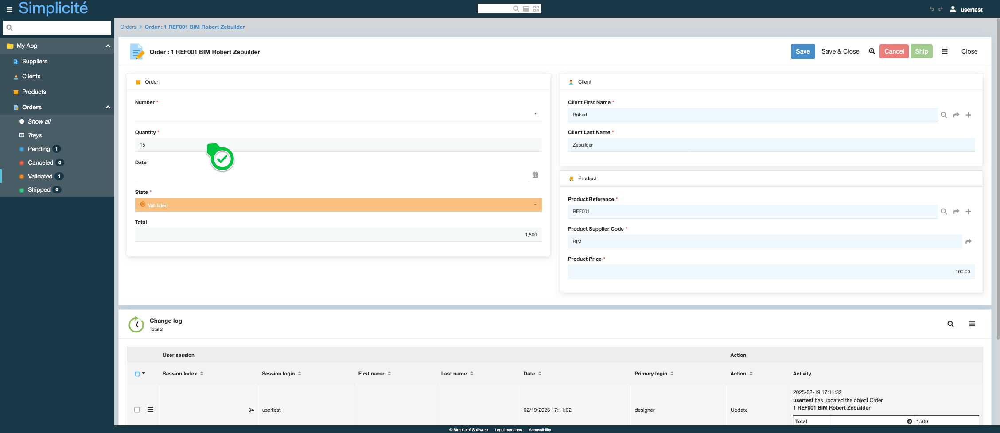

# Building the "Order Management" Training App : Configuring business rules - Constraints

> Prerequisite : [The Order object has a state model](/lesson/tutorial/expanding/states)

## What is a Constraint ?

In Simplicité, constraints allow to enforce business rules by dynamically controlling object properties, visibility, and behavior, while ensuring secure backend validation... [Learn more](/lesson/docs/platform/business-objects/constraints)

## Adding a Constraint to the Order Business Object

Create a Constraint to implement the following business rule : 
*The order quantity can only be updated on a rew record and at the "Pending" state*

To do so, follow the steps below : 
1. In the **Business objects > Business objects** menu, open **TrnOrder**
2. In the **Constraints** panel linked to the Business object, click **Create**  
    
3. Fill in the Constraint information like so :
    - Name : **TrnOrderConstraint-1**
    - Description : "The order quantity can only be updated on a rew record and at the "Pending" state" (click the *edit* button to change the description)
    - Order : **10**
    - Effects **Front-end | Back-end**
    - Type : **Expression**
    - Expression : **true**  
    
4. Click **Save**
5. In the **Impacts** panel, click **Create**  
    
6. Fill in the Impact information like so : 
    - Order : **10**
    - Apply to : **Field property**
    - Object / Field : **trnOrdQuantity** (use the *magnifying glass** button to select the field)
    - Field property : **Updatable**
    - Expression : `[ISNEW] || [STATUS].equals("P")`
    > `[ISNEW]` returns `true` if the record is in a Creation context  
    > `[STATUS]` return the value of the `trnOrdState` field  

    

7. Click **Save & Close** 

## Test the Constraint with the usertest User

Clear the platform's cache and log in using *usertest*
> For a detailed step-by-step, see : [Testing the User](/lesson/tutorial/getting-started/user#activating-and-testing-the-user)

    
For a new Order, the <b>Quantity</b> field is updatable

    
    
For a Validated Order, the <b>Quantity</b> field is read-only

    

