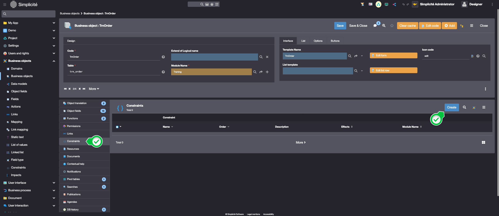
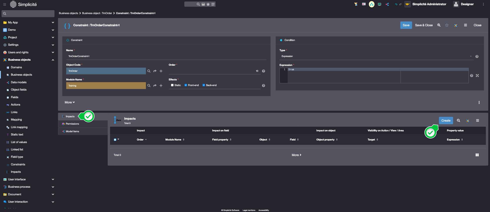
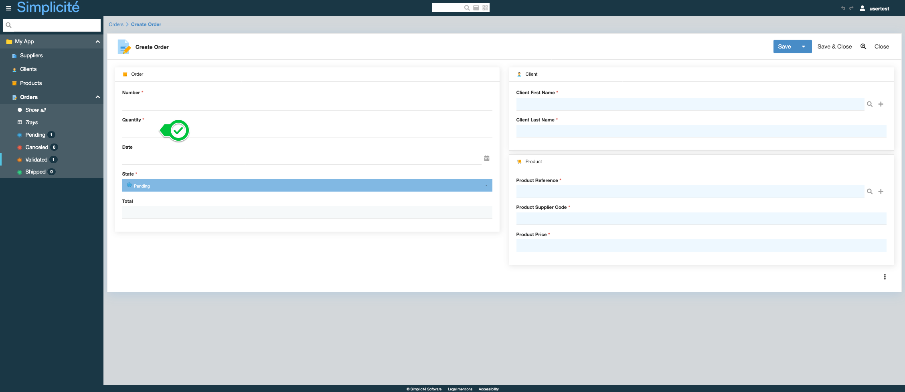

<!--Business rules via constraints
====================

**Constraints** are configuration elements that apply to a business object and allow the execution of business rules of limited complexity. They can be expressed schematically in pseudo-code as `If execution conditions are met THEN execute the impacts`.

Configuration
---------------------------

The conditions of execution can be of several types:
- **field:** a field of the business object __of boolean type__ must be true
- **expression:** an executed field "expression" of the constraint must return "true"
- **méthode:** a method in the business object script must return "true" (object scripts are covered in the next lesson)

In addition to the execution condition, a constraint can also be granted to be executed only for certain user groups.

The impacts override the properties:
- of the object (copy, create, modify, etc.),
- of an attribute of the object ( editable, visible, mandatory, etc.),
- visibility of certain elements of the object (field area, view, action)

The value of the property affected by the impact will be the result of the "Expression" executed field. Generally, it will return a boolean (for visible, copyable, modifiable, etc. properties), but it can also be a value (for the default value of the attribute for example).


The order of the constraints and impacts is important: being executed in the configured order, one impact may overwrite another.

How it works : Back vs Front
---------------------------

Constraints, impacts and their executed fields are transformed into JavaScript code that will be executed:
- on the server in the case of a **back-end constraint**, by the Rhino runtime engine, just like the calculated fields
- on the browser in the case of a **front-end constraint**, by the user's browser JavaScript engine

A front-end constraint is **dynamic**, i.e. the user sees the impact on the form directly (a field that disappears/appears for example). However, it will only run **only** on the browser, it's all about user experience. For example, if you make a field mandatory via a front-end only constraint, a user could bypass the constraint by using the API layer or by disabling the constraint via the browser console.

A back-end constraint is a genuine business rule, it is executed on the server during the preparation of the form, but also during the validation of the data sent by the user. The user will have no way of bypassing the rule. A back-end constraint, however, is not dynamic.

That being said, the great advantage of constraints over business rules via code is that you can make them **both front and back**, to ensure secure business rules AND a dynamic user interface, without having to code these rules on both front and back-end scripts.

Exercise
====================

Implement the following business rule: *The order quantity can only be changed if it is a new order or an open order*.


- add a new `TrnOrdConstraint-1` constraint on the order object
- this will be an non-granted back-end constraint, of type "Expression" with an expression value of `true`, so that it will always be executed for everyone (no execution condition)
- impact the `editable` property of the `trnOrdQuantity` attribute with the following expression:

```
[ISNEW] || [STATUS].equals("PROCESSING")
```

- clear the cache (or simply the business object's cache), and check the impact on the orders
-->

# Building the "Order Management" Training App : Configuring business rules - Constraints

> Prerequisite : [The Order object has a state model](/lesson/tutorial/expanding/states)

## What is a Constraint ?

In Simplicité, constraints allow to enforce business rules by dynamically controlling object properties, visibility, and behavior, while ensuring secure backend validation... [Learn more](/lesson/docs/platform/business-objects/constraints)

## Adding a Constraint to the Order Business Object

Create a Constraint to implement the following business rule : 
*The order quantity can only be updated on a rew record and at the "Pending" state*

To do so, follow the steps below : 
1. In the **Business objects > Business objects** menu, open **TrnOrder**
2. In the **Constraints** panel linked to the Business object, click **Create**  
    
3. Fill in the Constraint information like so :
    - Name : **TrnOrderConstraint-1**
    - Description : "The order quantity can only be updated on a rew record and at the "Pending" state" (click the *edit* button to change the description)
    - Order : **10**
    - Effects **Front-end | Back-end**
    - Type : **Expression**
    - Expression : **true**  
    
4. Click **Save**
5. In the **Impacts** panel, click **Create**  
    
6. Fill in the Impact information like so : 
    - Order : **10**
    - Apply to : **Field property**
    - Object / Field : **trnOrdQuantity** (use the *magnifying glass** button to select the field)
    - Field property : **Updatable**
    - Expression : `[ISNEW] || [STATUS].equals("P")`
    > `[ISNEW]` returns `true` if the record is in a Creation context  
    > `[STATUS]` return the value of the `trnOrdState` field  

    

7. Click **Save & Close** 

## Test the Constraint with the usertest User

Clear the platform's cache and log in using *usertest*
> For a detailed step-by-step, see : [Testing the User](/lesson/tutorial/getting-started/user#activating-and-testing-the-user)

<div class="success">
    <p>For a new Order, the <b>Quantity</b> field is updatable</p>
    
    <p>For a Validated Order, the <b>Quantity</b> field is read-only</p>
    
</div>
