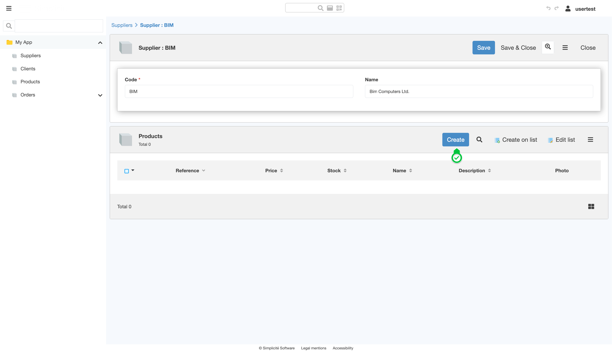
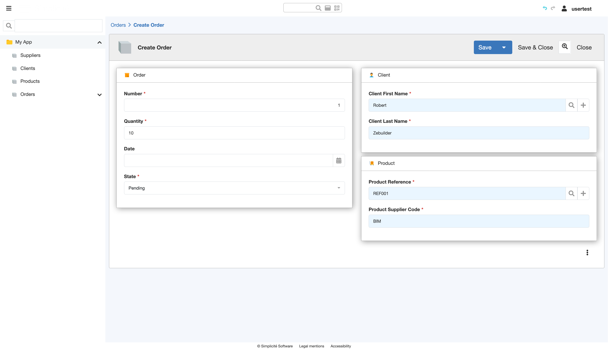

# Building the "Order Management" Training App : Creating links

> Prerequisite : [The Supplier, Product, Client and Order objects must be complete before starting this tutorial](/lesson/tutorial/expanding/addobjects)

## What is a Link ?

A Link in Simplicité represents a relationship between Business objects. It is defined physically by a foreign key in the database and configured using an Object field... [Learn more](/lesson/docs/platform/business-objects/links)

## Creating a Link between Supplier and Product

To create a link between the **Supplier** Business object and the **Product** Business object, follow the steps below :
1. In the **Business objects > Business objects** menu
2. Open **TrnProduct**
3. Click **Edit form** on the Business object's form (this will open the **template editor**)  
    
4. Hover over the **Field Area** and click on the `+`  
    
    > For more information about Field Areas, see [Field Area](lesson/docs/core/objects/field-area)  
5. Click **Business Object**
6. In the search box, enter **TrnSupplier**  
    
7. Check **Functional key ?** and **Required ?** 
    > For more information about Functional keys, see [Functional key](lesson/docs/core/platform/business-objects/fields#functional-key)
8. Click **Save**

The **Supplier Code** Joined field is added to the template.
    > For more information about Joined field, see [Joined field](lesson/docs/core/platform/business-objects/fields#joined-field)

## Creating a Link between Product and Order

To create a link between the **Product** Business object and the **Order** Business object, follow the steps below :
1. In the **Business objects > Business objects** menu
2. Open **TrnOrder**
3. Click **Edit form** on the Business object's form (this will open the **template editor**)
4. Hover over the **Field Area** and click on the `+`
5. Click **Business Object**
6. In the search box, enter **TrnProduct**
7. Check **Functional key ?** and **Required ?**  
     

8. Click **Save**

This will add the **TrnProduct** joined fields to the template, allowing the Order object to reference a product.

## Creating a link between Client and Order

To create a link between the **Client** and **Order** business objects, follow the same steps as for linking **Product** to **Order**, with one key difference:

6. In the search box, enter **TrnClient** instead of TrnProduct.  
     

This will add the **TrnClient** joined fields to the template, allowing the Order object to reference client information.

## Adding data to the Application

### Log in using usertest
Clear the platform's cache and log in using *usertest*
    > For a detailed step-by-step see : [Testing the User](/lesson/tutorial/getting-started/user#activating-and-testing-the-user)

    <b>Expected result :</b>
    <ul>
        <li>The Suppliers, Clients, Products, Orders are visible</li>
        <li>For each object, the Create button is displayed</li>
    </ul>
    

### Create a Supplier

1. Click the **Suppliers** menu
2. Click **Create**
3. Fill in the Supplier information like so :
    - Code : **BIM**
    - Name : **Bim Computers Ltd.**  
    
4. Click **Save**

### Create a Product

1. On the **BIM** Supplier's form, click **Create** on the linked Products list  
    
2. Fill in the Product information like so : 
    - Reference : **REF001**
    - Price : **100**
    - Stock : **100**   
    
3. Click **Save**

### Create a Client

1. Click the **Clients** menu
2. Click **Create**
3. Fill in the Client information like so :
    - First Name : **Robert**
    - Last Name : **Zebuilder**  
    
4. Click **Save**

### Create an Order

1. Click the **Orders** menu
2. Click **Create**
3. Fill in the Order information like so : 
    - Number : **1**
    - Quantity : **10**
    - Client First Name :
        - Click the *Loupe* icon  
            
        - Select a Client  
             
    - Product Reference :
        - Click the *magnifying glass* icon  
        - Select a Product
4. Click **Save**  
