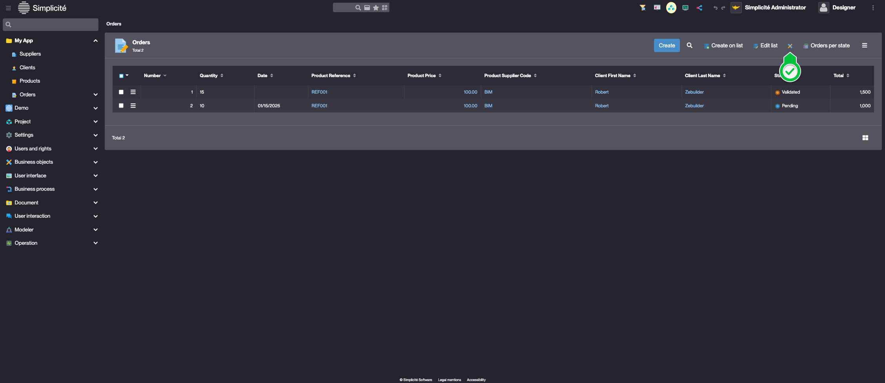

<!--Object Hooks
====================

<div class="warning">In this lesson, it is necessary to understand the basic concepts of Java: object-oriented programming, inheritance, overriding, etc.</div>

When an object is configured, it has a default behaviour based on the different elements and properties configured.

For example, if an attribute is mandatory:
- when preparing the form, it will be taken into account by the platform to transmit the information to the front-end
- when saving the object, a validation step checks the presence of a value for this attribute, returns an error and cancels the saving if there is none

It is conceivable that a webservice call is needed to find out whether the attribute is mandatory, in which case a constraint is no longer really appropriate as the code becomes too complex for an executed field.

It is for these cases that it is possible to extend the default behaviour of business objects. The default behaviour is coded in a Simplicité Java class called `ObjectDB`. All business objects inherit from this class, which provides a number of hooks that are executed at different points in the business object's lifecycle. By inheriting from this class and overriding the hooks, it becomes possible to modify the behaviour of the business object. The exhaustive list of hooks can be found in the [JavaDoc](https://platform.simplicite.io/current/javadoc/), and here we present only the more common ones. *The possibilities are endless, and a thorough understanding of the hooks and the Java Simplicité API is an important part of success*.

Object scripts can be written in Java or JavaScript (which will be executed by Rhino, just like the executed fields), but **good practice is to use Java scripts** which include a compilation step and ensure that the syntax of the script is correct. *In advanced use cases that are not part of this tutorial, the use of Java gives access to all of the classic application development tools: step-by-step debugging, unit tests, development in a Java IDE, code quality analysis with Sonar etc.*.

Exercise
====================

Implement the following business rules

### The order quantity cannot be less than 0

To do so :
- create a Java script for the order
- add a `postValidate` hook (after the default validations, to add an additional validation), which returns an error if the quantity is negative
    - we use `getInt(0)` instead of `getValue()` to obtain an `int` with a default value equal to 0 instead of a `String` or an `Integer`, cf the JavaDoc de ObjectDB.getField(), ObjectField.getValue() and ObjectField.getInt()
    - we use Message.formatError() to provide Simplicité with an error message that will be interpreted to froward an error to the interface
    - the **Simplicité snippets**, available in the editor via the shortcut <kbd>Ctrl</kbd>+<kbd>Space</kbd>, provide ready to use templates

```
@Override
public List<String> postValidate() {
	List<String> msgs = new ArrayList<String>();
	if (getField("appOrdQuantity").getInt(0) <= 0){
		msgs.add(Message.formatError("APP_ERR_QUANTITY", null, "appOrdQuantity"));
	}
	return msgs;
}
```

- clear the cache (necessary after **creation** of a script, but not during subsequent modifications of the script), and check the implementation of the business rule

### The order quantity cannot exceed the stock of the product

Independently, code this second business rule. This time, it will not be necessary to clear the cache (modification of an existing script).

### Le code d'un fournisseur doit commencer par le trigramme "SUP"

Independently, code this third business rule. This time, it will not be necessary to clear the cache (modification of an existing script).

-->

# Building the "Order Management" Training App : Coding business rules - Hooks

> Prerequisite : [The Order object has a state model](/lesson/tutorial/expanding/states) and [Product object has an Action](/lesson/tutorial/expanding/actions)

## What is a Hook ?

In Simplicité, Hooks allow you to extend the default behavior of business objects by overriding key lifecycle methods in Java or JavaScript, enabling advanced custom logic and processing... [Learn more]()

## Adding business rules to the Order Business object 

### The order quantity cannot be less than 0

To add this business rule, override the `postValidate` hook by following the steps below :
1. Open the **TrnOrder** Object :
	- Via the list of Orders, click on the *Go to object definition* button  
		
	> This is available if your designer user is granted to TRN_SUPERADMIN
	- Via the **Business objects > Business objects** menu
2. Click **Edit code**, select **Java** and click **Confirm**  
		
3. Override the `postValidate` method with the following implementation :
	> The `postValidate` hook is called after the platform's `validate()` and is used to to add validation rules. For more information, see [Hooks]()
	```java 
	@Override
	public List<String> postValidate() {
		List<String> msgs = new ArrayList<String>();
		if (getField("trnOrdQuantity").getInt(0) <= 0){
			// Add an error message
			msgs.add(Message.formatError("Invalid quantity", null, "trnOrdQuantity"));
		}
		return msgs;
	}
	```
4. Click **Save** or use the keyboard shortcut : <kbd>Ctrl</kbd>+<kbd>S</kbd>

### The order quantity cannot exceed the product's amount of stock  

To add this business rule, update the `postValidate` hook by following the steps below :

1. Add the Product's **Stock** field to the Order object
	> For a detailed guide, see : [Adding a joined field](/lesson/tutorial/getting-started/calculated-fields#add-the-product-price-field-to-the-oder-business-object)
2. Click **Edit code** on the **TrnOrder** object's form
3. Update the `postValidate()` implementation :
```java
@Override
public List<String> postValidate() {
	List<String> msgs = new ArrayList<String>();
	if (getField("trnOrdQuantity").getInt(0) <= 0){
		// Add an error message
		msgs.add(Message.formatError("Invalid quantity", null, "trnOrdQuantity"));
	}
	// Check : quantity > stock
	if (getField("trnOrdQuantity").getInt(0) > getField("trnPrdStock").getInt(0)) {
		msgs.add(Message.formatError("Insufficent stock", null, "trnOrdQuantity"));
	}
	return msgs;
}
```

### Implement back-end code for the Product's "Increase Stock" action

To implement back-end code for the Increase stock action, follow the steps below : 
1. In the **Business objects > Actions** menu, open **Increase Stock**  
	 
2. Update the Action's information like so : 
	- Execution : **Back**
	- Method : **increaseStock**  
	 
3. Click **Save & Close**
4. In the **Business objects > Business objects** menu, open **TrnProduct**
5. Click **Edit code**, select **Java** and click **Confirm**  
6. Declare the `increaseStock` method in the `TrnProduct` class  
```java
public void increaseStock(){
	ObjectField prdStock = this.getField("trnPrdStock");
	prdStock.setValue(prdStock.getInt(0)+10);
	save();
}
```
7. Click **Save** or use the keyboard shortcut : <kbd>Ctrl</kbd>+<kbd>S</kbd>

### Decrease the Product's stock when an Order is validated

To add this business rule, override the `postUpdate` hook by following the steps below :
1. Open the **Code editor** :
	- Via the shortcut :  
		 
	- Via the keyboard shortcut : <kbd>Alt</kbd>+<kbd>X</kbd>
2. Open the **TrnOrder** Class    
	   
3. Override the `postUpdate` hook :
	> Use <kbd>Ctrl</kbd>+<kbd>Space</kbd> to browse code snippets
```java
@Override
public String postUpdate() {
	Grant g = getGrant();
	// Get the TrnProduct's temporary instance
	ObjectDB prd = g.getTmpObject("TrnProduct");
	// Pending -> Validated state transition
	if ("P".equals(getOldStatus()) && "V".equals(getStatus())){
		try {	        
			synchronized(prd.getLock()){
				// select = load into the instance the values in the database corresponding to a technical key (id)
				prd.select(getFieldValue("trnOrdPrdId"));
				// read the quantity ordered on the current instance and the stock of the product on the loaded instance
				int orderedQuantity = getField("trnOrdQuantity").getInt(0);
				int stock = prd.getField("trnPrdStock").getInt(0);
				// change the stock quantity of the loaded instance
				prd.getField("trnPrdStock").setValue(stock-orderedQuantity);
				// write the instances data into the database
				prd.getTool().validateAndSave();
			}
		} catch (ValidateException | SaveException e) {
			AppLog.error(e, g);
		}
	}
	return super.postUpdate();
}
```
## Test the Business rules with the usertest User

Clear the platform's cache and log in using *usertest*
> For a detailed step-by-step, see : [Testing the User](/lesson/tutorial/getting-started/user#activating-and-testing-the-user)

<div class="success">
	<ul>
		<li>	
			<p>When creating an Order with a negative quantity, an error occurs</p>
			
		</li>
		<li>	
			<p>When creating an Order with a quantity exceeding the product's amount of stock, an error occurs</p>
			
		</li>
		<li>
			<p>When clicking on "Increase stock" on a Product, upon confirmation, it's stock is incremented by 10<p>
		</li>
		<li>
			<p>When an Order is Validated the quantity is deducted from the Product's stock<p>
		</li>
	</ul>
</div>
