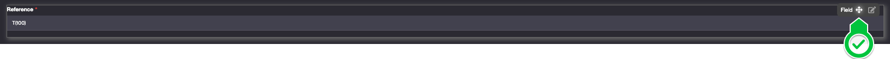

<!--Field areas
====================

Field Areas are used to group fields, both in forms and in lists. 

Often, all the joined fields from a referenced object are grouped together in the same field area. For this case, it is possible to assign the icon of the referenced object as a field area icon using the following syntax: `[EXPR:[OBJECTICON:TrnClient]]`

In list view, the field area appears in the list header above the fields it encloses. Fields are ordered by:
1- the order of the field area (if it exists)
2- the order of the object field

Exercise : improving the order's template
---------------------------

When creating the links, you added some of the customer's and product's fields to the order. Group these fields in the order’s form in dedicated field areas.
-->
# Building the "Order Management" Training App : Structuring Forms and Lists - Field Areas

> Prerequisite : [The Supplier, Product, Client and Order objects are linked together](/lesson/tutorial/expanding/relations)

## What is a Field Area ?

A Field Area groups related fields in forms and lists for better organization... [Learn more](/lesson/docs/platform/user-interface/templating/fields-areas)

## Customizing the Order Business object form

### Creating a Field Area
To create a Field Area on the **Order** Business object, follow the steps below :

1. In the **Business objects > Business objects** menu, open **TrnOrder**
2. Click **Edit form** on the Business object's form (this will open the **template editor**)  
    
4. Hover over the template and click on the `+`  
    
5. Click **Fields Area**

A **Field Area** is added to the object's template

### Adding fields to the Field Area

To add existing fields to the **Field Area**, follow the steps below :

1. Hover over an existing **Field**
2. Click and hold the *move* icon   
    
3. Drag & Drop the **Field** into the target **Field Area**

The moved **Field** is now visible in the created **Field Area**