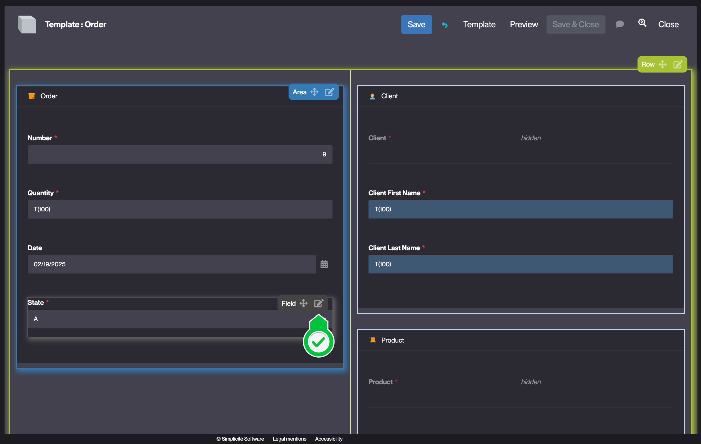
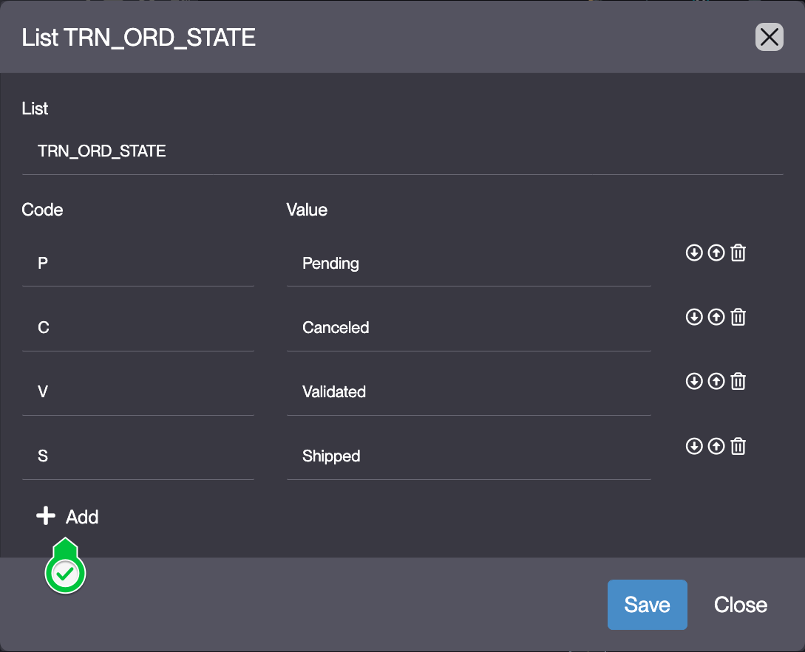
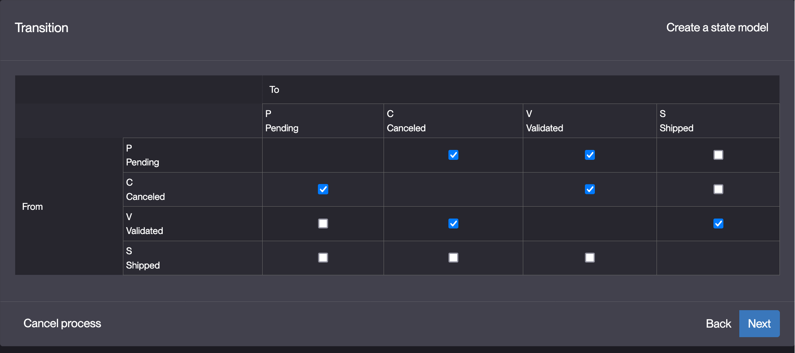

<!--State transitions
====================

A business object can have states that provide the following features: 
- via the menu, direct access to lists filtered by state
- grantable state transitions (for example, it is possible to grant only the administrator the right to go backwards)- actions / treatments in response to an event (transition, entered parameters, etc.)
- actions / processes in response to an event (transition, parameters entered, etc.)

In order to create a state, the following prerequisites must be met
- the object must have a simple enumerated field (which will carry the state)
- this field must be mandatory
- the object must not already have a state

Exercise: create the state of the order.
---------------------------

- use the template editor to add a **required** enumeration field `trnOrdState` to the order
- once added, modify the field to edit the list of values and create the different options (each option has a code and a translation)
- the pre-requisites being validated, the process of adding a state diagram becomes available on the definition of the Order object:
1. selection of the object field bearing the state (in this case, there is only one: trnOrdState)
2. selection of the possible transitions between the different states
3. selection of the groups that can perform the chosen transitions (assign all transitions to the `TRN_ADMIN` group)
4. translation of the actions: each state transition has a translation associated to it which corresponds to the text displayed on the button allowing to switch from one state to another
5. Navigate to the TRN_ORD_STATE list of value configuration, or alternatively, use the template editor to add the status bar to the user interface (UI).
- clear the cache (*because some grants have been modified*) and test the state transitions -->

# Building the "Order Management" Training App : Creating a State model

> Prerequisite : [The Supplier, Product, Client and Order objects are complete and linked together](/lesson/tutorial/expanding/fieldarea)

## What is a State model ?

A state model defines the different statuses a business object can have and controls how it transitions between them. It enables filtered views, enforces permissions on state changes, and automates actions triggered by transitions. Setting up a state model ensures a structured workflow for business objects... [Learn more](/lesson/docs/platform/business-process/state)

## Creating a State model for the Order Business object

### Adding a mandatory "State" field

To add a State field to the Order Business object, follow the steps below :

1. Add a **mandatory enumeration** field to the **TrnOrder** Business object in the [previsoulsy](/lesson/tutorial/expanding/field-area) created "Order" Field Area
    > For a detailed guide on how to add a field, see [Getting started : Create field](/lesson/tutorial/getting-started/attribute)
2. Fill in the Field fields like so : 
    - Label : **State**
    - Logical name : **trnOrdState** *should be auto-completed* 
    - Physical name : **trn_ord_state** *should be auto-completed*
    - Required : **Toggled**  
    
3. Click **Save**
4. Hover over the created **State** field and click the **Edit** icon  
    
5. Click **Edit list**  
    
6. Fill in the List items like so :  
     | Code | Value |
     | ----------- | ----------- |
     | P | Pending |
     | C | Canceled |
     | V | Validated |
     | S | Shipped |  

    *Click **Add** to add an element to the List*  
    
7. Click **Save**
8. Close the Template editor

### Creating the State model based on the "State field"

To create a State model for the the Order Business object, follow the steps below :

1. On the "TrnOrder" Business object's form, click **+ Add > Add State Model**  
    
2. Select the enumeration field that the State model is based on  
    
    > *By default "trnOrdState" is selected*
3. Click **Next**
4. Fill in the State Transition matrix like so : 
    
    ```mermaid
    graph TD
    Pending --> Canceled
    Pending --> Validated 
    Canceled --> Pending
    Canceled --> Validated
    Validated --> Canceled
    Validated --> Shipped
    ```

