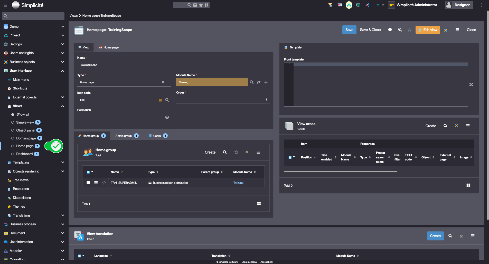
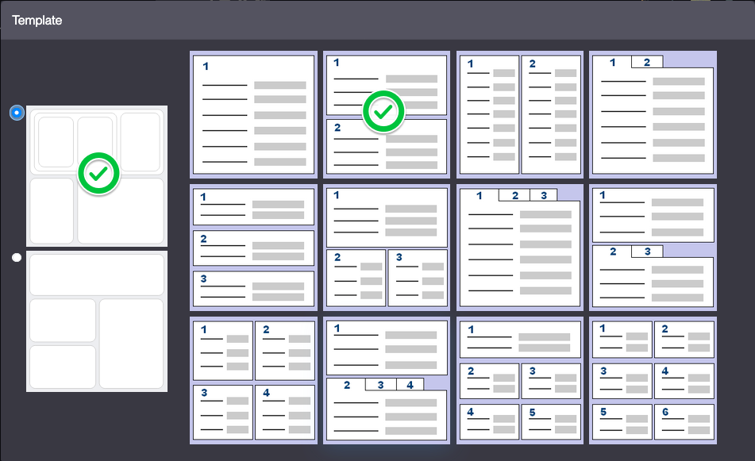
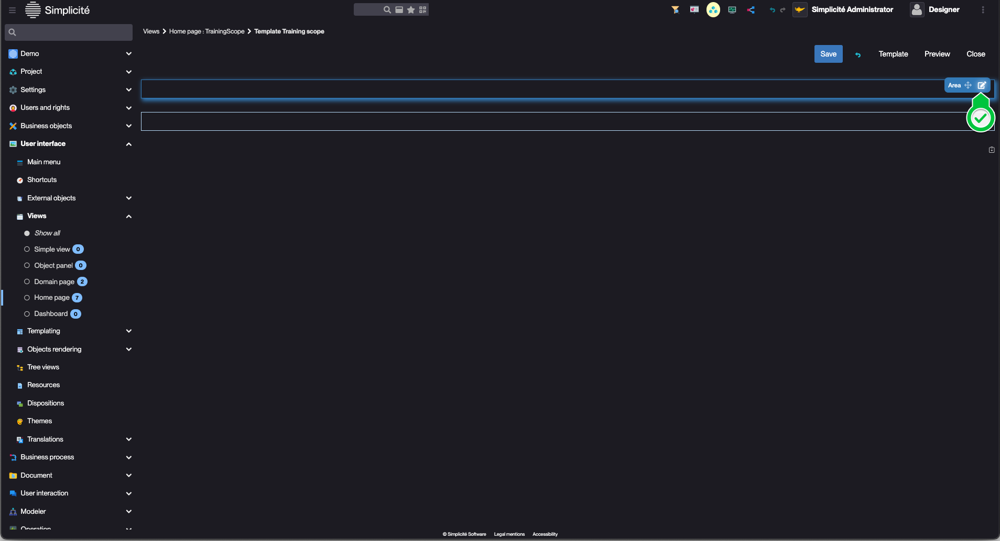
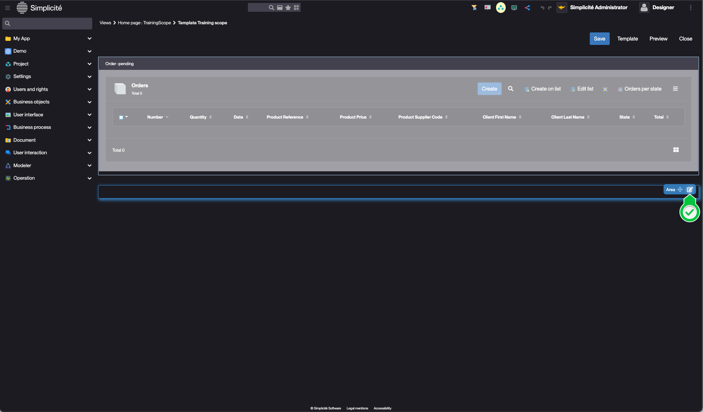
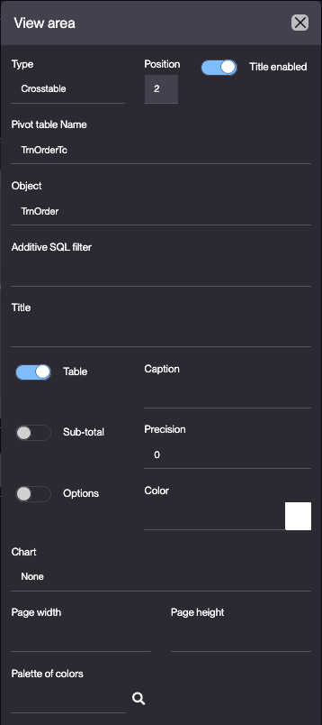
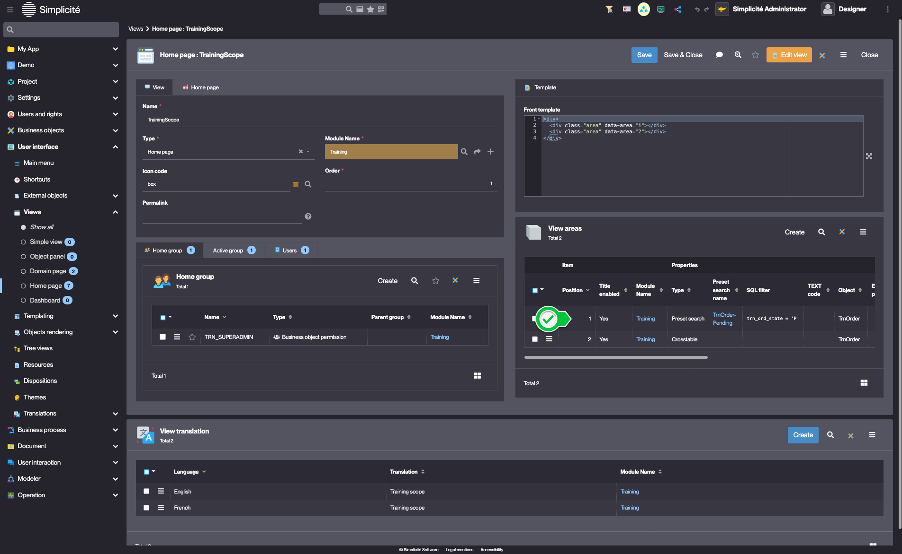
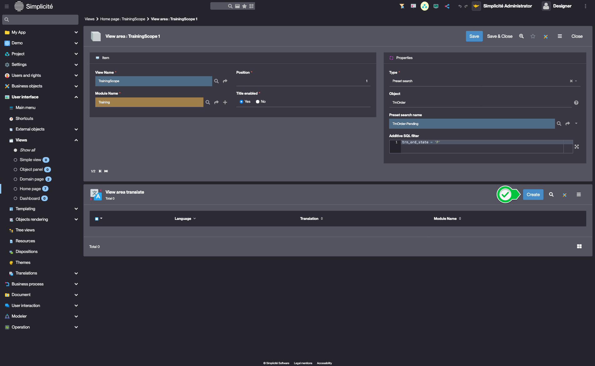
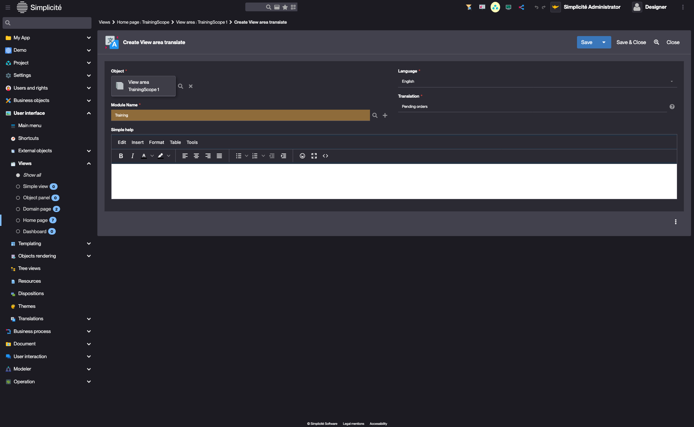

# Building the "Order Management" Training App : Creating a Home page

> Prerequisite : [The designer user has the TRN_SUPERADMIN responsibility](/lesson/tutorial/getting-started/user#adding-designer-to-trn_superadmin), the Order has [state model](/lesson/tutorial/expanding/states) and a [pivot table](/lesson/tutorial/expanding/pivot-table).

## What is a Home page ?

A View is a structured collection of components that define user interfaces, such as domain or group homepages. It can include predefined searches, crosstabs, custom UI components... [Learn more](/lesson/platform/userinterface/views/home-page)

## Creating a Home page for the TRN_SUPERADMIN Group

To create a home page for the TRN_SUPERADMIN Group, follow the steps below :

1. In the **User interface > Views > Home page** menu, open **TrainingScope**
    > This home page was automatically created during the [Create module](/lesson/tutorial/getting-started/module) process.   

    
2. Click 
3. Select the second template on the first row  
    

### Adding the list of Pending Orders 

1. Click the *edit* icon on the first View area  
    
2. Fill in the View area information like so :
    - Type : **Preset search**
    - Title enabled : **Toggled**
    - Preset search name : **TrnOrder-Pending**
    - Object to search : **TrnOrder**
    - Additive SQL Filter : `trn_ord_state = 'P'`  
    
3. Click **Save**

### Adding the "Orders per state" Pivot table

1. Click the *edit* icon on the second View area  
    
2. Fill in the View area information like so : 
    - Type : **Crosstable**
    - Title enabled : **Toggled**
    - Pivot table Name : **TrnOrderTc**  
    - Table : **Toggled**   
    
3. Click **Save**
4. Click **Close**

### Setting titles for the View areas

1. In the **View areas** panel linked to the View, open the Preset search  
    
2. In the **View area translate** list linked to the View area, click **Create**  
    
3. Fill in the View area translate fields like so :
    - Language : **English**
    - Translation : **Pending orders**
    
4. Click **Save & Close**

## Test the Home page with the usertest User

1. Clear the platform's cache and log in using *usertest*
    > For a detailed step-by-step, see : [Testing the User](/lesson/tutorial/getting-started/user#activating-and-testing-the-user)

    
The Home page displays the "Pending orders" view and the "Orders per state" pivot table

    

