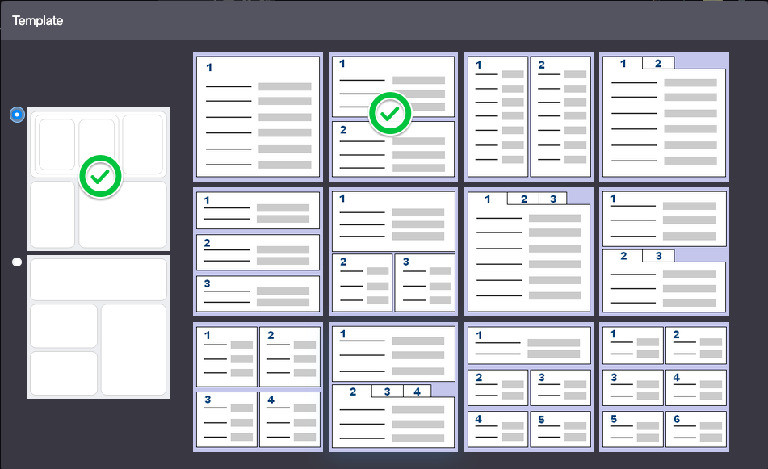
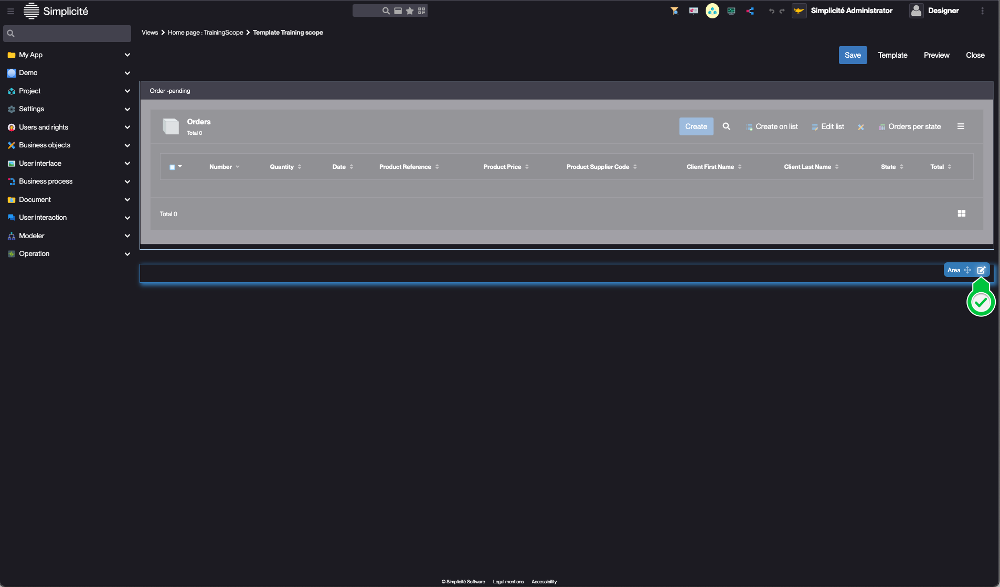
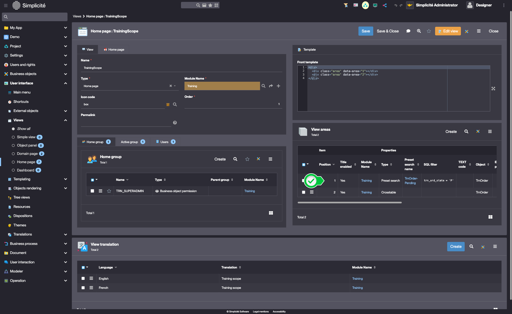
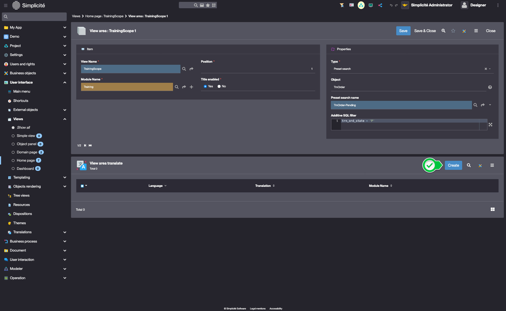

<!--Views
====================

A view is an aggregation of components that can be used:
- a domain home page,
- a group home page,

The main components are:
- predefined searches,
- crosstabs,
- external objects (particular objects allowing, among other things, to create specific components to be inserted in the views)

Scopes
---------------------------

When a user has many groups of rights, it is often useful to offer him a way to limit his rights. For example, an application administrator may want the application to behave as if he were a regular user. This use case is made possible thanks to scopes.

A scope is a group homepage that defines a certain number of active groups. When the user uses this scope, only these groups remain active.

As a designer, it is easy to test this functionality with the scopes already available:
- Application design
- Platform operation
- Rights management
- Simplicité Administrator (wildcard scope where all groups are active)
- etc.

To create a scope and make it available to a user : 

1. Create a View (Interface > Views)
2. Add an Active Group ("Active group" tab)
3. Set the View as the Group's Home page
4. Add the user to the Group

Exercise
====================  

 To set up the view correctly, your development user must have rights to your objects 
  
  
- create a view `TrnHome` of type `Domain page`
- add two areas to it:
    - the list of current orders via a predefined search
    - the pivot table previously set up
- define this view as the home page of the Training domain (make sure that the domain displays the home page)
- empty the cache and check the presence of the home page
-->

# Building the "Order Management" Training App : Creating a Home page

> Prerequisite : [The designer user has the TRN_SUPERADMIN responsibility](/lesson/tutorial/getting-started/user/#adding-desiger-to-trn_superadmin), the Order has [state model](/lesson/tutorial/expanding/states) and a [pivot table](/lesson/tutorial/expanding/pivot-table).

## What is a Home page ?

A View is a structured collection of components that define user interfaces, such as domain or group homepages. It can include predefined searches, crosstabs, custom UI components... [Learn more](/lesson/docs/platform/user-interface/views/home-page)

## Creating a Home page for the TRN_SUPERADMIN Group

To create a home page for the TRN_SUPERADMIN Group, follow the steps below :

1. In the **User interface > Views > Home page** menu, open **TrainingScope**
    > This home page was automatically created during the [Create module](/lesson/tutorial/getting-started/module) process.   

    
2. Click 
3. Select the second template on the first row  
    

### Adding the list of Pending Orders 

1. Click the *edit* icon on the first View area  
    
2. Fill in the View area information like so :
    - Type : **Preset search**
    - Title enabled : **Toggled**
    - Preset search name : **TrnOrder-Pending**
    - Object to search : **TrnOrder**
    - Additive SQL Filter : `trn_ord_state = 'P'`  
    
3. Click **Save**

### Adding the "Orders per state" Pivot table

1. Click the *edit* icon on the second View area  
    
2. Fill in the View area information like so : 
    - Type : **Crosstable**
    - Title enabled : **Toggled**
    - Pivot table Name : **TrnOrderTc**  
    - Table : **Toggled**   
    
3. Click **Save**
4. Click **Close**

### Setting titles for the View areas

1. In the **View areas** panel linked to the View, open the Preset search  
    
2. In the **View area translate** list linked to the View area, click **Create**  
    
3. Fill in the View area translate fields like so :
    - Language : **English**
    - Translation : **Pending orders**
    
4. Click **Save & Close**

## Test the Home page with the usertest User

1. Clear the platform's cache and log in using *usertest*
    > For a detailed step-by-step, see : [Testing the User](/lesson/tutorial/getting-started/user#activating-and-testing-the-user)

    
The Home page displays the "Pending orders" view and the "Orders per state" pivot table

    

