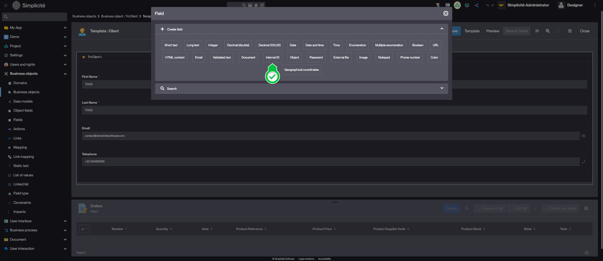
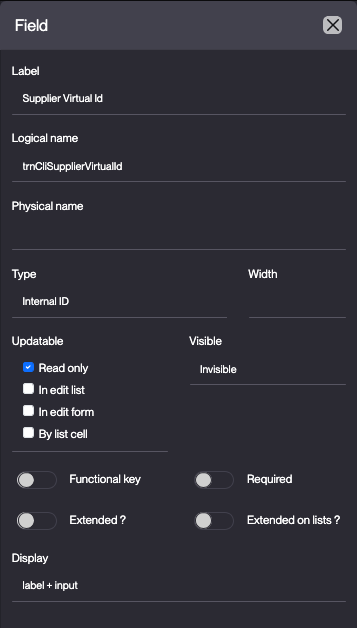
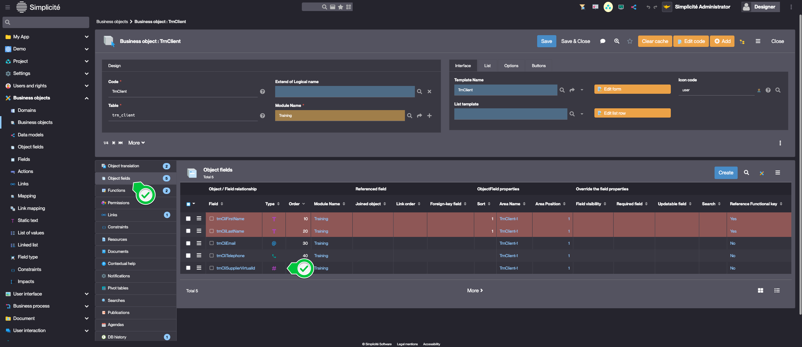
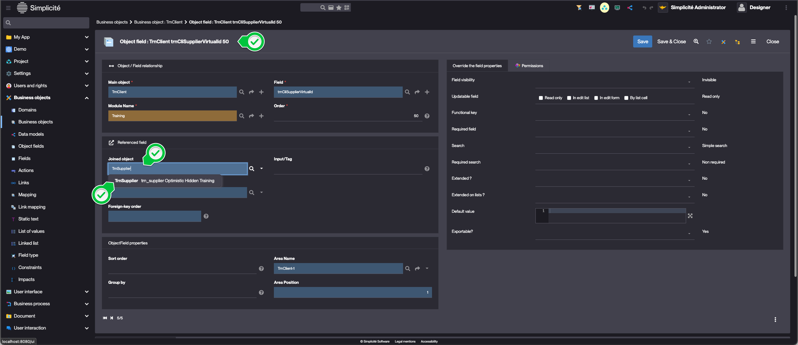
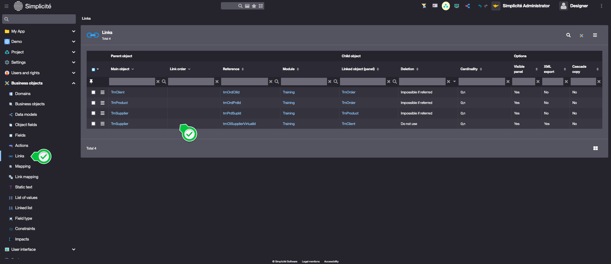
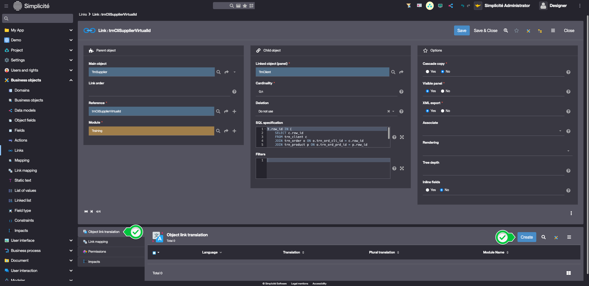
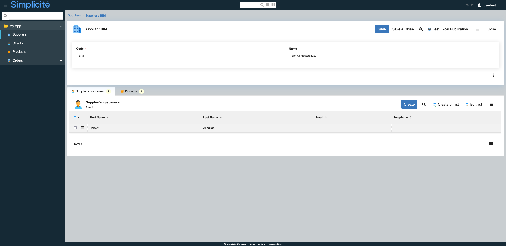

# Building the "Order Management" Training App : Creating virtual links

> Prerequisite : [The Supplier, Product, Client and Order objects are linked together](/lesson/tutorial/expanding/relations)

## What is a Virtual link ?

In Simplicité, a virtual link allows you to access data between business objects without adding a physical column or foreign key. The data is retrieved via an SQL query configured on the virtual link, enabling flexible relationships without altering the database structure... [Learn more](/lesson//platform/businessobjects/links#virtual-link)

## Accessing the list of a Supplier's Clients

To create a virtual link between the **TrnSupplier** and **TrnClient** objects, follow the steps below :

### Create and add a non persitent Field to TrnClient 

1. Open TrnClient's template editor
    > For a detailed step-by-step, see [Getting started : Create field](/lesson/tutorial/getting-started/attribute)
2. Add a new **Internal ID** field   
    
3. Fill in the Field's information like so :
    - Label : **Supplier Virtual Id**
    - Logical name : **trnCliSupplierVirtualId**
    - Physical name : *empty*
    - Updatable : **Read only**
    - Visible : **Invisible**  
    
4. Click **Save**
5. Close the Template editor, click **Close**
6. In the **Object Fields** panel linked to the Business object, open **trnCliSupplierVirtualId**  
    
    > Be sure to open the **ObjectField** and not the **Field**
7. In the **Joined object** field, type "TrnSupplier" and select the element suggested  
    
8. Click **Save**
9. Fill in the **Deletion** mandatory field : **Do not use**
10. Click **Save & Close**

### Add an SQL filter to the Virutal link

1. In the **Business objects > Links** menu, open the previously created link  
    
2. Fill in the Link's information like so :
    - SQL specification :
```sql
t.row_id IN (
    SELECT c.row_id  
    FROM trn_client c  
    JOIN trn_order o ON o.trn_ord_cli_id = c.row_id  
    JOIN trn_product p ON o.trn_ord_prd_id = p.row_id  
    JOIN trn_supplier s ON p.trn_prd_sup_id = s.row_id  
    WHERE s.row_id = [row_id]
)
```
> `t` is the alias of the child (Client) table  
> `[row_id]` is the parent (Supplier) record's ROWID
3. Click **Save**

### Add a label to the Virtual link

1. In the **Object link translation** panel linked to the Link, click **Create**  
    
2. Fill in the Translation's fields like so : 
    - Language : **English**
    - Translation : **Supplier's customers**
3. Click **Save & Close**

## Test the Virtual link with the usertest User

1. Clear the platform's cache and log in using *usertest*
	> For a detailed step-by-step, see : [Testing the User](/lesson/tutorial/getting-started/user#activating-and-testing-the-user)
2. Open a Supplier

<div class="success">
    <p>The "Supplier's customers" panel is visible and contains the list of clients that have ordered a Product from the Supplier</p>
    
</div>
