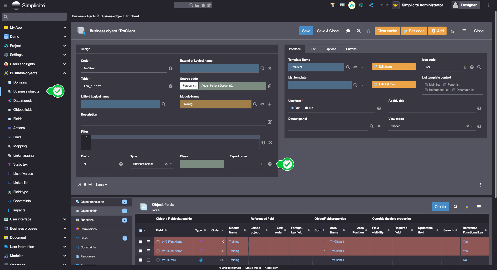

# Building the "Order Management" Training App : Creating a Dataset

> Prerequisite : [The Supplier, Product, Client and Order objects are linked together and contain data](/lesson/tutorial/expanding/relations)

## What is a Dataset ?

A dataset is a structured collection of data used for testing or transferring information between instances. Unlike technical exports, which may create inconsistencies, a dataset export ensures data integrity by using functional keys instead of technical IDs... [Learn more](/lesson//platform/project/datasets)

## Configuring an "export order" for the objects

To configure an "export order" for the **TrnClient** object, follow the steps below :
1. In the **Business objects > Business objects** menu, open **TrnClient**
2. Click **More**
    > This displays the Fields defined as *extended*
3. Fill in the object's information like so : 
    - Export order : **10**  
    
4. Click **Save**

Repeat the steps above for :
- **TrnSupplier** :
    - Export order : **20**
- **TrnProduct** :
    - Export order : **30**
- **TrnOrder** : 
    - Export order : **40**

TrnSupplier has a lower export order than TrnProduct because its data must be added to the dataset **before** TrnProduct's data.  
TrnOrder is exported last because its data depends of TrnProduct, TrnSupplier and TrnClient

## Generating the Dataset

To generate the Dataset, follow the steps below : 
1. In the **Project > Modules** menu, open **Training**
2. Click **Export data** in the "Import/Export" panel   
    
3. In the confirmation dialog, set :
    - Format : **xml**
    - Zipped : **no**  
    
4. Click **Confirm**
5. Close the Export data modal 

### Expected Result

1. The export is available the the **Dataset** panel  
    
2. Click the "File" icon  
    
3. A preview of the XML file is displayed  
    

## Deleting data and importing the Dataset

### Deleting data

To delete existing Orders, follow the steps below :
1. Open the list of Orders
2. Select all rows  
    
3. In the *plus* menu, click **Delete all**  
    
4. Click **Ok**

Repeat the steps above to delete existing Products, Suppliers and Clients

### Importing the Dataset

1. In the **Project > Datasets** menu, click the *play* button on the previously exported Dataset  
    
2. Click **Yes**

    
The data is successfully imported

