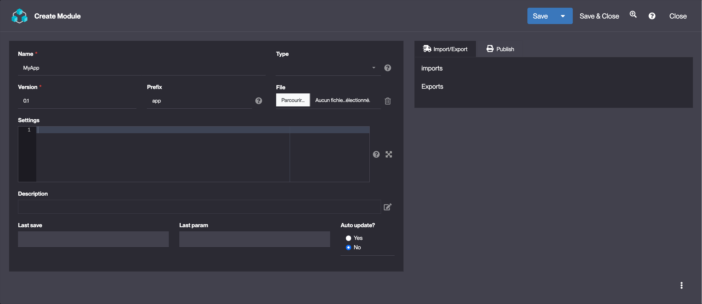

Module
====================

### What is a Module ?

Each configuration of an app starts with the creation of a module.

**All the configuration objects are part of a module, corresponding to the export unit of Simplicité**.

Simplicité is configured via **configuration objects** that provide the description of the application. These objects are business objects, fields, templates, actions, etc.

### How to create a Module ?

> If you are creating your first Module use the [Module creation assitant](/lesson/tutorial/getting-started/module)

To create a Module, follow the steps below :
1. Click **Create** in Project > Module
2. Fill in the Module information and click **Save** :  
    > Example values :  
    

#### Minimal configuration suggestion : 
| Field | Description |
| ----- | ----------- |
| **Name** | Unique identifier of your module (generally the name of the application) |
| **Prefix** | Module trigram used for naming conventions |

### Module filtering

### Read more

- [Module export / import]()
- [Module add-on]()
- [Managing git repositories](/lesson/docs/integration/webservices/git-repositories)
- [Generating documentation]()