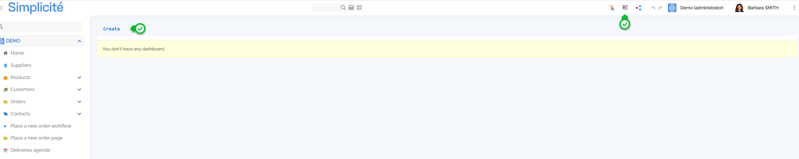
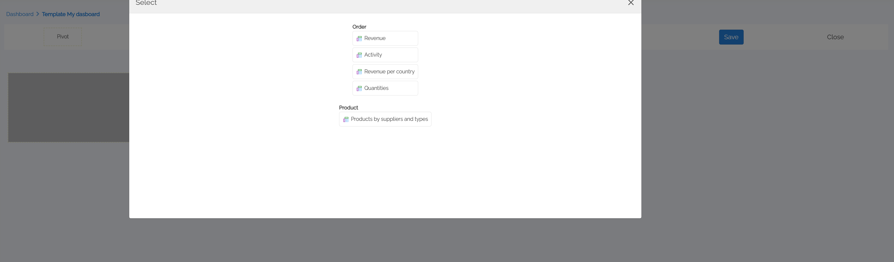

# Dashboard 

## What is a Dashboard ?

Since version 6.2, Simplicité has enabled end users to create and share their own dashboards.
A dashboard is a visual interface that provides an overview of key data, metrics, and insights in a structured and interactive way.  

- Filters and Selections : Users can filter data by period, category or other criteria.

- Drill-Down (Data Exploration) : Click on an element (bar, point on a graph) to see more details.

- Dynamic updates : Data is often connected to databases in real time.

- Customisation : Simplicité allows users to change the display, rearrange widgets and create their own reports.

- Sharing : Simplicité allows users to share their dashboards.   

## How to create a Dashboard ?

To create a dashboard, follow the steps below:  
1. If you have DASHBOARD_MAKER rights, a dashboard icon will appear in the page header.  
It allows you to create your dashboard. Click on create.  

2. Give a label. The dashboard editor is open. 

You have differents choices : 
- Pivot : this will give you access to all the crosstables available to you  
 
- Chart : this will give you access to all the crosstables available to you with chart display. 
  Choose your chart and click on Apply.   

- Widget : this will give you access to all the widgets (specific external objects) available to you.   
  Choose one and place it.   
  
- Preview : to preview your dashboard  
- Up arrow icon : automatically arrange your dashboard  
- Save : to save your dashboard  
- Close : to close your dashboard   
3. Once you have chosen the type of element (pivot, chart or widget), click on the element and drag it to the position of your choice.  
4. Save your dashboard 