Basic web user interface usage
==============================

This document explains the basic usage principles of the generic web user interface (UI).

### Home page

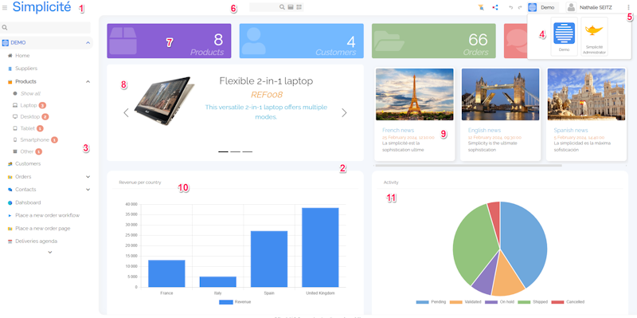

1 - Return to Home Page    
2 - Work area with UI components  
3 - Menu  
4 - Change scope  
5 - Shortcuts  
6 - Global search  
7 - UI widget (Counter external object > V6)  
8 - UI widget (Carousel external object > V6)    
9 - UI widget (Cards external object > V6)    
10 - Crosstab displayed as a chart  
11 - Crosstab displayed as a chart  

   
### Search, list and form pages

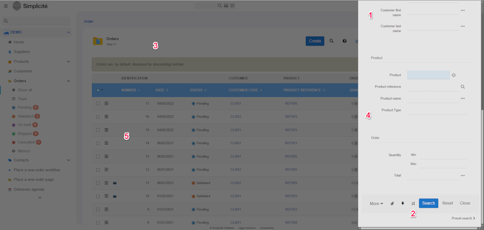

1 - Multi-criteria search    
2 - Multi-sort asc/desc  
3 - Search result in a paginated list of matching records  
4 - Actions List in the header of the list  
5 - Click everywhere on the line (except link) to open a record  

  

### Form details

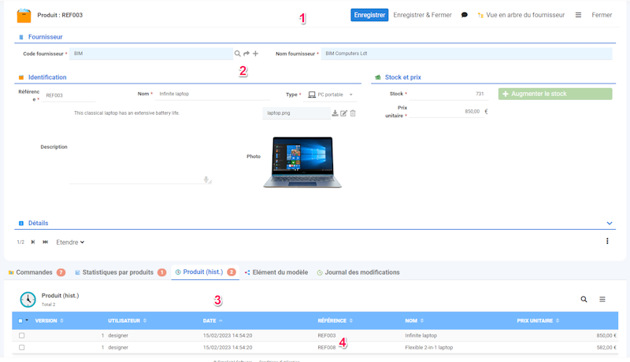

1 - Object form with actions buttons : save, specific action, close ...etc    
2 - Link to father object  
3 - Child objects list tab  
4 - Direct access to linked objects, files ...  
 

  

### Modeler

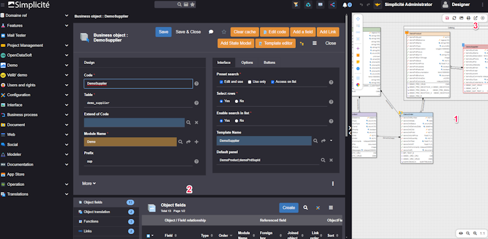

1 - Model diagram : use contextual menu (right click)    
2 - From the diagram, double click on an object link to its definition   
3 - Opens to full page 

### Menu

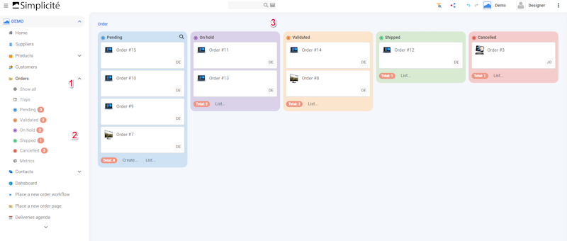

1 - (v) icon : means that the object follows a state diagram    
2 - For objects following a state diagram, direct access to the lists by state  
3 - Kanban view of state objects  
 
### Search form details

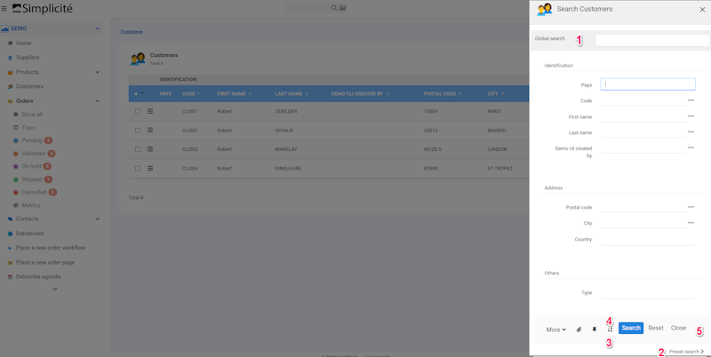

1 - Global search       
2 - Preset search : list of available preset search  
3 - Change or add orders to filter    
4 - Change the ascending order by default  
5 - Click on `Search` to execute or `Reset` to clear the form   

### Global search

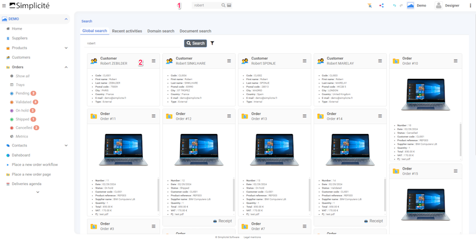

1 - Input for global search     
2 - Direct access to result search  with available open and others actions : all data containing 'Robert'  

### List

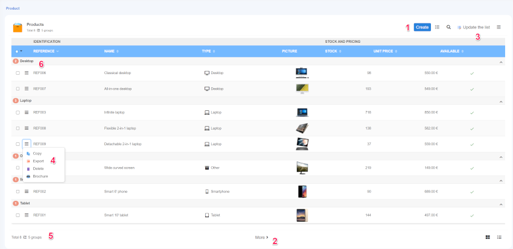

1 - Create button    
2 - Pagination  
3 - Action bar  
4 - Action bar per line (including specific actions)  
5 - Number of lines per page (configurable)  
5 - Group by option (configurable)

### Tree list

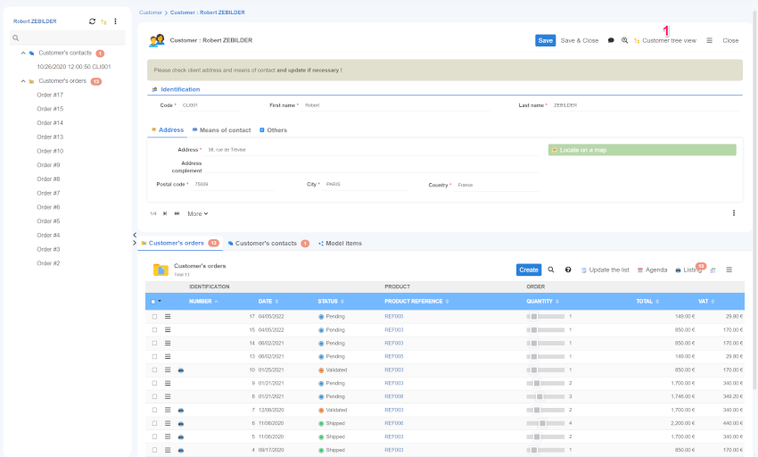

1 - In the case above a treeview is associated to the customer object   
2 - Direct access to tree view hierarchy to the left of the customer form           

### Create from list

 
1 - New line appears in list. Validation controls and rules (required fields, functional key ... etc) are the same as in form.  The default action bar disappears.  
2 - Save / Cancel to return to list and exit the creation mode.    
Creation is only possible if the list contains all the required fields, including functional keys.    
     
### Edit list

 
1 - All lines appear in edit mode. For each row, validation controls and rules (required fields, functional key ... etc) are the same as in form.  The default action action bar disappears.  
2 - Save / Cancel to return to list and exit the edit mode.    
   
### Bulk update

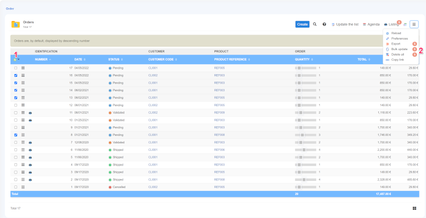

 
1 - Select all or a part of the data to update.  

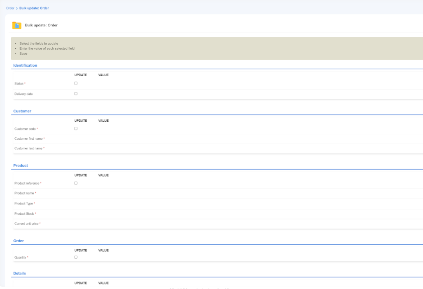  

    
Select the fields to update and then the values.        
   
### Delete all

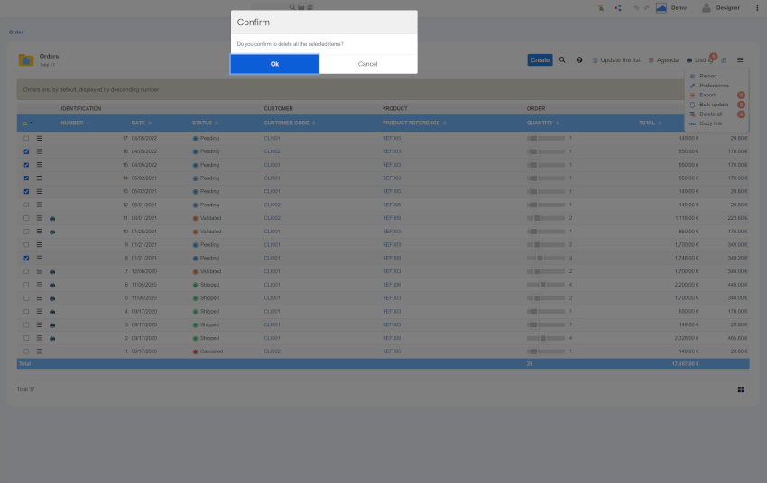

 
1 - Select all or a part of the data to delete.      
2 - Select the `Delete all` action in the plus action bar.  
3 - A confirm message appears. Press `ok` to confirm the removal of the selected data.  

         
### Preferences

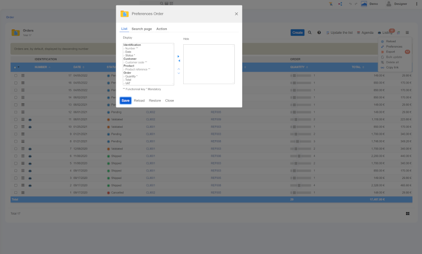

A user can customize its display : change the fields and their order in lists, hide some fields from search form, hide action.  
1 - Select the `Preferences` action in the plus action bar. Preferences is only for a user during a session.          
2 - The Preferences popup appears for the selected list :  
		 -	List : Hide the field or change their order except functional key. If some required field are hidden, creation from list will not be possible.  
		 -	Search page tab : Hide any field.  
		 - Action : hide action such as `Create on list`, `Edit list`, specific action ...etc   
		 
3 - Press `Save` to confirm the changes, `Reload` to remove last change, `Restore` to remove all preferences, `Close` to exit.    

         
### Form details

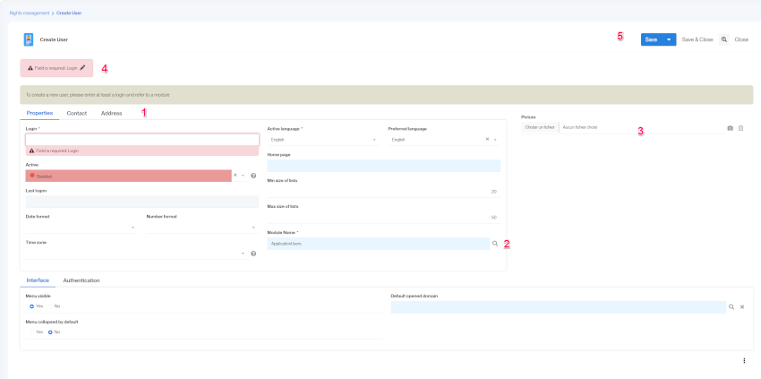

1 - Browse all tabs to see all the fields.               
2 - Click on the magnifying glass icon to select a data from a link object.    
3 - Allows to attach local file.      
4 - Error message.  
5 - The action bar below allows to `Save`and stay on the form, `Save/close` to save and go to the last consulted page, `Close`to exit without saving.  

### Update Form details

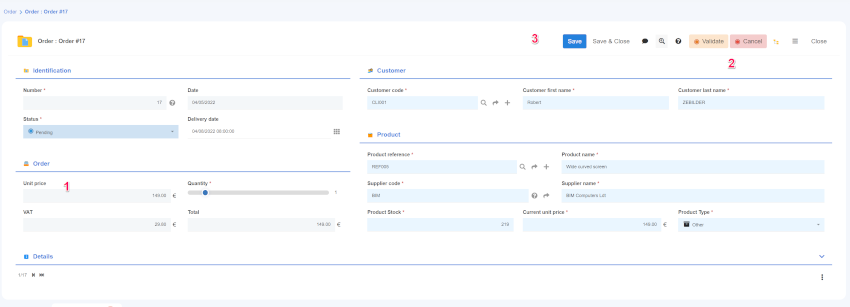

1 - Gray fields are disabled.                 
2 - Transition action allows to change states.   
3 - The action bar can contains specific actions.  

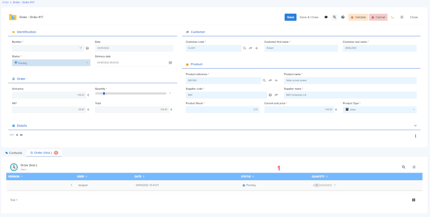

1 - Link objects are displayed in list.     