Version 5.3.x release note
==========================

> **Note**: This release note corresponds to the current minor release.

<h2 id="compatbreakingchanges">Compatibility breaking changes</h2>

<h3 id="bootstrap-version">Bootstrap V5</h3>

- Bootstrap V4 is still the default renderer in release V5.x
- Bootstrap V5 `BOOTSTRAP_VERSION = 5` is supported since release V5.3 and will be the default at major release V6
- The disposition `responsive5` supports the 2 implementations
- `jQuery` is still supported to wrap constructor/events (but Bootstrap 5 uses pure javascript)
- Migration doc for specific front: https://getbootstrap.com/docs/5.1/migration

<h3 id="ecmascript">ECMAScript</h3>

- This version uses common ES6/7 features (const, let, lambda, promise, async/await...)
- IE11 is not supported anymore by all UI components

<h3 id="chartjs-version">ChartJS version 3</h3>

- `Chart.js` has been upgraded to V3 but V2 will be supported in all release V5
- Set the parameter `CHARTJS_VERSION` to specify the version 2 or 3
- The location of the chartjs libs has changed to `scripts/chartjs/v2` and `scripts/chartjs/v3`
- Migration guide for your specific charts: https://www.chartjs.org/docs/latest/getting-started/v3-migration.html

<h3 id="marked-version">Marked version 4</h3>

- `Marked` Javascript lib has been upgraded from version 3.x.y to version 4.x.y
- If you use it in your custom JS code you need to upgrade calls like `marked(...)` to `marked.parse(...)`

<h3 id="fullcalendar-version">FullCalendar version 5</h3>

- FullCalendar version 3 is now **deprecated** and will be removed in the next minor release (you can still use version 3 but you now **must**
  consider migrating your custom code to version 5 or at least version 4, see bellow)
- `FULLCALENDAR_VERSION` is now set to version 5 by default.
  Version 4 is still supported but you **should** consider migrating your custom code to FullCalendar version 5.

To upgrade your specific code see https://fullcalendar.io/docs/upgrading-from-v3 or https://fullcalendar.io/docs/upgrading-from-v4

<h3 id="excel-export">Export to XLSX</h3>

- The data export to XLSX format is now only implemented with Apache POI
- The legacy HTML format is deprecated/hidden by default, and will be removed in the next minor release

<h3 id="vue">Vue.js</h3>

The embedded Vue.js JS lib has been upgraded from version 2 to version 3. If you are using this lib in some of your custom components
you **must** refactor their code according to the [Vue 3 migration guide](https://v3-migration.vuejs.org/).

### No more user-key on huge fields

For index size limitation, some field types cannot be functional-key anymore:
- document
- image
- html
- notepad (structured JSON)
- very long text (more than 4000 characters)

You will have to change these user-keys if any.

### Same-site cookie policy default

The instance template and Docker images are now configured to implement a `lax` same-site policy by default.
This `lax` value the appropriate value when using external OpenIDConnect/SAML authentication. If you don't use such external authentication yu can set it to `strict`.

You can revert to Tomcat's default by setting it to `unset` in the `CookieProcessor` block of the `META-INF/context.xml` descriptor (or by commenting this block).

### EasyModeAdapter deprecated

Old adapters to import legacy settings thru `quick param` (V3 tooling) has been removed, and related code is deprecated.


<h2 id="changes">Core changes</h2>

- Added accessors `Grant.getResource` to find Resources by code, type and/or target object name
- Added `MailTool.convertImages` to replace in email all HTML inlined images `` with attachments and ``
- The system parameter `USE_SOCIAL` has been removed, but still valued to true at logon if user has responsibility `SOCIAL_USER` or `SOCIAL_ADMIN` (for backward compatibility)
- Update of area position is synchronized in the object template
- Using an older webapp on an upgraded database is now causing a **FATAL** error that prevents platform
  to start up (this is to avoid unexpected side effects in this non supported case)
- New dedicated panel instance to merge links `Grant.getMergePanelObject` (against UI panel rules)
- Functional key property can be overrided in object field definition
- Bulk associate action added automatically in inherited links
- Associate a Bookshelf to any document field to specify accepted MIME types
- Simplify DocMIME functional key
- New adapter to import CSV with new lines support
	- `CSVAdapterOpen` based on Open CSV
- Import XML solves data-model cycle (not only reflexive errors)
- Rebuild automatically and asynchronously after a module import all objects DB indexes (UK+FKs) + data fult-text indexes (m_index)

- New `DataLink` configuration to synchronize data between several applications
	- Set a list of named hosts with credentials to be accessed thru REST APIs
	- Define datalinks with master/slave hosts to synchronize objects changes
	- Master data updates are synchronized with other masters/slaves on the fly when systems are available
	- A new cron job `DataLink` is used as fallback when a system is down or temporarily unreachable
	- When operational again, it synchronizes all dataLinks with a master from the last scan per object (stored in parameters `_SYNC_MASTER_<object>`)

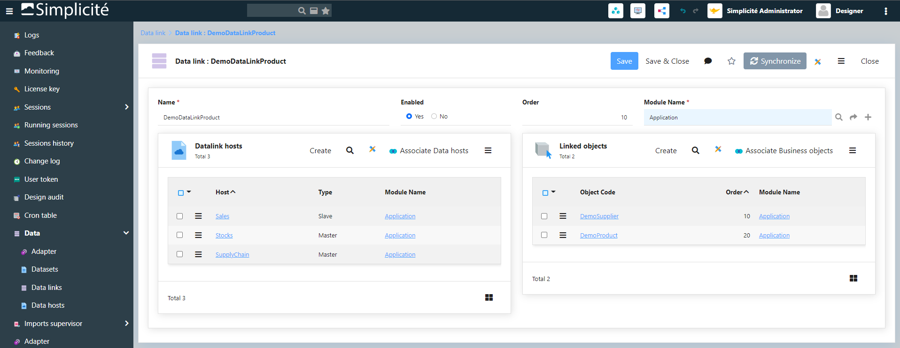

- Added **experimental** platform annotations in the `com.simplicite.util.annotations` package
  these annotations have only "informative" function at that stage
  (using them also avoid false prositive messages in some cases of code analysis)
  except for the `RESTServiceExternalObject` helper class which processes the `@RESTService*` annotations for building the OpenAPI/Swagger schema
  in the `openapi` hook default implementation/

- `CronManager.lock` robustness to re-affect the `CRON_LOCK`

- Added Apache Kafka client libs + experimental `KafkaTool` helper class
- Added license key file (`<project dir>/licenses/license.<xml|json|yaml>`) or environment variable (`LICENSE_KEY`) import at startup
- `initAction` with `getParentObject` context
- `initRefSelect` and `initDataMapSelect` with parent object set with DB old-values and UI current values
- Optimized asynchronous Data export of module

- Added a new property **Fixed filter** in field definition:
	- accessors `field.isFilterFixed()` and `field.setFilterFixed(fixed)`
	- `ObjectField.FIXED_FILTER_NOT` : default value, usual updatable end-user filter
	- `ObjectField.FIXED_FILTER_READ` : the filter is displayed on UI but in read-only
	- `ObjectField.FIXED_FILTER_HIDE` : the filter is hidden on UI

- New **Link filters** to specify filed filters on a panel search:
	- applied in the same time of the search specification SQL of link
	- useful to join heterogenous objects (from several datasources, object service...) when SQL is not permitted
	- JSON filters with common token, example:
	
```json
{
  "childField1" : ">=1000 and <=5000",
  "childField2" : "[VALUE:parentFieldName]",
  "order__childField3" : -1,
  "group__childField4" : 1
}
```

- New object hook `public String[] postSearchRow(String[] row)`:
	- Called on each record when fields are calculated and decrypted from DB
	- More efficient than a `postSearch` as it avoids a second loop over the records

- New type of `Action` to launch long running jobs started thru UI in a `isolated session`

- New message with **call to action** to ask the user to do something
	- action type must be hidden to be used only in this context
	- action is displayed only if the user is granted thru a function
	- action will call the front javascript or the back-end method

```java
// Single action
ObjectDB obj = this;
Action action = obj.getAction("MyAction_SendEmail");
return Message.formatCallToAction("WARNING", "Save is OK, do you want to send an email to client?", Message.WARN, null, obj, action);

// Or with several actions
List<Action> list = new ArrayList<>();
list.add(obj.getAction("MyAction_OptionA");
list.add(obj.getAction("MyAction_OptionB");
return Message.formatCallToAction("MYCODE", "What is the best option?", Message.WARN, null, obj, list);
```


- New `_tabId` in sessionStorage 
	- to isolate objects of a same session (JSESSIONID) but accessed from different browser tabs
	- getter `Grant.getClientTabId()`

- New auto-incremental field
	- "Auto-incremental syntax" configuration field on Field object allows to automatically increment field value according to a specified syntax when creating a new record.

- Supports several Keycloak providers, names must start with `keycloak` to be identified in `AUTH_PROVIDERS`

- New monitoring of **JDBC pool size** (needs access to JMX/MBean)

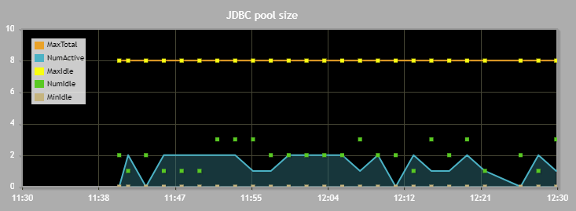

- New **Notification** feature
	- Is defined by an Object, an Action, a Condition, Channels, Recipients and Content
	- Object : Object that is linked to the Notification 
	- Action (Create, Update, Delete) : Action on the Object that will trigger the Notification
	- Condition : Expression to define in which Condition(s) the Notification should be pushed
	- Content can be overriden for each Channel and / or Recipient
	- Channels are globally defined at the Notification level but can be specific to a given Recipient
	- Users can subscribe / unsubscribe from their Notifications (requires the Notification to be non-mandatory and user is a Recipient of the Notification)
		- Subscriptions are based on the Notification / Channel couple - meaning that for a given Notification broadcasted over Mail and Internal channels, a user can unsubscribe from the Mail channel.
	- *Channels* :
		- Internal : Bell icon in header updated when a new Notification is received - Notifications are stored in a system table
		- Mail : Sends an email to recipients configured in the Notification 
		- Specific : Calls a method defined in the Object
	- *Recipients* :
		- User : specific user that will receive the Notification
		- Group : users with active Resp will receive the Notification
		- SQL : user ids or emails to receive the Notification
		
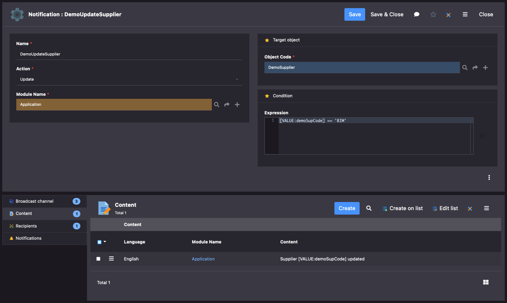

- Modules can be merged together
- Ping platform nodes to clean `m_pf_node` periodically thru the cron HealthCheck

- Import License key file thru UI action

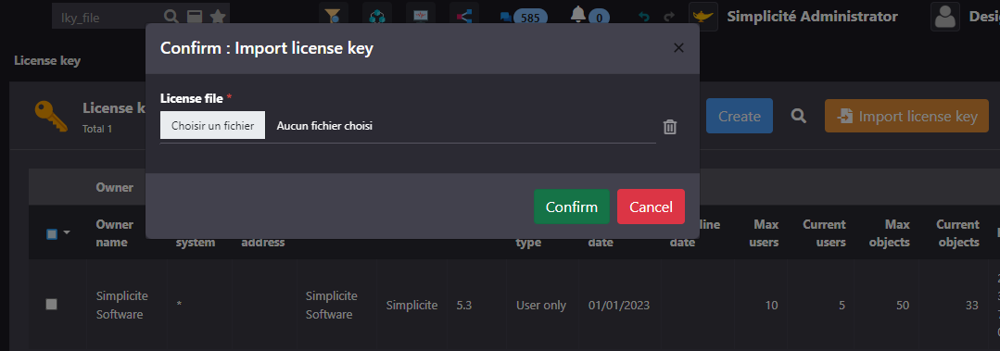

<h2 id="uichanges">UI changes</h2>

- UI extended controllers has been moved to `scripts/ui/tools`:
	- they are not included in the core packaging `ui-bundle.js`
	- to be loaded only if they are used by the UI engine
	- include calendar, charts, placemap, firebase, speech, tray and workflow

- Added resource `MENTIONS` to disposition `responsive5` to simplify the previous `FOOTER`
- Show bootstrap full version in `ABOUT` dialog

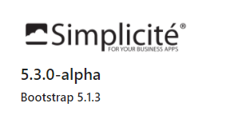

- Tiny URL on resources:
	- no more `objid` in URL is needed if the resource is unique by code, by object name and/or by type
	- `/r?c=MY_UNIQUE_CODE`: to find a unique-named resource
	- `/r?c=MY_CODE&o=MyObjectName`: to find a resource of a named object (disposition, internal/external object or process name)
	- `/r?c=MY_CODE&o=MyObjectName&t=IMG`: to find a typed resource of a named object 
	
- New module template to categorize publications:

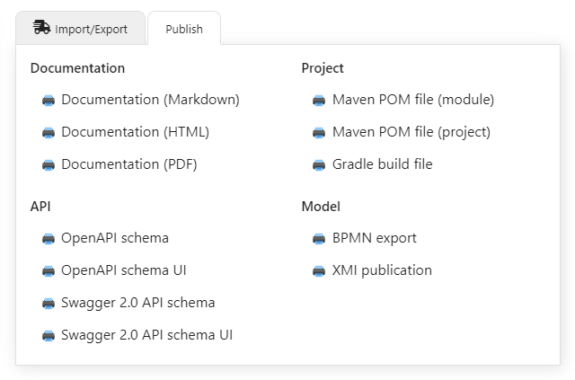

- Added a `beforesave` and `aftersave` object UI hook

- User's **bookmarks** with fast access to favorite objects:
	- Granted to user with new group `BOOKMARK`
	- New popup with all bookmarks stored as JSON in user's parameter `BOOKMARKS <home>`
	- Ability to dock the bookmarks bar on top or bottom (except on mobile)
	- Add/remove each bookmark in object's form
	- New generic Action `bookmark` associated to new button property: visible (default), hidden (no bookmark) or in 'plus' menu
	
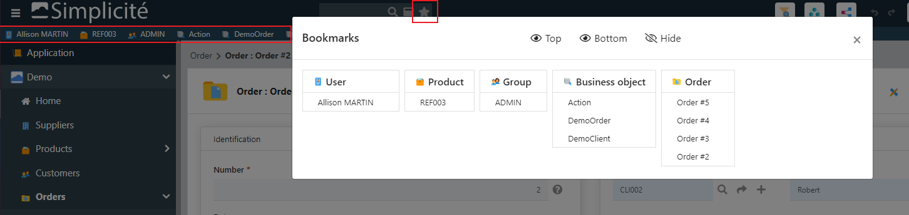

- Added Bootstrap icons 1.5.0 from https://icons.getbootstrap.com

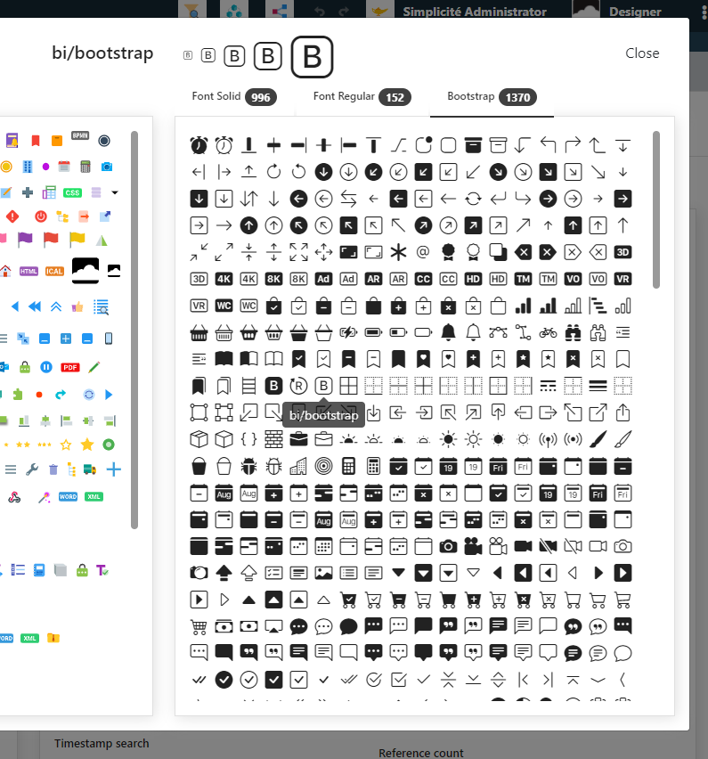

- New triggers `ui.field.visible`, `ui.area.visible`, `ui.view.visible` and `ui.action.visible`
  to add specific code to a listener component when something is shown or hidden dynamically.

```javascript
$(div).addClass("js-field-visible").on("ui.field.visible", (e,field,vis) => { /* do something */ });
$(div).addClass("js-area-visible").on("ui.area.visible", (e,area,vis) => { /* do something */ });
$(div).addClass("js-view-visible").on("ui.view.visible", (e,view,vis) => { /* do something */ });
$(div).addClass("js-action-visible").on("ui.action.visible", (e,action,vis) => { /* do something */ });
```
- Allows to create links within N,N pillbox during creation
	- stored in memory on form or edit-list object
	- then saved when the object is created

- `Simplicite.Ajax` with Class and Promises:
	- old syntax with a callback function as first parameter is still supported
	- new syntax calls return Promises, examples:

```javascript
app.setSysParam("MYPARAM", "value")
.then(() => { /* ... */ });

obj.search({ field: "abc" })    // no more callback in parameters
.then(list => { /* ... */ }) // then: new callback
.catch(err => { /* ... */ }) // catch: replace old parameter 'error' callback
.finally(() => { /* ... */ }); // finally: do something on both success or reject

obj.get(rowId)
.then(item => {
	item.field = "123";
	return obj.save(item);
})
.then(() => alert("saved!"))
.catch(err => { /* ... */ })
.finally(() => { /* ... */ });

```

- New bar with overflow items `$ui.view.widget.barOverflow`:
	- the horizontal must have a limited CSS height
	- change an horizontal bar to flex with a dropdown button to show hidden items on demand
	- caller must trigger a 'ui.resize' to (re)build the dropdown menu when the bar is visible or the container has been resized
	- bring hidden item to first or last visible tab
	- caller can bind a 'ui.bar.click' on bar
	- Usage in a tabs with overflow:

```javascript
let tabs = $ui.view.tools.tabs({
	id: "mytabs",
	overflow: { // use a bar-overflow for hidden tabs
		icon: "fas/angle-double-right", // not the default caret icon
		show: "last", // bring hidden item visible at last position
		count: true   // display a badge to count hidden items
	}, 
	tabs: [{ title, icon, key, click... }, ... ]
});
...
// resize when tabs is displayed on screen = rebuild dropdown
let bar = $(".bar-overflow",tabs).trigger("ui.resize");
// click on overflow item
bar.on("ui.bar.click", (_,t) => {
	// save positions in user's preference...
});
```

- New code editor features:
	- Added a "close all" button to code editor (save all + close all tabs)
	- Tabs overflow in a dropdown on the right side

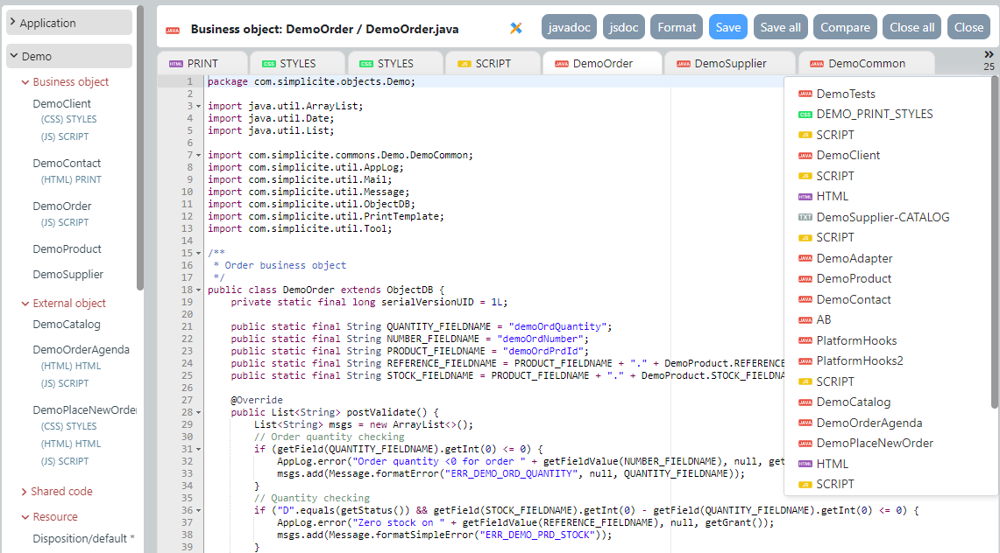

- New sub-filter on the global search per domain

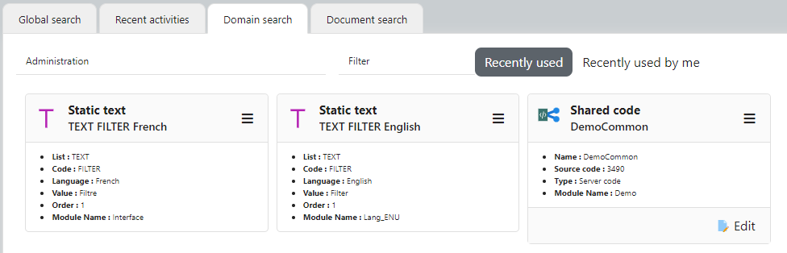

- Merge screen with links picker to limit relationships to merge (not available on meta-links)

- New Image field rendering:
	- Take a picture (ex: expense report on mobile)
	- Take a selfie (ex: customer profile)
	- Signature dialog or inlined into form (ex: sign a receipt)
	- Scratch pad (simple note)

Take a picture

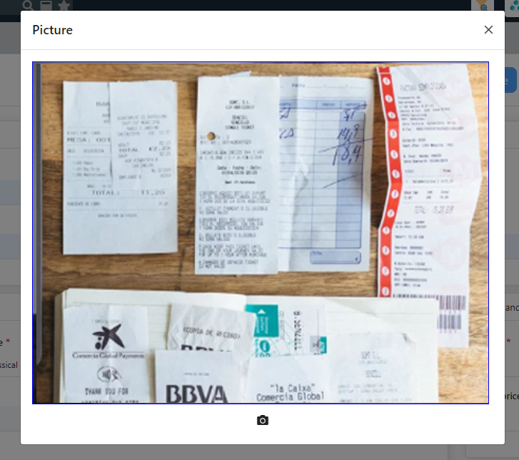

Image with signature in a dialog

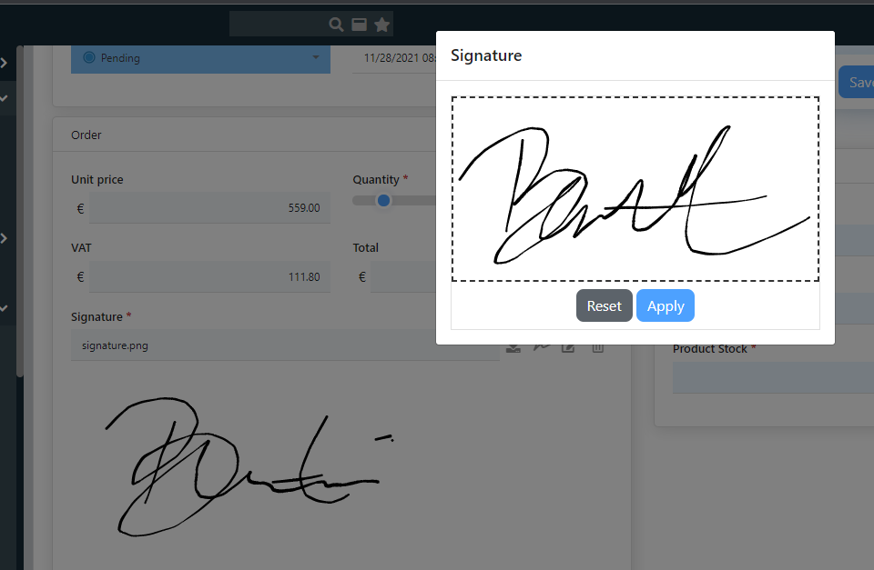

Embedded signature into form

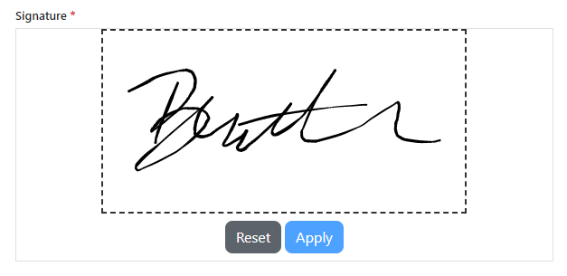

Scratch pad

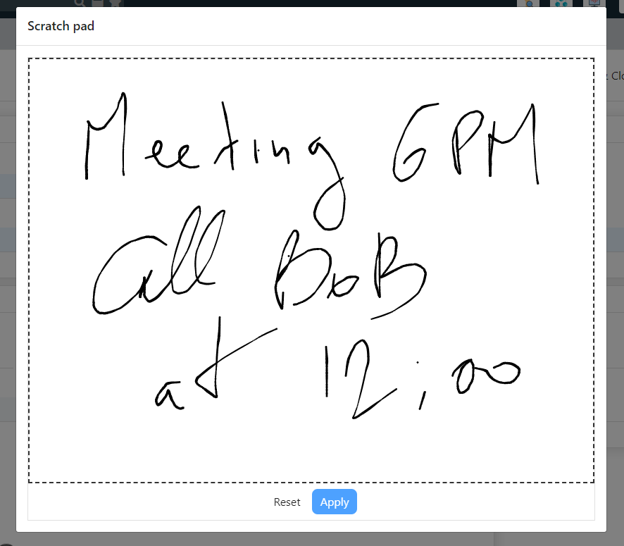

- New **menu** features
	- Count simple ENUM per code in menu (as status)
	- Sub-menu per ENUM in case of multiple lists or status
	- Allows access to referenced ENUM

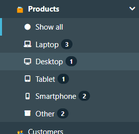

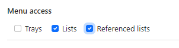

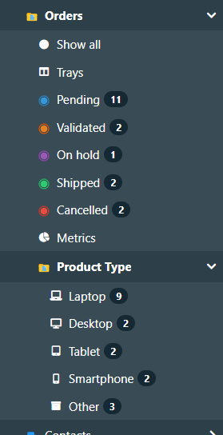

- **Action style**: added color + background on buttons

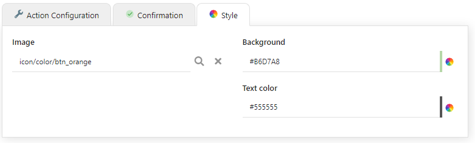

- New view item to insert a **Sub-view** in a View

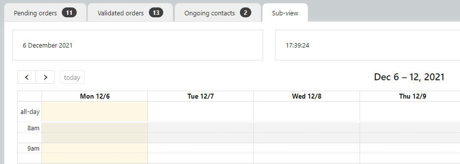

- `Shortcut` visibility refactoring to allow displaying as plain button in header

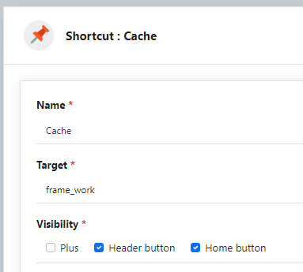

- Agenda/Fullcalendar
	- Access to search dialog
	- Use the first colored enum on events

- Draggable dialog box (on bootstrap 5 only)
- Refactored place map: added dedicated API services + used in generic UI
- Added Min/Max times and End date field in Agenda model
- Added the `moment-timezone.js` lib
- New UI parameter `Simplicite.UI.Globals.form.titleMax = 120`
- It is now possible to override the Ace editor theme at the `Theme` system object level
- Modeler of business objects can show/hide referenced fields
- Optimized list export to POI/CSV/PDF/ZIP without a long Ajax request
- Support tree rendering in panel with a reflexive child object

- Supports Number/Date formats
	- per language: see the List `FORMAT/NUM` and `FORMAT/DATE`
	- per user: to override the language format

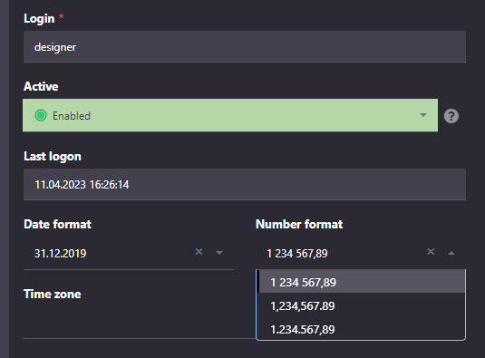

- State transitions are accessible on list rows when the action has `type = Form + Rows`

<h2 id="postrelease">Post-release</h2>

<h3 id="version-5.3.0">5.3.0 (2023-04-24)</h3>

- Initial release for minor version 5.3. See above for details.

<h3 id="version-5.3.1">5.3.1 (2023-05-02)</h3>

- Fixed "more" button with user's preference on list
- Fixed SQL-injection vulnerabilities and increased robustness
- Improved error responses on the API endpoint

<h3 id="version-5.3.2">5.3.2 (2023-05-09)</h3>

- Improved N-N relationships pillboxes
- Improved reflexive relationships treeviews
- Added audit purge before rescanning
- Fixed missing Jakarta lib for emails
- Improved JWT nonce checking for OpenIDConnect auth providers
- Added nonce support for internal authentication

<h3 id="version-5.3.3">5.3.3 (2023-05-15)</h3>

- Fixed `hasChanged` on big decimal during `form.onload`
- Fixed print template with empty `getSelectedIds` in case of separate browser window/tab
- Fixed duplicated transition buttons on embedded list
- Explicit warning when /events is requested over HTTP
- Disabled by default the JWT nonce checking for OpenIDConnect auth provider (as some providers does not ebnable it by default)

<h3 id="version-5.3.4">5.3.4 (UNRELEASED)</h3>

- Backported distances tool methods in `Tool`
- View editor allows to remove the chart option
