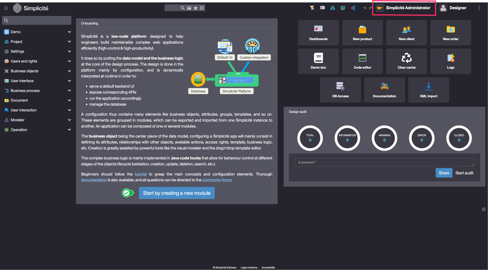
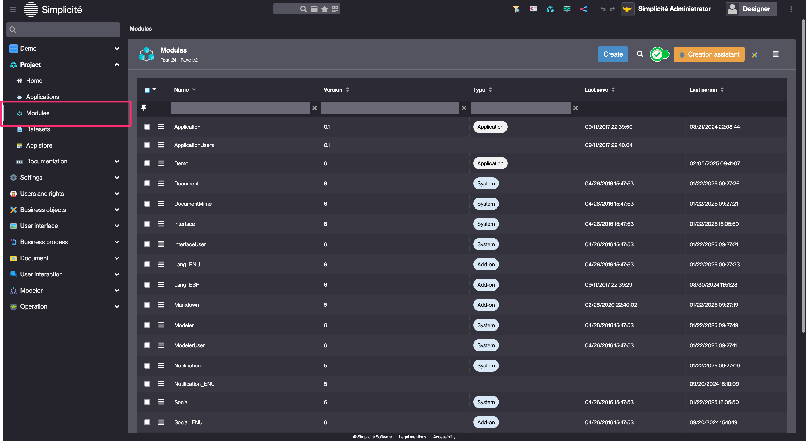

Module
====================

### What is a Module ?

Each configuration of an app starts with the creation of a module.

**All the configuration objects are part of a module, corresponding to the export unit of Simplicité**.

Simplicité is configured via **configuration objects** that provide the description of the application. These objects are business objects, fields, templates, actions, etc. E.g. Developers create their application on a development instance and export their module on a production instance.

### How to create a Module ?

#### Minimal configuration suggestion : 
| Field | Description |
| ----- | ----------- |
| **Name** | Unique identifier of your module (generally the name of the application) |
| **Prefix** | Module trigram used for naming conventions |

To facilitate the first steps, a module creation process is available in Simplicité, it allows to create a module, groups, a domain and a scope.

You can access the process directly from the Simplicité Administrator Home page :

Or from the list of Modules :

