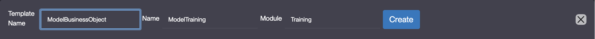
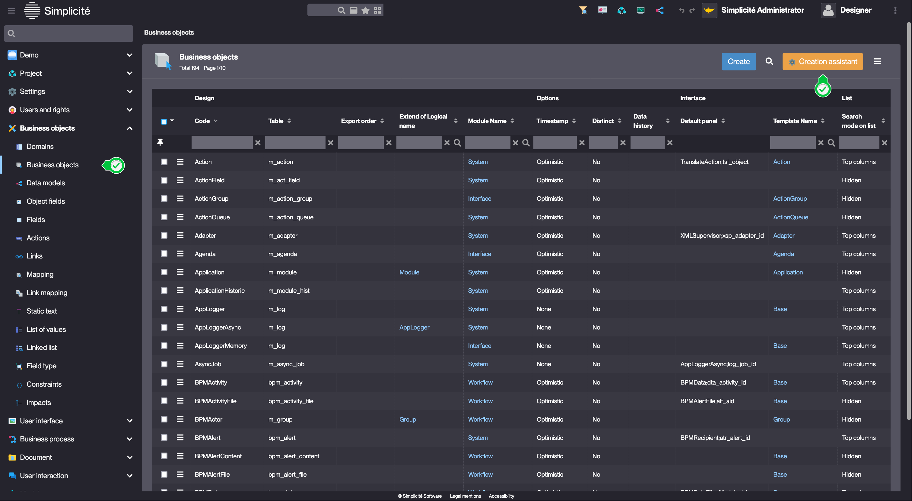
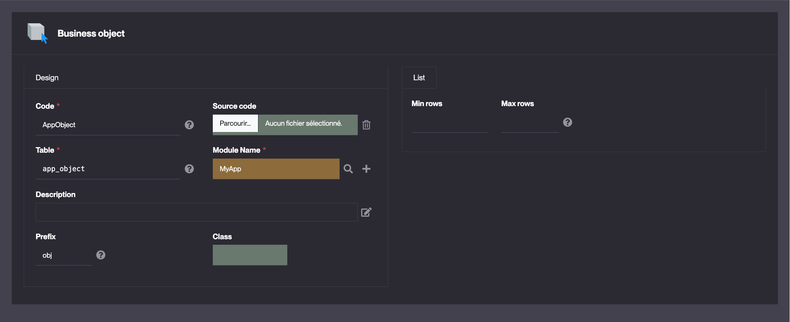

Business object
====================

### What is a Business object ?

Business objects represent real-world entities or concepts within an application, such as a **Client**, **Product**, **Invoice**, or **Employee**. They typically consist of multiple **attributes**, maintain relationships with other business objects, and follow specific **business logic**. For instance, once an invoice is sent to a client, its items may no longer be editable.  

As explained in the [object tutorial](/lesson/tutorial/configuration/object), the **business object** concept is central to Simplicité's meta-model.  

Business objects are usually linked to a database table, enabling standard **Create, Read, Update, and Delete (CRUD)** operations. Additionally, they may include processing logic (code, constraints, etc.) to enforce behavior and data integrity. However, some objects are not tied to a table:  

- **[Select objects](/lesson/docs/core/objects/select-objects)** – based on SQL queries  
- **Service objects** – interact with external services

Since business objects form the foundation of the platform, most functionalities revolve around them, including:  

- Search  
- Lists  
- Forms
- Scripts
- Publications
- And more...

Additionally, business objects can include **business rules** to precisely control their behavior.

### How to create a Business object ?

We **highly** recommend you use the business object **creation assistant** to create a Business object. 

#### Creation assistant via the modeler 

1. Open the modeler :  

2. Create or select a previsouly created *ModelBusinessObject* model :
    - For creation, fill in the header of the pop-up and click **Create** : 
        > Example values :   
        
3. Right click on the opened modeler window and select **Add > Create Business object**. This will start the creation assistant.

#### Creation assistant via the Business object list

1. Access the list of Business objects :
    - Business objects > Business objects  
    
2. Click **Creation assitant**
3. Fill in the Object information and click **Create** :  
    > Example values :  
    
4. Fill in the Translation for your Object and click **Next**:
    - These are the labels that will be displayed in the user interface. *NB: using "|" allows the use of the plural form (label used for lists)*
5. If applicable, select a Function for each previously created Group(s) and click **Next**
6. If applicable, add the Object to the previously created Domain(s) and click **Next**

The Business object is created and opened. 
