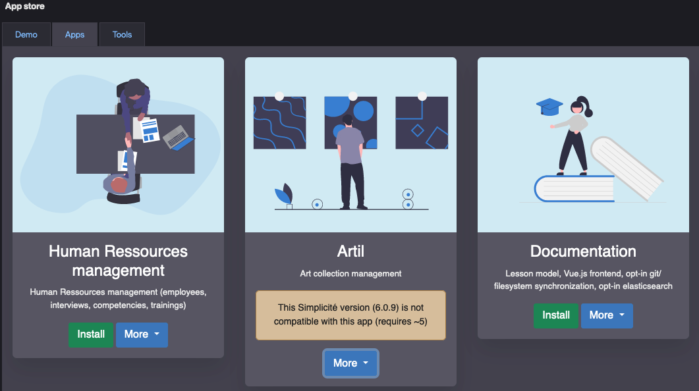
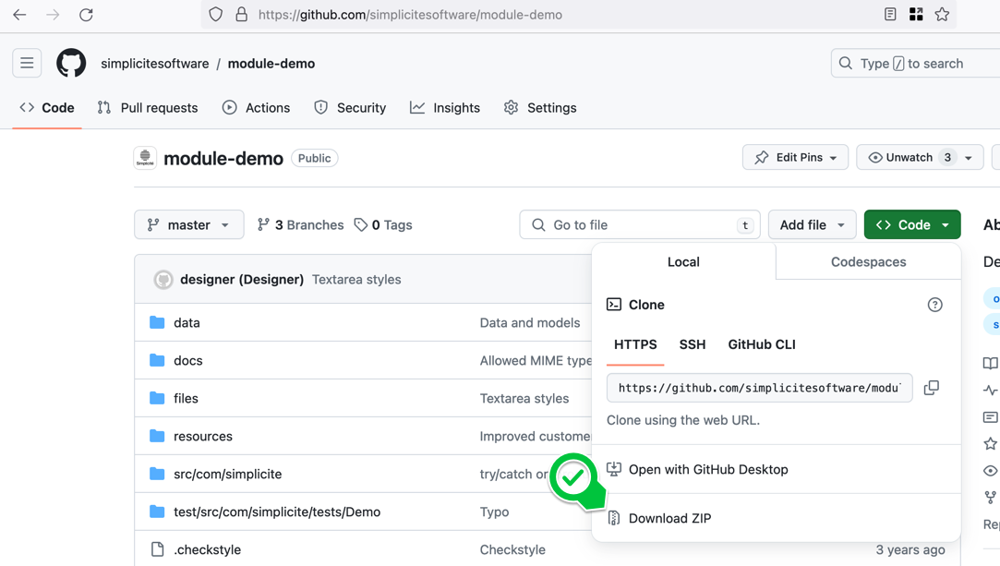

App Store
====================

The app store (domain *Project > App store*) allows installation of modules. It is based on declarative JSON files giving all necessary information for Simplicité to install that module.

As a reminder, that minimal information is:
- the name of the module
- a source to install from (usually a URL for the zipped module or the URL to the GIT repository)

The JSON also includes some extra information usefull to the designers who will visit the AppStore :
- an image
- a title
- a description
- a URL to get extra information

A store JSON file will thus typically look like this:

```json
{
	"date": "2022-06-08",
	"name": "Demo",
	"apps": [
		{
			"name": "Demo",
			"logo": "https://cdn.jsdelivr.net/gh/simplicitesoftware/module-demo@latest/resources/Disposition/default/demo-module.svg",
			"description": "Order management demo",
			"url": "https://simplicitesoftware.github.io/module-demo/",
			"module_name": "Demo",
			"settings_by_platform": {
				"~5": "{ \"type\": \"git\", \"origin\": { \"uri\": \"https://github.com/simplicitesoftware/module-demo.git\" } }",
				"~6": "{ \"type\": \"git\", \"branch\": \"v6\", \"origin\": { \"uri\": \"https://github.com/simplicitesoftware/module-demo.git\" } }"
			}
		}
	]
}
```

<details>
<summary>Configuration in versions < 6.0 </summary>

```json
{
	"date": "2022-06-08",
	"name": "Demo",
	"apps": [
		{
			"name": "Demo",
			"logo": "https://cdn.jsdelivr.net/gh/simplicitesoftware/module-demo@latest/resources/Disposition/default/demo-module.svg",
			"description": "Order management demo",
			"url": "https://simplicitesoftware.github.io/module-demo/",
			"module_name": "Demo",
			"module_settings": "{ \"type\": \"git\", \"origin\": { \"uri\": \"https://github.com/simplicitesoftware/module-demo.git\" } }",
			"min_version": "5.1",
			"max_version": "5.3"
		}
	]
}
```

</details>

Ultimately, the source to install from is fed to the **Settings** field of the module. Starting from Simplicité 6.0, different settings can be provided depending on the version of the platform using [NPM's semver range syntax](https://www.npmjs.com/package/semver#hyphen-ranges-xyz---abc). This means that if a module is tested in a given version, it's specifiable in the store, and it will appear as not installable with the appropriate error message for the designer: 



Stores are configured through the `STORE_SOURCE` setting, which default to Simplicité's stores:

```json
[
	"https://cdn.jsdelivr.net/gh/simplicitesoftware/resources@latest/public/appstore_demo.json", 
	"https://cdn.jsdelivr.net/gh/simplicitesoftware/resources@latest/public/appstore_apps.json",
	"https://cdn.jsdelivr.net/gh/simplicitesoftware/resources@latest/public/appstore_tools.json"
]
```

The idea behind that is that it makes it possible to easily share modules to an organisation's pool of designer (for example, an authentication module that will be shared by all of the organisation's apps).

It also makes it possible to clone Simplicité's modules and stores to make them available on a network disconnected from the public internet.

> It's pretty easy to download modules as directly installable ZIPs from Github and upload them on a private network with a modified version of our stores.
> 