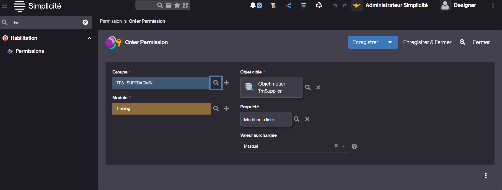

Permissions
==========================

Since version 6.0, permissions have replaced functions for several objects of the metamodel.  

Function is now dedicated to business objects only.  

<h2 id="Concept">Concept</h2>

A permission is a business object of the metamodel that contains an object-type attribute.  This makes it possible to create permissions for a list of designated objects.  
The designated objects are :   
- Agenda  
- Domain  
- External object  
- Link  
- Modeltemplate  
- Pivot table  
- Places map  
- Publication  
- Search  
- Shortcut   
- Simple view  
- Timesheet  
- Tree view  

For these objects, they replace functions by overloading the object's Visible property and offers the possibility to grant to rights groups.  

But it's also possible to create permissions for  
- Business object
- Field  
- Object Field 

For these objects, they allow properties to be overloaded and only authorized to one or several rights groups.  
In this sense, they can replace certain constraints.

For example, overriding the list update property of a business object to specific rights groups.  
For example, only allow certain groups to see a field, ...etc.

<h2 id="howto">How to create a permission</h2>

For all the objects listed above, you will see the Permissions panel, which allows you to create permissions.  
Alternatively, use the menu search bar to find where the permissions configuration is hidden.  

