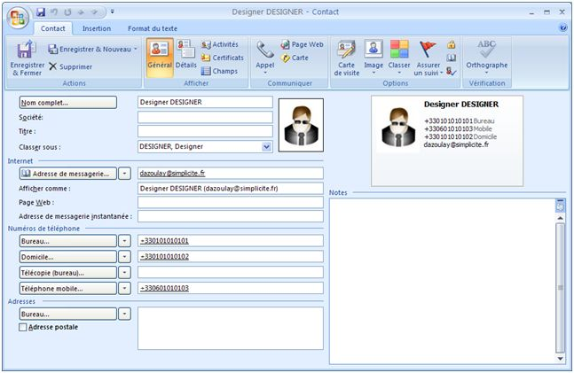

Publication examples
====================

Ths document gives various examples of business object publications. Most examples are using the server-side **Rhino** scripting language.

> **Note**:
>
> The **Rhino**-only code examples can easily be transposed to equivalent **Java** code.
> Some examples are provided both in Rhino and Java so as you can see the syntax differences.
>
> Apart from the variable and methods declarations syntax, the main point of attention is regarding comparisons syntax for **non raw types**:
>
> - Rhino: `a == b`, Java: `a.equals(b)`
> - Rhino: `a != b`, Java: `!a.equals(b)`

Print template types
--------------------

Publication templates can use 3 processing mechanism:

- Substitutions in a text template (suitable for any text-based publication HTML, XML, CSV, ...)
- Substitutions in a document template (same as above except that the template is a document)
- Calling a custom method

The 2 first examples below are using substitutions, the last examples are using custom methods.

vCard publication
-----------------

If a business objects includes identity data it may be published as a vCard
to be imported on contact management systems, e-mail clients, mobile devices, ...

An example of vCard publication (using a dedicated publication template) is provided on the standard `User` object:

```plaintext
[BEGIN]
BEGIN:VCARD
VERSION:2.1
N:[VALUE:usr_last_name];[VALUE:usr_first_name]
TEL;CELL:[VALUE:usr_cell_num]
TEL;WORK;VOICE:[VALUE:usr_work_num]
TEL;HOME;VOICE:[VALUE:usr_home_num]
EMAIL;PREF;INTERNET:[VALUE:usr_email]
UID:[VALUE:usr_login]
ADR;WORK:;[VALUE:usr_address2];[VALUE:usr_address1];[VALUE:usr_city];[VALUE:usr_state];[VALUE:usr_zipcode];[VALUE:usr_country]
PHOTO;ENCODING=BASE64:[EXPR:res = DocumentDB.toBase64(obj.getField("usr_image_id").getValue(), obj.getGrant());]
END:VCARD
[END]
```

Note the usage of a `DocumentDB` API for inlining the user picture as a base 64 encoded string,
the global `[BEGIN]` / `[END]` publication template statements allows to export multiple vCards
at the same time (beware that this bulk import is not possible with every e-mail clients).

For instance the import of published data renders as follows in Microsoft Outlook&reg;:



RSS publication
---------------

The simplest approach for publishing business object data as a RSS feed
is to configure a publication template such as the one used by default for
the `WebNewsobject` (publication template name is `WebNewsAsRSS`):

```xml
<?xml version="1.0" encoding="UTF-8"?>
<rss version="2.0">
	<channel>
		<title>[LABEL:WebNews]</title>
		<description>[LABEL:WebNews]</description>
		<generator>Simplicite</generator>
		<ttl>15</ttl>
[BEGIN]
		<item>
			<title><![CDATA[[VALUE:nws_title]]]></title>
			<description><![CDATA[[VALUE:nws_description]]]></description>
			<pubDate>[VALUE:nws_date]</pubDate>
		</item>
[END]
	</channel>
</rss>
```

If the RSS is to be public the object must be granted in read mode
to the `PUBLIC` group, so as the publication template.

<h2 id="singlerecord">Single record (form or list item) publication</h2>

<h3 id="textcontent">Custom method for text content</h3>

The example below is for a simple printable HTML content:

```javascript
MyObject.myPublicationMethod = function(pt) {
	try {
		var t = this.getFieldValue("myTitleField");
		var out = HTMLTool.openSimplePage(t, null, null);
		out += HTMLTool.cssBlock("@media print { @page { size: portrait A4; margin: 0; }");
		out += "<h1>" + pt.getLabel() + ": " + t + "</h1>";
		out += "<p>" + this.getFieldValue("myHTMLContentField") + "</p>";
		out += HTMLTool.closePage();
		return out;
	} catch(e) {
		console.error(e);
	}
};
```

> For **text** contents the return type of method **must** be `String`

<h3 id="binarycontent">Custom method for binary content</h3>

The example below is for a simple PDF content using the iText&reg; library and its wrapper tool (publication template MIME type must be set to PDF):

```javascript
importPackage(Packages.com.lowagie.text);

MyObject.myPublicationMethod = function(pt) {
	try {
		var out = new java.io.ByteArrayOutputStream();
		var pdf = PDFTool.open(out);
		pdf.add(new Phrase(this.getFieldValue("myTextContentField")));
		PDFTool.close(pdf);
		return out.toByteArray();
	} catch(e) {
		console.error(e);
	}
};
```
The example below is for a simple Microsoft Excel&reg; content using the Apache POI&reg; library and its wrapper tool (publication template MIME type must be set to XLS):

```javascript
MyObject.myPublicationMethod = function(pt) {
	try {
		var xls = new ExcelPOITool(); // or ExcelPOITool(true); as of version 4.0, the true argument means using XLSX format
		var s = xls.newSheet(this.getLabel());
		var r = xls.newRow(0);
		r.add(xls.newCell(0, this.getFieldValue("myLabelField")));
		r.add(xls.newCell(1, this.getField("myValueField").getDouble()));
		s.add(r);
		xls.add(s);
		return xls.generateToByteArray();
	} catch(e) {
		console.error(e);
	}
};
```

The example below is for a simple Microsoft Word&reg; content using the Docx4j&reg; library (publication template MIME type must be set to DOCX):

```javascript
importPackage(Packages.org.docx4j.openpackaging.packages);
importPackage(Packages.org.docx4j.openpackaging.parts.WordprocessingML);

MyObject.myPublicationMethod = function(pt) {
	try {
		var pkg = WordprocessingMLPackage.createPackage();
		var doc = pkg.getMainDocumentPart();
		doc.addStyledParagraphOfText("Title", this.getDisplay());
		doc.addParagraphOfText(this.getFieldValue("myTextField"));
		var res = new java.io.ByteArrayOutputStream();
		pkg.save(res);
		return res.toByteArray()
	} catch(e) {
		console.error(e);
	}
};
```

> For **binary** contents the return type of method **must** be `byte[]`

<h2 id="multiplerecords">Multiple records (list) publication</h2>

For list publications you must handle the list of explictly selected records **and** the case where no record has been explicitly selected.

Example:

```javascript
var rows = new ArrayList();
var ids = this.getSelectedIds();
if (!Tool.isEmpty(ids)) {
	for (int k = 0; k < ids.size(); k++) {
		if (select(ids.get(k)))
			rows.add(getValues());
		} else {
			rows = this.search(false);
		}
	}
}
```

Then you can process the `rows` variable
