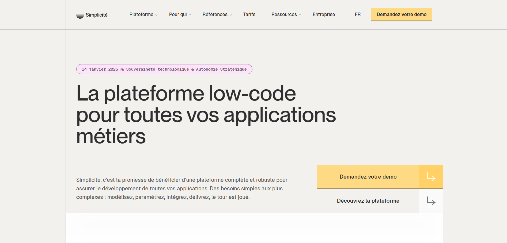
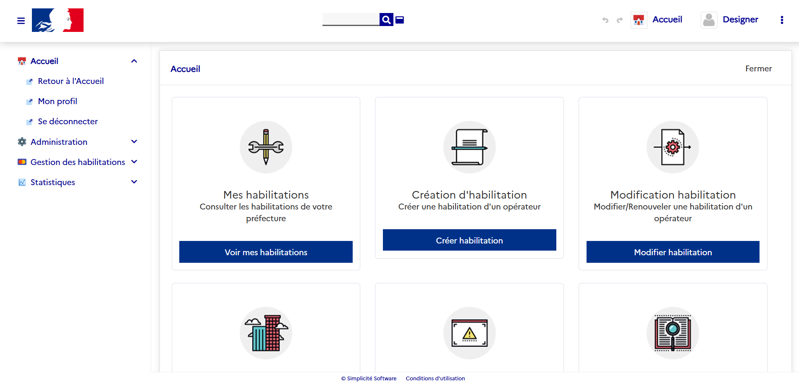
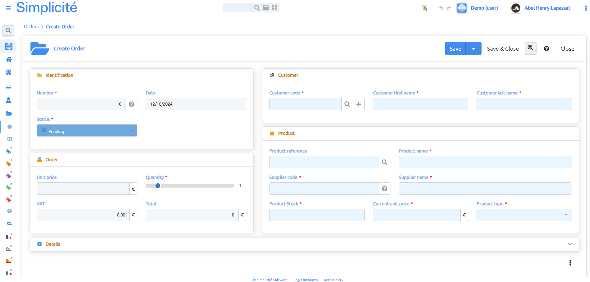
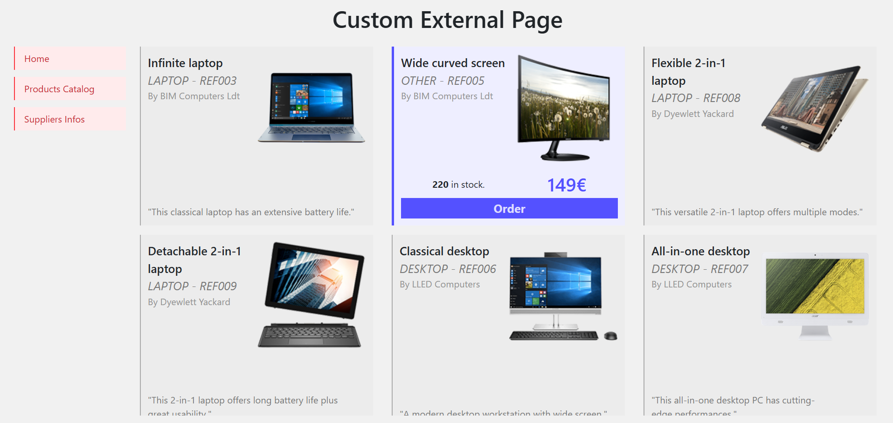
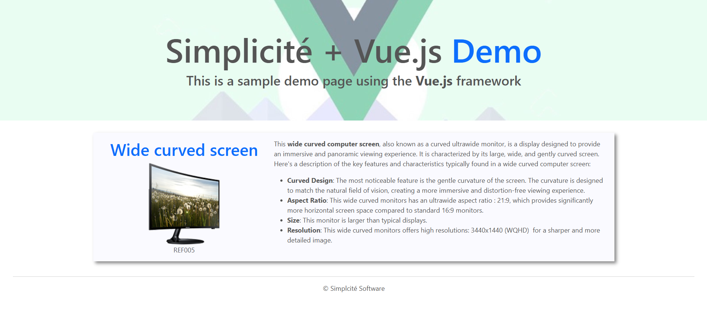
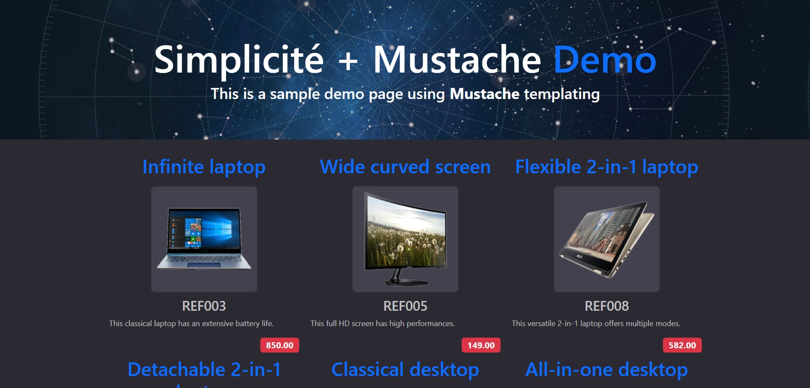
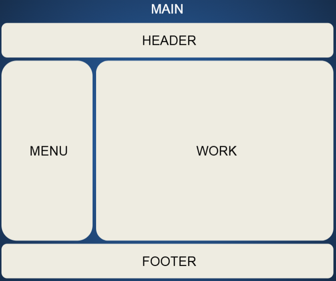

Introduction to Frontend Dev
============================

    This lesson is a part of the <b>Frontend Development</b> category, which is meant to guide you through the frontend development within Simplicité. Thus it might be a bit longer and more verbosed than other lessons you will find in the <b>Simplicité Configuration Object</b> category.

This document presents Simplicité's tools and functionalities that can be used to *customize your UIs* and implement your own designs or looks while still accessing all of Simplicité's back-office features.

## Target Users

The presented functionalities may be used mainly by *web-designers* or *frontend-developers*, in order to possibly answer specific needs that are not covered by Simplicité's default interface.
Most of the following concepts are relying on *web development*, involving both basic web architectures with **HTML**, **CSS** & **Javascript** and more peculiar technologies like *web frameworks*, *CSS preprocessors*.

## Use Cases

The use of such features can be encountered due to various needs, or specific use cases. Those can vary from simple custom widgets within Simplicité's UI to external webpages with access to all of Simplicité's back-office features.

### Visual identity & design guidelines

<!--  -->

When integrating a Simplicité's instance into an existing system with a *distinct identity*, or specific *design guidelines*, you have the possibility to customize and align your instance's UI to those in order to ensure ease of use and familiarity for end-users.

These customizations can extend to the layout and organization of your Simplicité application.

**Example**: the government's interfaces shall follow the *DSFR design guideline*, so they need to align their Simplicité's interface to match it's rules.

<!--  -->

### Client-oriented interfaces

<!--  -->

If your solution is *client-oriented*, you may benefit from creating a *custom front-end* that is tailored to meet the specific needs of your end-users and possible customers. For example you can want your client to be immersed in a specific environment if you wanna apply some specific marketing strategies or user-oriented designs. The idea is that Simplicité will allow you to customize the fronts of your applications, and even take them outside of the solutions if you don't want to mix anything together. 

There are numerous possibilities, but a common example is the one of having products and client ordering them, this is a workflow allowed by Simplicité by default (accessible & illustrated in the *Demo* module). But you could want a specific experience for your customers, for example to preview videos or very specific visualisations of your products. Another possibility is that you want your interfaces to contain widgets or layouts that you've already designed --also maybe implemented-- that you really want to include.

**Example**: in case of a system or application containing orders, possibly emitted by clients, you might benefit from having a minimalist webpage using a more *user-friendly* interface than Simplicité's default one.

<!-- 
 -->

### Use of specific web technologies

If your teams or organization are committed to a specific technical solution (web frameworks or templates) for design and integration, then you might want to format your interfaces to simplify and optimize the internal development and evolution of your solutions.

**Example**: it is possible that your teams are more comfortable with specific web frameworks like **VueJs**, or even templating frameworks like **Mustache**. Simplicité then allows you to use those to design and develop your specific interfaces.

<!-- 
 -->

## Disposition

In order to properly manipulate and customize your Simplicité applications, it is important to understand how it is organized and rendered. Starting with the **Disposition**, being responsible for serving several **front elements**:

### Major HTML blocks

<!--  -->

* **HEADER -** remains visible and accessible whatever you are displaying, usually contains a set of necessary shortcuts and features that you want to access anytime such as:
- Global Search Tool
- Scope Navigation
- Shortcuts Dropdown
- User Informations
- Parameters Menu

* **MENU -** contains all your application's sections, with sub-menus and categories, it helps you to intuitively navigate through your applications. You can also embed specific features and categories (trays, typed items, ...).

* **WORK -** this represents the main area of interest, where all dynamic content is displayed, indeed it is the biggest one. That's where any of your search or navigation result will appear and be interactible with.

* **FOOTER -** this last parts serves to add some specific links that less users would access but that are still mandatory, like Legal Mentions and Accessibility features.

## Agenda

This part of the documentation follows the following organization and flow:

0) This introduction document.
1) Presentation of the [Theme Editor](https://docs.simplicite.io/lesson/docs/front/theme) tool, allowing you to customize the themes and styles of you applications, all within Simplicité's solution.
2) Overview of the [complementary tool](https://docs.simplicite.io/lesson/docs/front/styles) for theming, allowing you to add even more precise customizations to your applications.
3) Guide through the [javascript development](https://docs.simplicite.io/lesson/docs/front/javascript-dev) in Simplicité, both outside with the *NPM Library* and inside with the *External Objects*.
4) Breakdown of the [Ajax Library](https://docs.simplicite.io/lesson/docs/front/lib-ajax) that is useful for javascript development as it presents the core functions and methods to navigate and manipulate Simplicité's concepts and objects.
5) An understanding of how to create [Custom UI Components](https://docs.simplicite.io/lesson/docs/front/ui-components), breaking down the processes and techniques to do so using Simplicité's  *External Objects* and some *Web Development*.
6) An extension of *UI Components* to now make those objects outside of Simplicité, creating [external webpages](https://docs.simplicite.io/lesson/docs/front/web-page) that communicates with Simplicité's backend and allow for even more customized fronts.

Still it is roughly organized in 2 parts, presenting first the basic and very accessible customizations, then delving into more tech aspects of customizations and adressing to web and frontend developpers. All documents are overall independent from each others if your need is only one specific concept, but it is also possible to read them in the right order and get a progressive understanding of how to customize and adapt your Simplicité applications.

### Other relevant lessons

Don't hesitate to also check on other lessons that are relevant for the presented concepts and features,: 

* [*External Objects (Tutorial)*](https://docs.simplicite.io/lesson/tutorial/development/external-object)  
* [*Responsive UI (Documentation)*](https://docs.simplicite.io/lesson/docs/ui/responsive)  
* [*Custom UI disposition (Documentation)*](https://docs.simplicite.io/lesson/docs/core/disposition-code-examples)  
* [*Core Javascript (Documentation)*](https://docs.simplicite.io/lesson/docs/core/javascript-code-examples)  
* [*Interface tool `$ui` (Documentation)*](https://docs.simplicite.io/lesson/docs/core/ui-tools-code-examples)  
* [*Custom Services through External Objects (Documentation)*](https://docs.simplicite.io/lesson/docs/integration/webservices/custom-services)  
* [*Ajax API (Documentation)*](https://docs.simplicite.io/lesson/docs/integration/librairies/ajax-api)  
* [*External Objects (Tutorial)*](https://docs.simplicite.io/lesson/tutorial/development/external-object)  
* [*Responsive UI (Documentation)*](https://docs.simplicite.io/lesson/docs/ui/responsive)  
* [*Custom UI disposition (Documentation)*](https://docs.simplicite.io/lesson/docs/core/disposition-code-examples)  
* [*Core Javascript (Documentation)*](https://docs.simplicite.io/lesson/docs/core/javascript-code-examples)  
* [*Interface tool `$ui` (Documentation)*](https://docs.simplicite.io/lesson/docs/core/ui-tools-code-examples)  
* [*Custom Services through External Objects (Documentation)*](https://docs.simplicite.io/lesson/docs/integration/webservices/custom-services)  
* [*Ajax API (Documentation)*](https://docs.simplicite.io/lesson/docs/integration/librairies/ajax-api)  
* [*Simplicité NPM Javascript API Doc*](https://simplicitesoftware.github.io/javascript-api/)
