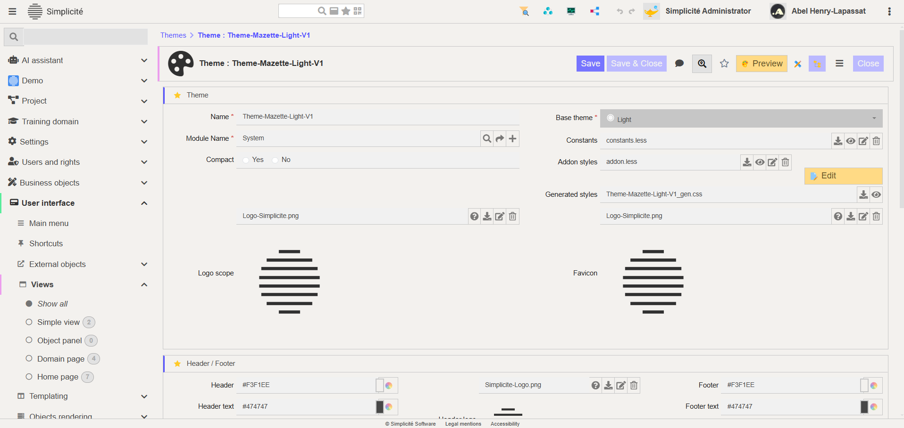
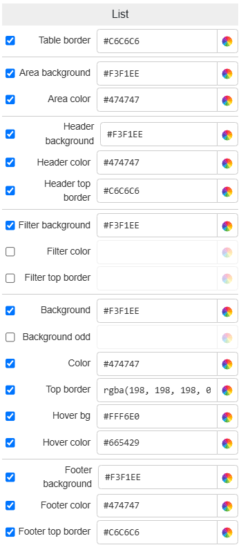

Theme Editor presentation and overview
======================================

This document presents the **Theme Editor** tool of Simplicité, and explains how it works, illustrating its features and the possible customizations you can perform when using it.

This tool will allow you to customize the theme of your instance (both designer and user) according either to your personal tastes or specific guidelines or identity.

## Tool Overview

Theme Editor is accessible from the themes list *User Interface > Themes*, when selecting an existing theme using the *Preview* button.

This tool allows you to customize your instances design globally, giving you control over all of the elements' style.

**Example**: here are few example already created and available in the default Simplicité's solution.

* **ThemeAdmin**: main administrator theme created with `Dark Base`, used mainly by Simplicité's administrator or *designer users*.

* **ThemeDesign**: theme made up from `Light Base` this theme is the equivalent of the *ThemeAdmin* for users that would prefer light mode.

* **ThemeEtat**: this theme is created based on the *DSFR* design norms from & for french government. It is applied to there solutions in order to follow specific rules of contrasts and spacings.

> 2 new themes (Dark & Light) are coming, matching the Simplicité's new look & identity !

### Theme Creation

When creating your own themes, you first need to select the base theme which you will override with your own styles:
- **Dark Base:** contains all base values for a dark theme, keeping it simple so everything is easily overridable for your own theme.

- **Light Base:** contains all base values for a light theme, keeping it simple so everything is easily overridable for your own theme.

- **Default Base:** similar to both above, more alike with the *Light Base*, thus this one is slightly more refined than both others. 

> None of the base theme are actually meant to be used, those simply vows to contain the basic bricks for you to create new themes.

### Styles Organization

After creating and saving your themes, the styles are compiled, and you can see that files were added to your theme, they serve to apply your styles through all selected interfaces, there are 3 of them:

1 - `constants.less`: this file is the result of what you applied in the *Theme Editor*, it basically contains all the values you defined as *less constants*.
2 - `addons.less`: allows you to either override the existing styles, or to add new ones if wanted (further developed in **Addons**).
3 - `themeName_gen.css`: contains all the compiled styles from both `constants` and `addons` less files. It is the final results of all the theming work done before.

## Organization

getting back to the tool itself, it is divided in *three parts*, each hosting and representing a *key feature*. So it makes it very important to understand how each part works and how to use them all.

1 - Interface preview  
2 - Values menu  
3 - DOM path  
1 - Interface preview  
2 - Values menu  
3 - DOM path  

### Interface Preview

The Theme Editor’s Preview Section displays a *live preview* of your themes and the styles you are currently applying. It allows you to instantly see the results of your design. You can navigate through *Simplicité’s interface elements* using the tabs menu, enabling you to explore all contexts and situations with your custom styles applied.

* **Home**: presents the main shared elements across Simplicité’s UI, including the header and menu. The menu showcases various states and hierarchy cases, such as sub-menus and active domains.

* **Buttons**: unique as it combines both elements and their style options. It displays all button types available in Simplicité and allows you to customize the following properties; `background-color`, `text-color` or `icon-color`, `border-radius` and `border-width`. The button types are:
1 - ***Primary:*** represent main actions shared across various contexts and interfaces.
2 - ***Secondary:*** represent secondary or less critical actions with text labels.
3 - ***Action:*** specific to the current object or context.
4 - ***Transition:*** used for state-switching handlers for business objects or fields.
5 - ***Icon:*** represent actions using icons instead of text.

* **Panels**: contains core UI elements that structure Simplicité’s interface:
1 - ***Panels:*** Found primarily in the `WORK` section of the UI, these display the content of selected menus or objects.
2 - ***Sub-Panels:*** nest within Panels, typically containing *fields* for displayed objects.
3 - ***Tabs:*** Organize fields and are available in four layouts: *Left*, *Right*, *Top*, and *Bottom*. These layouts determine the position of tab navigation items.

* **Form**: essential components in Simplicité’s UI. They combine Panels, *Sub-Panels*, and *Tabs* to organize `fields and inputs. The types of customizable fields include:
1 - ***Field:*** casual element for text inputs within objects' forms.
2 - ***Readonly:*** non-editable fields displaying static information.
3 - ***References:*** editable link to other objects or data.

Other input types, such as radio buttons, dropdown menus, or code editors, are not customizable in the Theme Editor. However, they adapt their styles based on the selected `base theme`.

* **List**: core element in Simplicité, appearing at various levels of the UI. They display rows of data in table format and can be customized for style consistency.

* **Dialog**: pop-up interfaces used for confirmations, alerts, or additional inputs. They can be styled to align with the overall theme. Similar look to panels and sub-panel, but are meant to contain easily understandable contents with clear actions at hand.

* **Addons**: provides customization options for external plugins or integrations, ensuring a cohesive design across additional functionalities. This is the `addon.less` file mentionned above

### Styles Values Menu

The Styles Menu section allows you to actually change the values of the elements displayed in the Preview, in this menu you'll have access to the presented elements per category, making it easier to navigate through styles. The different sub-sections so are each related to a preview section, making it it more intuitive to design, emphasizing on the context of items and their cohenrency.
In each of the section, you'll be given control of the following style variables and values:
1 - **BACKGROUND:** for all elements' backgrounds you'll be able to choose the `color` and `opacity`.
2 - **TEXT:** you have control hover the `fonts` you wanna apply, but also the overall `size` of it. Then for each elements you can modify the `color` & `opacity` of your texts.
3 - **BORDER:** for all the elements you can first select if a border is *displayed or not*, and then it's `color` and `opacity`, but also the `border-radius` for some elements.
4 - **HOVER:** available for some of the *interactive elements*, you can define the styles while beeing hovered, such as the `background-color` and `text-color`.

Here is a detailled list of the menu's sub-section and the specific elements they cover:

* **Base**: here are defined the styles of the basic elements for your theme, such as the main background color, but also the font and the shared spacings for all elements (to make it consistent).

| Element            | Style Value            | Value Range / Description                                                                                                                                              |
|--------------------|------------------------|------------------------------------------------------------------------------------------------------------------------------------------------------------------------|
| Theme              | Base Theme             | { Light, Dark, Default }: defines the base constants and variables on which your whole theme will be based on                                                          |
| Theme              | 'Compact'              | Yes/No: defines wether the space on screen is spread or restrained.                                                                                                    |
| Font               | Font Family            | Name of a Google Font or another font resource. Applied to all texts.                                                                                                  |
| Font & Icons       | Size                   | [50;200]: defines the base size of these elements throughout the UI.                                                                                                   |
| Contents           | Padding X              | [0;300]: defines the padding-left of all elements displayed in different containers (texts, sub-panels, ...), without affecting container's width.                     |
| Contents           | Padding Y              | [0;300]: defines the padding-top & padding-bottom of all elements displayed in different containers (texts, sub-panels, ...), thus modifying container's height.       |
| Background         | Color                  | Any: defines the color of your whole background, noticeable mainly on the `WORK` part of the UI.                                                                       |

* **Main**: in this section you will define the values for the permanent elements in your Simplicité instances' UI, such as the header, footer and also the navigation breadcrumb.

| Element               | Style Value            | Value Range / Description                                                                                                                                              |
|-----------------------|------------------------|------------------------------------------------------------------------------------------------------------------------------------------------------------------------|
| Header Logo           | Image File             | Any: this will be the image placed at the very left of your Simplicité's header bar.                                                                                   |
| Header Logo           | Color Invert           | Yes/No: says if the logo shall be inverted or not.                                                                                                                     |
| Navigation Breadcrumb | Background Color       | Any: defines the background color of your navigation breadcrumb (top-left of your **WORK** UI section).                                                                  |
| Navigation Breadcrumb | Text Color             | Any: defines the colors of the texts composing your navigation breadcrumb.                                                                                             |
| Header Bar            | Background Color       | Any: defines the color of your header's background only (rendered on top of the general background), header is full width of your window.                              |
| Header Bar            | Text Color             | Any: defines the colors of the texts composing your header section (all the text within).                                                                              |
| Header Bar            | Border Color           | Any: defines the colors & display of the `border-bottom` for your whole header, can be hidden by unticking the value.                                                  |
| Header Bar Searchbox  | Background Color       | Any: defines the colors of the input part for your header's searchbox (not the items aside it).                                                                        |
| Footer Bar            | Background Color       | Any: defines the color of your footer's background only (rendered on top of the general background), footer is full width of your window.                              |
| Footer Bar            | Text Color             | Any: defines the colors of the texts composing your footer section (links in it).                                                                                      |
| Footer Bar            | Border Color           | Any: defines the colors & display of the `border-top` for your whole footer, can be hidden by unticking the value.                                                     |

* **Menu**: this section allows to define the styles for the last permanent element of your instance; the main menu (located on the left), you'll be able to define all styles for embedded, active, and hovered menus as you wish.

| Element              | Style Value            | Value Range / Description                                                                                                                                              |
|----------------------|------------------------|------------------------------------------------------------------------------------------------------------------------------------------------------------------------|
| Main Menu            | Background Color       | Any: will define the background color for your menu, which is the bottom layer in this element.                                                                        |
| Inactive Menu Domain | Background Color       | Any: will define the **inactive** background color of all the domains in your main menu.                                                                                 |
| Inactive Menu Domain | Text Color             | Any: will define the **inactive** color of the text for all the domains in your main menu.                                                                               |
| Active Menu Domain   | Background Color       | Any: will define the **active** background color of all the domains in your main menu.                                                                                   |
| Active Menu Domain   | Text Color             | Any: will define the **active** text color of all the domains in your main menu.                                                                                         |
| Inactive Sub-Menu    | Background Color       | Any: will define the **inactive** background color of all the items in your domains. Which are referenced as 'sub-menus' but in fact are the items you add in a domain.  |
| Inactive Sub-Menu    | Text Color             | Any: will define the **inactive** text color of all the items in your domains. Which are referenced as 'sub-menus' but in fact are the items you add in a domain.        |                                                                                  |
| Active Sub-Menu      | Background Color       | Any: will define the **active** background color of all the items in your domains. Which are referenced as 'sub-menus' but in fact are the items you add in a domain.    |
| Active Sub-Menu      | Text Color             | Any: will define the **active** text color of all the items in your domains. Which are referenced as 'sub-menus' but in fact are the items you add in a domain.          |
| Status Menu          | Background Color       | Any: will define the **inactive** background color for the status items held in the sub-menus.                                                                           |
| Status Menu          | Text Color             | Any: will define the **inactive** textcolor for the status items held in the sub-menus.                                                                                  |

* **Panel**: in this section you will get access to the values for the panels styles, by this mean you will be able to modify only the higher level of panels. These changes are previewed in the *Panels* section of the ***PREVIEW***, with the top-left item. 

| Element            | Style Value            | Value Range / Description                                                                                                                                                                         |
|--------------------|------------------------|---------------------------------------------------------------------------------------------------------------------------------------------------------------------------------------------------|
| Panel Container    | Background Color       | Any: defines the background of your whole panel container, these elements are rendered on top of the `WORK` part of your UI. But on first layer for this element.                                 | 
| Panel Container    | Text Color             | Any: defines the color of all texts within your Panel but not contained by another element.                                                                                                       |
| Panel Container    | Border Radius          | [0;200]: defines the border radius of your Panel, so modifies the following corner; `top-left` & `top-right` from `panel-header`, and `bottom-left` & `bottom-right` from `panel-footer`.         |
| Panel Container    | Box Shadows            | [0;100]: defines the `box-shadow` value for panel items, with the following relation; 0 ~ `box-shadow: none`, 50 ~ `box-shadow: .125rem .125rem 1rem` and 0 ~ `box-shadow: .125rem .125rem 2rem`. | 
| Panel Header       | Background Color       | Any: defines the background color of your panel's header, renderer on top of the background defined at first layer for this element.                                                              |
| Panel Header       | Text Color             | Any: defines the color of all texts within the header of your panel, excluding for the ones of buttons.                                                                                           |
| Panel Header       | Bottom Border          | Any: defines the color of the header's `bottom-border`, if you want to hide the border then simply untick the value.                                                                              |
| Panel Footer       | Background Color       | Any: defines the background color of your panel's footer, renderer on top of the background defined at first layer for this element.                                                              |
| Panel Footer       | Text Color             | Any: defines the color of all texts within the footer of your panel, excluding for the ones of buttons.                                                                                           |
| Panel Footer       | Bottom Border          | Any: defines the color of the footer's `top-border`, if you want to hide the border then simply untick the value.                                                                                 |

* **Sub-panel**: this section is the exact same as previously mentionned *Panels*, but is related to the panels embedded in panels, defined as *Sub-Panels*.

| Element                | Style Value            | Value Range / Description                                                                                                                                                                              |
|------------------------|------------------------|--------------------------------------------------------------------------------------------------------------------------------------------------------------------------------------------------------|
| Sub-Panel Container    | Background Color       | Any: defines the background of your whole sub-panel container, first layer for this element.                                  | 
| Sub-Panel Container    | Text Color             | Any: defines the color of all texts within your Sub-Panel but not contained by another element.                                                                                                        |
| Sub-Panel Container    | Border Radius          | [0;200]: defines the border radius of your Panel, so modifies the following corner; `top-left` & `top-right` from `sub-panel-header`, and `bottom-left` & `bottom-right` from `sub-panel-footer`.      |
| Sub-Panel Container    | Box Shadows            | [0;100]: defines the `box-shadow` value for sub-panel items, with the following relation; 0 ~ `box-shadow: none`, 50 ~ `box-shadow: .125rem .125rem 1rem` and 0 ~ `box-shadow: .125rem .125rem 2rem`.  | 
| Sub-Panel Header       | Background Color       | Any: defines the background color of your sub-panel's header, renderer on top of the background defined at first layer for this element.                                                               |
| Sub-Panel Header       | Text Color             | Any: defines the color of all texts within the header of your sub-panel, excluding for the ones of buttons.                                                                                            |
| Sub-Panel Header       | Bottom Border          | Any: defines the color of the header's `bottom-border`, if you want to hide the border then simply untick the value.                                                                                   |
| Sub-Panel Footer       | Background Color       | Any: defines the background color of your sub-panel's footer, renderer on top of the background defined at first layer for this element.                                                               |
| Sub-Panel Footer       | Text Color             | Any: defines the color of all texts within the footer of your sub-panel, excluding for the ones of buttons.                                                                                            |
| Sub-Panel Footer       | Bottom Border          | Any: defines the color of the footer's `top-border`, if you want to hide the border then simply untick the value.                                                                                      |

* **Tabs**: that one is dedicated to tabs, elements used to display organized informations in the same placeholder but not all together, these elements are often placed & used at the same level as sub-panels.

| Element            | Style Value            | Value Range / Description                                                                                                                                                      |
|--------------------|------------------------|--------------------------------------------------------------------------------------------------------------------------------------------------------------------------------|
| Tabs Container     | Background Color       | Any: defines the background color of the first layer for this element.                                                                                                         |
| Navigation Links   | Background Color       | Any: defines the background color for the navigation links above/below or aside the tabs content.                                                                              |
| Navigation Links   | Text Color             | Any: defines the color for all text within the navigation links, so the categories' names.                                                                                     |
| Navigation Links   | Border Color           | Any: defines the color of the whole border for each navigation link, if you wanna hide it then untick the value.                                                               |
| Navigation Links   | Bottom Border Color    | Any: defines the color of the border separating the navigation links part and the content, untick to hide.                                                                     |
| Navigation Links   | Bottom Border Radius   | [0;200]: defines the value for the navigation links `border-radius`, but only for the corners not linked to the content.                                                       |
| Active Link        | Background Color       | Any: defines the background color of the active navigation link, the one that has its content displayed.                                                                       |
| Active Link        | Text Color             | Any: defines the color of the text within the active navigation link.                                                                                                          |
| Active Link        | Border Color           | Any: defines the color of the single border, if you wanna hide it then untick the value.                                                                                       |
| Active Link        | Bottom Border Color    | Any: defines the color of the border separating the active navigation link and the content, untick to hide.                                                                    |
| Tabs Content       | Background Color       | Any: defines the background color for the `tab-content` part only, rendered on very last layer.                                                                                |
| Tabs Content       | Text Color             | Any: defines the color of all informative texts within the `tab-content`, doesn't apply to buttons or text within other elements, is overriden by `text-color` from **Fields** |
| Tabs Content       | Border Color           | Any: defines the color of the border of the whole content part, untick to hide.                                                                                                |
| Tabs Content       | Shadow                 | [0;100]: defines the `box-shadow` style for the tab-content (not nav-links!), with the following range; 0 ~ `none`, 50 ~ `solid .125rem .125rem 1rem #e0e0e0`, 100 ~ `solid .125rem .125rem 2rem #e0e0e0` |

* **Field**: in both the Sub-Panels and Tabs elements, several infos are displayed, but mostly fields of various type and input features.

| Element            | Style Value            | Value Range / Description                                                                                                                                              |
|--------------------|------------------------|------------------------------------------------------------------------------------------------------------------------------------------------------------------------|
| Label              | Text Color             | Any: |
| Label              | Font Weight            | [200;900]: per hundreds, |
| Input              | Height                 | [100;400]: |
| Readonly Field     | Background Color       | Any: |
| Reference Field    | Background Color       | Any: |
| Input              | Border Color           | Any: |
| Input              | Border-Bottom Color    | Any: |
| Input              | Border-Bottom Radius   | [0;100]: |

> Except for the presented above ones, input fields are from the bootstrap library, and so aren't customizable from here. Still they are adapted to the `base-theme` you choosed. 
> You can use the `addon.less` file to override their styles anyway.

* **List**: 

| Element            | Style Value            | Value Range / Description                                                                                                                                              |
|--------------------|------------------------|------------------------------------------------------------------------------------------------------------------------------------------------------------------------|

* **Dialog**: 

| Element            | Style Value            | Value Range / Description                                                                                                                                              |
|--------------------|------------------------|------------------------------------------------------------------------------------------------------------------------------------------------------------------------|

### Path to element in DOM

This last section allows you to see the location of the interfaces elements in the actual DOM of your instance. It mainly serves for you to understand quickly how those elements are defined, their overall layout and the organization of every Simplicité's shared elements through any UI. It is coupled with the **Home**, **Form** and **List** sections of the **Preview**, as they contain elements that are identifiable through any Simplicité's interface.

In order to show an element's path, simply hover on it and its path shall be displayed as it is supposed to be in a *.less* file:

* **Home common path;** `div.main > div.simplicite.wrapper > . . . > **element.class**`.

* **Form common path;** `div.objform > div.card > . . . > **element.class**`.

* **List common path;** `div.objlist > div.card.panel-list > . . . > **element.class**`.