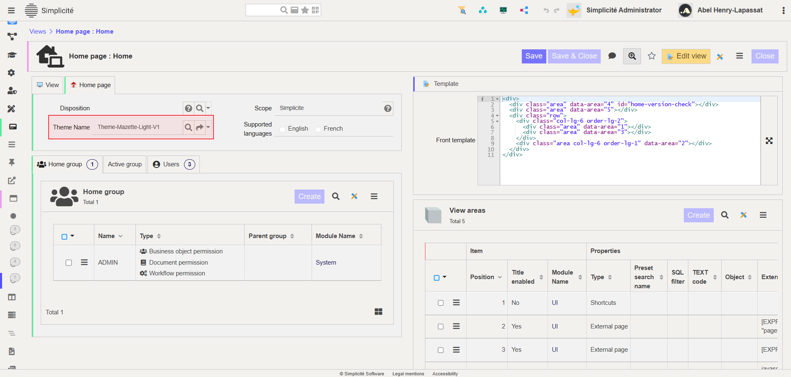

Complementary Theme Styles
==========================

This document outlines how to enhance and refine your custom or pre-existing themes using the *addon.less* file.

The *addon.less* file enables you to override or fine-tune the styles defined in the foundational files, namely *constants.less* and *theme_gen.css*. By leveraging this approach, you can create more dynamic and cohesive designs while maintaining flexibility and ease of management.

> **What is Less ?**
> Leaner CSS (Less), is a dynamic preprocessor style sheet language that extends the capabilities of CSS. It introduces features like variables, nesting, mixins and functions. Thus making style sheets more maintainable, customizable and easier to scale.

## Less Overview

### What is Less ?

Leaner CSS (Less), is a dynamic preprocessor style sheet language that extends the capabilities of CSS. It introduces features like variables, nesting, mixins and functions. Thus making style sheets more maintainable, customizable and easier to scale.

### Key Features

*Variables:* Store reusable values for colors, fonts or dimensions:
<details>
<summary>Code Snippet<summary>

```less
@primary-color: #3498db;
body {
    color: @primary-color;
}
```
</details>

*Nesting:* Write styles in a structured & hierarchical way. Allowing to specify depending on contexts when it's needed. Below are shown two ways to use nesting, and shows a use case where items with same class have different styles depending on their parent:
<details>
<summary>Code Snippet<summary>

```less
.container {
    .header {
        .box {
            background-color: red;
        }
    }
    .body > .box {
        background-color: blue;
    }
}
```
</details>

*Interactions Nesting:* Same way as nesting works for children elements or contexts, yo ucan use it to dynamically handle different type of interactions for your elements:
<details>
<summary>Code Snippet<summary>

```less
body {
    .container {
        .box {
            background-color: yellow;
            transition: background-color 0.5s ease;

            &:hover {
                background-color: orange;
            }
            &:active {
                background-color: red;
            }
        }
    }
}
```
</details>

*Mixins:* Define reusable style blocks for consistency:
<details>
<summary>Code Snippet<summary>

```less
.rounded-corners(@radius: 0.5rem) {
    border-radius: @radius;
}
div {
    .rounded-corners(1rem);
}
```
</details>

*Functions:* Perform calculations and color operations directly in your styles:
<details>
<summary>Code Snippet<summary>

```less
@primary-color: #3498db;
body {
    color: darken(@primary-color, 16%);
}
```
</details>

Combining all these features can allow you to go very far in the customization of your UI, but the use of the *addon.less* file to add more specificities should be limited to not create too much of less programming for your devs.

## Use Case for addon.less

The use of *addon.less* can be justified in case of very specific needs, in the Simplicité's identity, there are those vertical and horizontal colored lines. Which we wanted to include in one of our themes.

This will also serve to illustrate how to use the *addon.less* to add a unique style to themes.

### Process Overview

Such process can be divided in several steps:
1 - Finding the elements & their DOM path.
2 - Identifying the precise context for our style to be applied
3 - Implementing the style in the file

### 1) Finding the element

The first step after knowing what style we wanna add on top of the theme. For that you need to understand which element of the UI you are gonna modify. And to do so there are two ways to proceed:

* If the element you wanna add style to is part of the *Theme Editor - Preview, Home* section, then you can simply use the *Theme Editor - Path in DOM* section to read the path until the precise element.

* If the element is another one, then you will have to identify your element within the Simplicité's UI using the browser's inspector tool. Which is slightly less practical but accurate enough to give you the element and also the context.

**Example:** In our case, the elements we wanted to add style to were the Panels, Sub-Panels and Tabs, so we used the browser's inspector tool to find the following path:

* ***Panels:*** the element that is use to implement the panels in the page HTML is `div.card`. Which is then organized in three parts; `div.card-header`, `div.card-body`, `div.card-footer`.

* ***Sub-Panels:*** the element used to implement the sub-panels is fortunately the same as for panels, `div.card`.

* ***Tabs:*** these are implemented thanks to another element, more identifiable and unique by `div.tabs`, then the layout is specified by a second class, so our different tabs are; `div.tabs.tabs-top`, `div.tabs.tabs-left`, `div.tabs.tabs-right`, `div.tabs.tabs-bottom`. Plus the organizarion of tans is a bit specific as it is roughly organized this way:
```less
div.tabs.tabs-top {
    ul.nav.nav-tabs {
        li.nav-item
        // . . .
    }
    div.tab-content {
        div.tab-pane.hidden // content of an unselected nav-item
        div.tab-pane.active.show // currently displayed content
    }
}
```

> For our style, only the header of each element is gonna be targeted, that's why it is important to understand how different items are organized and what are their precise contexts.


## 2) Identifying the context

When the element is found, you need to be sure to grasp the whole context in which you wanna add the style, otherwise your new styles could be mixed up in other UIs, which can have (unless it is wanted) impacts in unwanted contexts.

A proper way to do so is to identify the focused elements and there classes, and same for their parents, etc

> This part is especially needed when you are going for the second options in the previous step, as classes are shared by many objects, you need to really be careful while adding new styles.

**Example:** For our 3 targeted elements, which are core items of every Simplicité's UI, we had to make sure that the style was applied properly, especially for the differentiation between *Panels* and *Sub-Panels*, that are both referenced as `card` in the HTML.

## 3) Implement the style

Last but not least, you have to actually implement your style in the *addon.less* file, using the DOM path & context your previously identified, in order to target your wanted element without impacting other unwanted cases.

**Example:** within the *addon.less* file, we'll apply the identified path to precisely target our element:

```less
// Colors variables
@border-pink: #EC9DED;
@border-blue: #5451FF;
@border-green: #58EC9B;

// Targetting Panels and Sub-Panels
div.card {
    div.card-header { //this is the header of PANELS
        border-left: solid 0.2rem @border-pink;
    }
    div.panel-card > div.card {
        div.card-header { //this is the header of SUB-PANELS
            border-left: solid 0.2rem @border-blue;
        }
    }
}

// Targetting Tabs (top layout)
div.tabs-top {
    div.nav-tabs > div.nav-link.active {
        border-left: solid 0.2rem @border-green;
    }
    div.tab-pane.active {
        border-left: solid 0.2rem @border-green;
    }
}
```

> **Careful**
> If the style you are adding doesn't appear at first, consider adding *!important* on it so you make sure it is applied.

Now to see if your new styles has been applied, make sure to apply your theme to the wanted *Home Page* view in the *User Interface > Views > Home Pages*:



Then make sure to clear your cache to update the styles, and you should see the result !