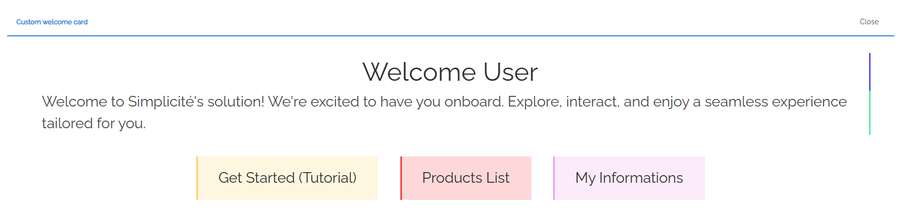
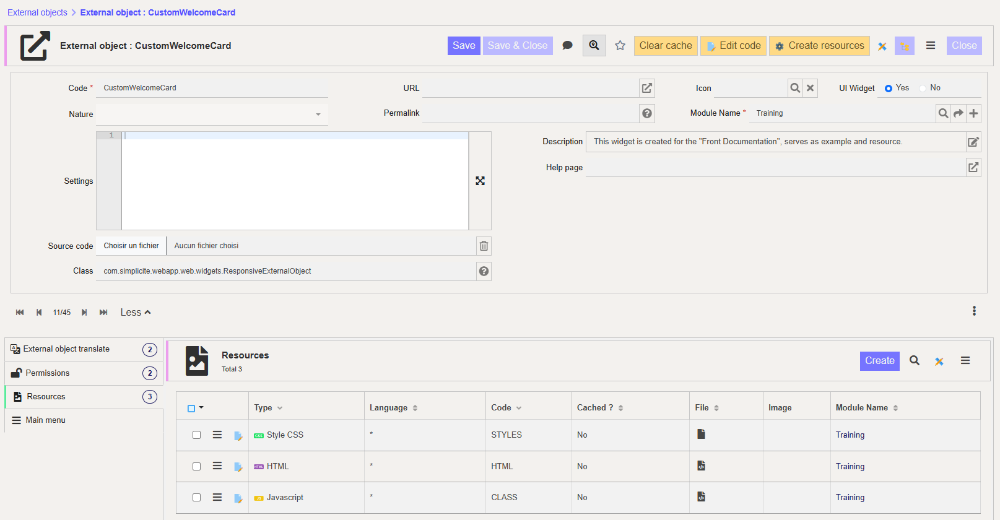

UI Component
============

This document outlines the process of using **External Objects** to design and implement custom widgets *from scratch*. It breaks down the important steps to create *dynamic* objects to thoroughly address the **creation**, **integration** and the **implementation** processes.

> Following this, it will explore how to make these widgets dynamic by incorporating interactive behaviors, user engagement, and seamless communication with Simplicité's backend and features.

## Use Case Scenarios

The need for custom widgets typically arises when existing Simplicité components do not fully meet your requirements. These scenarios may include the need to display information in a particular format, implement specific functionalities that are incompatible with the desired UI, or combine features in ways that the default options do not support.

> Such requirements are often niche. Most technical operations can already be accomplished using Simplicité's core functionalities. Consequently, the primary purpose of creating custom widgets is to address unique visualization needs, enabling you to embed tailored styles and feature combinations within a custom interface.

### Welcome Card



Highly customizable element that can be styled to align with the platform's visual identity, offering users a warm and engaging entry point. Depending on the context, its design can include dynamic color palettes, branded typography, or interactive icons to reflect the system's tone or purpose. For instance, a business-oriented platform might feature a professional and minimalist style, while a creative application might opt for bold, vibrant visuals to set an energetic tone. It can also integrate unique ways of calling objects, such as clickable shortcuts or personalized greetings.

## Implementation (Welcome Card)

The creation process is quite straightforward, as it is a specific type of **External Object**, it is mainly instantiating a new external object with specific values and then implementing the content and styles for the widget we want.



### External Object Creation

Start by creating an `External Object`, and make sure it is of nature `UI page or component`, and of class `com.simplicite.webapp.web.widgets.ResponsiveExternalObject`. Also make sure that the `UI widget` field is set to *Yes*.

Another important step is to grant your widget the rights of the module and view you want to embed it in. This way you won't have troubles integrating it to your application.

### Adding Content & Styles

Then use the *Create Resources* action button, and click *Yes*. By doing so, you are adding 3 files to your object's *Resources*:

- **ext-object_index** or **HTML**; the `HTML` file in which you can define the content for your object. By default it just contains the `<div id="ext-obj"></div>` in which you can put whatever style you want.

- **ext-obj_styles** or **STYLES**; the `CSS` file that serves as stylesheet for your object. There are no default style defined, only an empty bracket `#ext-obj { /* Custom styles */ }`.

- **ext-obj_script** or **CLASS**; the `Javascript` script that will be useful for the next lesson. 

> The ressources are organized as any web element, in order to be easily integrated and created by designers and frontend developers.

For the welcome card, both content and style ressources are quite easy to create. Below are the `HTML` and `CSS` codes.

```html
<div id="customwelcomecard">
	<span class="welcome-title">Welcome User</span>
    <span class="welcome-text">
        Welcome to Simplicité's solution! We're excited to have you onboard. Explore, interact, and enjoy a seamless experience tailored for you.
    </span>
    <div class="welcome-buttons">
        <button class="welcome-btn tuto" onclick="goToSimpliciteDoc()">Get Started (Tutorial)</button>
        <button class="welcome-btn prd-nav" onclick="goToProductsWithin()">Products List</button>
        <button class="welcome-btn info" onclick="getMyInfos()">My Informations</button>
    </div>
</div>
```

```css
#customwelcomecard {
    display: flex;
    flex-direction: column;

    width: 100%;
    padding: 1rem 2rem;

    justify-content: start;
    align-items: center;
}
.welcome-title {
	width: 100%;
    color: #303030;
    text-align: center;
	font-size: 3.5rem;
    border-right: solid 0.25rem #5451FF;
}
.welcome-text {
	padding: 0rem 1.5rem;
    color: #474747;
    text-align: left;
	font-size: 2rem;
    margin-bottom: 1rem;
    border-right: solid 0.25rem #58EC9B;
}
.welcome-buttons {
    display: flex;
    flex-direction: row;
    width: 100%

    justify-content: center;
    align-items: center;
    gap: 3rem;
    margin-top: 2rem;
}
.welcome-btn {
    position: relative;
    padding: 1.5rem 3rem;
    border: none;
    color: #303030;
    background-color: transparent;
    overflow: hidden;
    cursor: pointer;
    text-align: center;
    font-size: 2rem;
}
.welcome-btn::before {
    content: "";
    position: absolute;
    top: 0;
    left: 0;
    width: 0.25rem;
    height: 100%;
    background-color: transparent;
    border-left: solid 0.25rem transparent;
    border-bottom: solid 0.125rem transparent;
    transition: all 0.5s ease;
}
.welcome-btn:hover::before {
	border-left-width: 1.5rem;
}
.welcome-btn:active {
	&::before {
		border-left-width: 3rem;
	}
}
.tuto {
	background-color: #FFF6E0;
	transition: all 0.25s ease;
	&:active {
		background-color: darken(#FFF6E0,4%);
	}
    &::before {
        border-color: #FFD166;
    }
}
.info {
	background-color: #FBEBFB;
	transition: all 0.25s ease;
	&:active {
		background-color: darken(#FBEBFB,4%);
	}
    &::before {
        border-color: #EC9DED;
    }
}
.prd-nav {
	background-color: #FED7D9;
	transition: all 0.25s ease;
	&:active {
		background-color: darken(#FED7D9,4%);
	}
    &::before {
        border-color: #FB3640;
    }
}
```

> Yet the buttons are doing nothing, because yet we are sticking to creation & integration, dynamic implementation will be a bother for next lesson, where features will be implemented in the *Dynamic External Object* lesson. That's why only the styles are presented above.

## Integration (Welcome Card)

As for the *creation process*, the process of integrating the created widget is very straightforward, everything will be done in the *User Interface > Views > Show All*, select a view that is of type `Home Page`, and click the *Edit View* action button:

1 - Add a new `Sub-View`.
2 - Make it of type `External Page`.
3 - Select `External Object` as Source.
4 - Fill the *External Object* field with the name of your widget (for the welcome-card use `CustomWelcomeCard`).
5 - Save it, and you shall see a preview of your object integrated within the view.

> Make sure to grant the rights for your external object !
> * If encountering the `External object ____ not granted`, first try to clear your cache.
> * If clearing cache wasn't the solution check for your object's rights, and make sure that they matches the ones of your application.

The creation of an object's behavior and interaction within one Simplicité application sure comes along with the creation of its content & styles. Though it requires a bit more understanding of how Simplicité is organized and how to communicate properly and access the informations.

## Implementation (Welcome Card)

The first step is to make sure that our object can be aware of the Simplicité's system that he is a part f. To make such things we are gonna use the `javascript` resources of our External Object: **extobj_script** or **CLASS** or **SCRIPT**.

### File structure

The created `javascript` file initially contains only the base structure to later implement whatever we want in our object:

```javascript
class CustomWelcomeCard extends Simplicite.UI.ExternalObject {
	async render(params, data = {}) {
		$('#demowelcomecard').append('Hello world!');
	}
}
```

* The class extends the `Simplicite.UI.ExternalObject` class, so the object is set to access all (possibly needed features)[]
* Only the `render(params, data)` function is declared yet, as it is the one called inside the server-side java code resource `com.simplicite.webapp.web.ResponsiveExternalObject`.

### Workflow


### Accessing the current session

The communication with Simplicité's environment is allowed by using the `$ui` call within our object's class extending `Simplicite.UI.ExternalObject`. And we get the current session by using the `getApp()` function, returning the current `Simplicite.Ajax` instance.

> Throughout this document, the exposed example will be the same as in *Custom Widgets*, the **CustomWelcomeCard**. Indeed make sure to understand its creation and setup as an embedded custom widget.

### Fetching BusinessObjects

