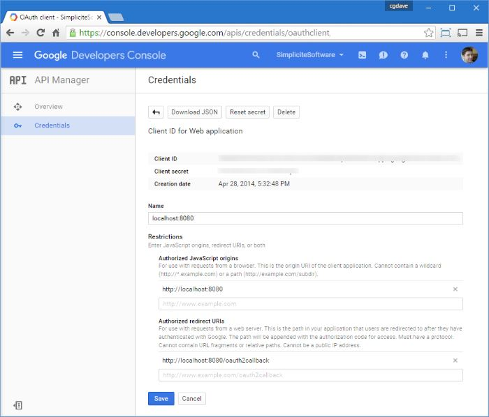
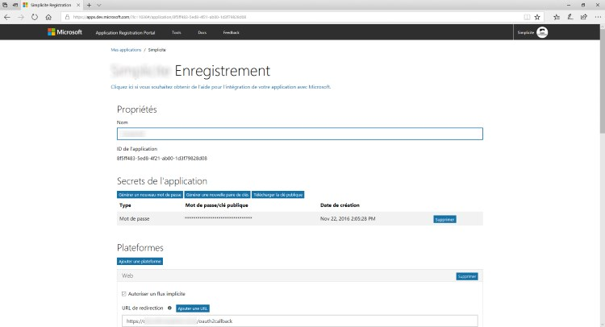

Tomcat OAuth2 authentication
============================

<h2 id="providers">Providers</h2>

The following table indicates OAuth2/OpenIDConnect providers supports per Simplicité version:

| Provider      | 3.1(1) | 3.2 | 4.0 and 5 |
|---------------|--------|-----|-----------|
| OpenIDConnect | No     | No  | Yes       |
| Google        | Yes    | Yes | Yes       |
| Microsoft     | No     | Yes | Yes       |
| LinkedIn      | No     | Yes | Yes       |
| FranceConnect | Yes    | Yes | Yes (2)   |

(1) version 3.1 allows only one **unique** OAuth2 provider to be configured.
For subsequent versions **multiple** providers can be configured at the same time.

(2) FranceConnect being an OpenIDConnect-compliant provider, starting with version 4.0
it should thus be configured as an OpenIDConnect provider instead.

<h2 id="webappsettings">Webapp prerequisites</h2>

The changes to be done (if not already done) are :

- Remove all realm-related settings in `WEB-INF/web.xml` (security-constraint, login-config and security-role tags)
- Optionaly remove also the realm definition in `META-INF/context.xml`

> **Notes**:
> - If you are using our standard Docker images or our instance tempates these changes are already done
> - Your application's URL **must** be exposed over HTTPS, SSL encryption is **mandatory** for any OAuth2/OpenIDConnect based authentication.

> **Warning**: Before doing these changes, **make sure** that you will still be able to login with a user having at least a responsibility on the `ADMIN` group.

<h2 id="common">Common settings</h2>

The callback URL (redirect URI) to configure in your OAuth2/OpenIDConnect IdP for your instance is `<base URL>/oauth2callback`.

As of version 4.0 a global system parameter `AUTH_PROVIDERS` contains the description of the various providers you configure.

Ex:

```json
[
	{ "name": "google", "type": "oauth2", "sync": true },
	{ "name": "microsoft", "type": "oauth2", "sync": false },
	{ "name": "linkedin", "type": "oauth2", "sync": false },
	{ "name": "myoidc", "type": "oauth2", "label": "Sign in with your private IdP", "sync": true }
	(...)
]
```

All OAuth2/OpenIDConnect providers requires at least the following system parameters or attributes:

- Set `OAUTH2_CLIENT_ID <provider name>` or `client_id` attribute in `AUTH_PROVIDERS`: your instance's client ID
- Set `OAUTH2_CLIENT_SECRET <provider name>` or `client_secret` attribute in `AUTH_PROVIDERS`: your instance's client secret


See [this document](/lesson/docs/authentication/tomcat-multi-auth-providers) for details.

> **Note**: in 3.x versions you have a unique provider so the `<provider name>` suffix must not be used,
> nor the `AUTH_PROVIDERS` system parameter, but instead a `OAUTH2_PROVIDER` system parameter
> must be configured with the name of your unique provider

If needed, the logout URL to configure in your OAuth2/OpenIDConnect IdP for your instance is `<base URL>/logout
or `<base URL>/logoutconfirm` (for displaying just a logout confirmation page).

<h2 id="openidconnect">Generic OpenIDConnect provider settings</h2>

As of version 4.0 it is possible to configure generic OpenIDConnect (OIDC) providers (see [this specification](http://openid.net/connect/) for details on the OIDC standards).

Beyond the above common system parameters, for the OIDC providers there are some additional system parameters that needs to be configured:

- `OAUTH2_BASE_URL <provider name>` or `base_url` attribute in `AUTH_PROVIDERS`, **required** unless the 3 below are defined: base URL for endpoints, the authorization endpoint is then defined as `<value of OAUTH2_BASE_URL <provider name>>/authorize`,
   the token endpoint as `<value of OAUTH2_BASE_URL <provider name>>/token` and the user info endpoint as `<value of OAUTH2_BASE_URL <provider name>>/userinfo`
- `OAUTH2_AUTHORIZE_URL <provider name>` or `authorize_url` attribute in `AUTH_PROVIDERS`, **required** unless `OAUTH2_BASE_URL <provider name>` is defined: URL of authorize endpoint
- `OAUTH2_TOKEN_URL <provider name>` or `token_url` attribute in `AUTH_PROVIDERS`, **required** unless `OAUTH2_BASE_URL <provider name>` is defined: URL of token endpoint
- `OAUTH2_REDIRECT_URL <provider name>` or `redirect_url` attribute in `AUTH_PROVIDERS`, **optional** post authentication redirect URL, defaults to `<instance URL>/oauth2callback`
- `OAUTH2_CLIENT_CREDENTIALS_MODE <provider name>` or `client_credentials_mode` attribute in `AUTH_PROVIDERS`, **optional** authentication method, defaults to `authheader` for Basic (Authorization header), should be `params` for HTTP POST method  
- `OAUTH2_USERINFO_URL <provider name>` or `userinfo_url` attribute in `AUTH_PROVIDERS`, **required** unless `OAUTH2_BASE_URL <provider name>` is defined: URL of user info endpoint
- `OAUTH2_USERINFO_MAPPINGS <provider name>` or `userinfo_mappings` attribute in `AUTH_PROVIDERS`, **optional**: user info fields to use as instead of standard fields defined by the OIDC standards,
  the value is a JSON object (e.g. `{ "login": "uid", "firstname": "first_name", "lastname": "last_name", "email": "email_address", "phone": "mobile_phone, "lang": "preferred_language"}` to
  map the defaults which are respectively `sub`, `given_name`, `family_name`, `email`, `phone_number` and `locale`)

As of version 5.2.30:

- `OAUTH2_PKCE_CHALLENGE_METHOD <provider name>` or `pkce_challenge_method` attribute in `AUTH_PROVIDERS`, **optional** to enable PKCE flow, possible values are `S256` or `plain` (if absent PKCE is disabled)
- `OAUTH2_PKCE_CODE_VERIFIER_LENGTH <provider name>` or `pkce_code_verifier_length` attribute in `AUTH_PROVIDERS`, **optional** to define the length of the PKCE code verifier, defaults to `64`

As of version 5.2.32:

- `OAUTH2_NON_SSL_URLS_ALLOWED <provider name>` or `non_ssl_urls_allowed` attribute in `AUTH_PROVIDERS`, **optional** to allow using non SSL URLs (Note that this does not comply with OAuth2/OpenIDConnect standards, it should never be used unless you absolutly need it)

> **Note**: By default the OIDC OAuth2 implementation uses by default the `openid` and `profile` scopes when calling user info endpoint.
> Only additional and/or custom scopes need to be configured using the `OAUTH2_SCOPES` system parameter  or `scopes` attribute in `AUTH_PROVIDERS`if needed.

By default, the relevant user info fields defined by the OIDC standards are used to update corresponding user field (e.g. `given_name` for first name, `family_name`, etc.).
As for any OAuth2 provider it is possible to do a custom parsing of user info response in the `postLoadGrant` grant hook as described above.

> **Note**: The FranceConnect provider is a OIDC-compliant provider, its management as a dedicated provider has been kept in version 4.0 for backward compatibility but
> it **should** now be rather configured as a generic OIDC provider. 

For instance here is a _Keycloak_ integration configuration for `AUTH_PROVIDERS`:

```json
{
	"name": "keycloak",
	"type": "oauth2",
	"label": "Sign in with Keycloak OAuth2 IdP",
	"sync": true,
	"visible": true,
	"client_id": "<my client ID>",
	"client_secret": "<my client secret>",
	"authorize_url": "https://<host:port>/auth/realms/<myrealm>/protocol/openid-connect/auth",
	"token_url": "https://<host:port>/auth/realms/<myrealm>/protocol/openid-connect/token",
	"userinfo_url": "https://<host:port>/auth/realms/<myrealm>/protocol/openid-connect/userinfo",
	"logout_url": "https://<host:port>/auth/realms/<myrealm>/protocol/openid-connect/logout",
	"userinfo_mappings": {
		"login":     "username",
		"firstname": "firstName",
		"lastname":  "lastName",
		"email":     "email"
	}
}
```

`userinfo_mappings` is used to map simple fields during synchronization (when global system parameter `USER_SYNC` is enabled), as of version 5
it is possible to specify additional mappings hints:

- `field`: optional to set a User's field with the userinfo value
- `transform`: optional to change the value with a local code of List of values
- `param`: optional to add a user's system parameter

Example:

```json
	"userinfo_mappings": {
		"login":     "username",
		"firstName": { "field": "usr_first_name" },
		"lastName":  { "field": "usr_last_name" },
		"email":     { "field": "usr_email" },
		"address":   { "field": "usr_address1" },
		"myfield":   { "field": "myUserField" },
		"myparam":   { "param": "APP_MYPARAM" },
		"title":     { "field": "usr_title", "transform": { "M.":"MR", "Mme":"MRS", "Mlle":"MS" } },
		"unit":      { "field": "myUserUnit", "param": "APP_USER_UNIT" }
	}
```

As of version 5, it is possible to proceed with additional JWT token processing using `jwt_*` settings described bellow.

API endpoint authentication
---------------------------

As of version 5, it is possible to use external authentication tokens on the API endpoint. Some additional configuration is required in the `AUTH_PROVIDERS` system parameter
depending on the (exclusive) validation method of the token:

### JWT validation

JWT token validation is enabled by adding the following attributes:

- `jwt_issuer`, **required**: JWT token issuer
- `jwt_secret`, **optional**: JWT token signature secret
- `jwt_claims_mappings`, **optional**:": JWT token's payload claims mappings (e.g. `{ "login": "preferred_username" }`)
- `jwt_check_nonce`, **optional**:": Check JWT token's nonce, defaults to `false`

### Token info URL validation

Token validation using token info URL is enabled by adding the following attributes:

- `tokeninfo_url`, **required**: Token info URL
- `tokeninfo_mappings`, **optional**: Token info result mappings (e.g. `{ "login": "preferred_username" }`)

<h2 id="google">Google provider</h2>

Register a new client ID on the [Google Developers Console](https://console.developers.google.com) for the application:



Activate the **required** _Google+ API_ on Google Developers Console and, optionally, activate any other Google API that you would like to call with the auth token your users get from Google authentication.

Optionally set `OAUTH2_SCOPES <Google provider name>` with additional OAuth2 scopes you may need (e.g. drive scopes, calendar scopes, ...)
see Google documentation for the values of the possible scopes, if you have several scopes use space as separator.

In `AUTH_PROVIDERS` just add Google settings as follow, for example to add consent to access User's drive files:

```json
{ "name": "google",
  "type": "oauth2",
  "label": "Sign in with Google",
  "client_id": "xxxxx.apps.googleusercontent.com",
  "client_secret": "xxxxx",
  "scopes": "https://www.googleapis.com/auth/drive.file",
  "sync": true,
  "visible": true 
}
```

> **Notes**:
> - By default the Google OAuth2 implementation uses the `profile` and `email` scopes when calling the user info endpoint.
>   Only additional scopes needs to be configured.
> - In 3.x versions you have a unique provider so the `<Google provider name>` suffix must not be set

<h2 id="microsoftliveid">Microsoft LiveID provider</h2>

Register a new client ID on the [Microsoft LiveID application portal](https://apps.dev.microsoft.com) for the application (the OAuth2 callback URL will be `<url>/oauth2callback`):



Activate the **required** _User.Read_ on the portal and, optionally, activate any other Microsoft API that you would like to call with the auth token your users get from Microsoft authentication.

Optionally set `OAUTH2_SCOPES <Microsoft LiveID provider name>` with additional OAuth2 scopes you may need
see Microsoft LiveID documentation for the values of the possible scopes, if you have several scopes use space as separator.

<h2 id="granthooks">Grant hooks</h2>

If needed you can implement additional business logic in the `GrantHooks` Java class or Rhino script.

The Rhino script **example** below checks and removes the domain part of the account name in `parseAuth`
and creates/updates the corresponding application user (with responsibilities on `MYAPP_GROUP1` and `MYAPP_GROUP2` groups
on the fly in `pre/postLoadGrant`.

```javascript
GrantHooks.parseAuth = function(g, auth) {
	if (Globals.useOAuth2()) {
		// Example of domain verification
		var domain = Grant.getSystemAdmin().getParameter("MY_OAUTH2_DOMAIN", "");
		if (!Tool.isEmpty(domain)) {
			console.log("OAuth2 account = " + auth);
			if (Tool.isEmpty(auth) || !auth.matches("^.*@" + domain + "$")) {
				console.log("OAuth2 error: Invalid domain for " + auth);
				return ""; // ZZZ must return empty string, not null, to tell the auth is rejected
			}
			console.log("OAuth2 valid domain for " + auth + " = " + domain);
		}
		/* and/or
		// Example of user verification
		var uid = Grant.getSystemAdmin().simpleQuery("select row_id from m_user where usr_login = '" + auth + "' and usr_active = '1'");
		if (Tool.isEmpty(uid)) {
			console.log("OAuth2 error: No active user for " + auth);
			return ""; // ZZZ must return empty string, not null, to tell the auth is rejected
		}
		console.log("OAuth2 active user ID for " + auth + " = " + uid);
		*/
		return auth;
	}
	return auth;
};

GrantHooks.preLoadGrant = function(g) {
	if (Globals.useOAuth2()) {
		// Example of business logic to create users on the fly
		if (!Grant.exists(g.getLogin(), false)) {
			try {
				// Create user if not exists
				var usr = Grant.getSystemAdmin().getTmpObject("User");
				usr.setRowId(ObjectField.DEFAULT_ROW_ID);
				usr.resetValues(true);
				usr.setStatus(Grant.USER_ACTIVE);
				usr.getField("usr_login").setValue(g.getLogin());
				new BusinessObjectTool(usr)/* or usr.getTool() in version 5+ */.validateAndCreate();
				
				// Get module in which user has been created (default module for users)
				var module = usr.getFieldValue("row_module_id.mdl_name");
				console.log("OAuth2 user " + g.getLogin() + " created in module " + module);

				// Force a random password to avoid the change password popup
				usr.resetPassword();

				// Add responsibilities on designated groups
				var groups = [ "MYAPP_GROUP1", "MYAPP_GROUP2" ];
				for (var i = 0; i < groups.length; i++) {
					var group = groups[i];
					Grant.addResponsibility(usr.getRowId(), group, Tool.getCurrentDate(-1), "", true, module);
					console.log("Added user " + group + " responsibility for OAuth2 user " + g.getLogin());
				}
			} catch (e) {
				console.error(e.javaException ? e.javaException.getMessage() : e);
			}
		}
	}	
};
```
**Java**
```Java
@Override
public String parseAuth(Grant sys, SessionInfo info) {
    if (AuthTool.useOAuth2()) {
		// Example of domain verification
		String domain = Grant.getSystemAdmin().getParameter("MY_OAUTH2_DOMAIN", "");
        String auth = info.getLogin();
		if (!Tool.isEmpty(domain)) {
            AppLog.info("OAuth2 account = " + auth, sys);
			if (Tool.isEmpty(auth) || !auth.matches("^.*@" + domain + "$")) {
				AppLog.info("OAuth2 error: Invalid domain for " + auth, sys);
				return ""; // ZZZ must return empty string, not null, to tell the auth is rejected
			}
			AppLog.info("OAuth2 valid domain for " + auth + " = " + domain, sys);
		}
		/* //and/or
		// Example of user verification
		String uid = Grant.getSystemAdmin().simpleQuery("select row_id from m_user where usr_login = '" + auth + "' and usr_active = '1'");
		if (Tool.isEmpty(uid)) {
			AppLog.info("OAuth2 error: No active user for " + auth, sys);
			return ""; // ZZZ must return empty string, not null, to tell the auth is rejected
		}
		AppLog.info("OAuth2 active user ID for " + auth + " = " + uid, sys);
		 */
	}
    return super.parseAuth(sys, info);
}
@Override
public void preLoadGrant(Grant g) {
    if (AuthTool.useOAuth2() &&  (!Grant.exists(g.getLogin(), false))){
        // Example of business logic to create users on the fly
			try {
                // Create user if not exists
                ObjectDB usr = Grant.getSystemAdmin().getTmpObject("User");
                usr.setRowId(ObjectField.DEFAULT_ROW_ID);
                usr.resetValues(true);
                usr.setStatus(Grant.USER_ACTIVE);
                usr.getField("usr_login").setValue(g.getLogin());
                new BusinessObjectTool(usr)/* or usr.getTool() in version 5+ */.validateAndCreate();
                    
                // Get module in which user has been created (default module for users)
                String module = usr.getFieldValue("row_module_id.mdl_name");
                AppLog.info("OAuth2 user " + g.getLogin() + " created in module " + module,g);
                // Force a random password to avoid the change password popup
            
                usr.invokeMethod("resetPassword", null, null);
            

                // Add responsibilities on designated groups
                String[] groups = { "MYAPP_GROUP1", "MYAPP_GROUP2"};
                for(String group : groups){
                    Grant.addResponsibility(usr.getRowId(), group, Tool.getCurrentDate(-1), "", true, module);
                    AppLog.info("Added user " + group + " responsibility for OAuth2 user " + g.getLogin(),g);
                }
            } catch (MethodException | CreateException | ValidateException e) {
                AppLog.error(e, g);
            }
			
		
	}	
    super.preLoadGrant(g);
}
```

<h2 id="customzingloginscreen">Customizing the login screen</h2>

If you want to change the top logo you can create a `OAUTH2_LOGO` **image** resource (ideal type = SVG and ideal dimension = 120x120 px)

If you wat to change some of the styles of the login screen you can add a `OAUTH2_STYLES` **CSS** resource, for instance for a dark scheme:

```css
.auth-signin { background-color: #152935; }
.auth-signin-with img, .auth-signin button { border: none 0; box-shadow: 5px 5px 10px #3A3A3A; }
.auth-signin-form { background-color: #394b54; box-shadow: 5px 5px 10px #131b21; border: solid 1px #152935; }
.auth-signin-version { color: #C0C0C0; }
.auth-signin-fp a { color: #D0D0D0; }
```

For each OAuth2 provider you can create a custom `OAUTH2_SIGNIN_<uppercase provider name, e.g. MYPROVIDER>` **image** resource.