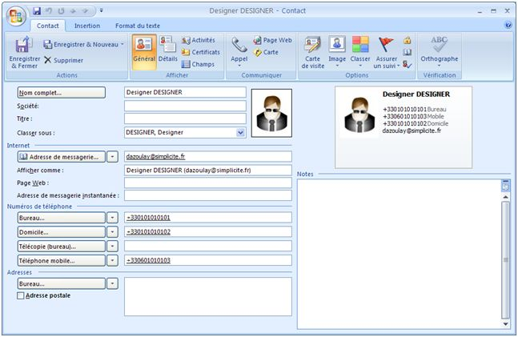

Templates
====================

Here are two examples using substitutions in a text template 

vCard publication
-----------------

If a business objects includes identity data it may be published as a vCard
to be imported on contact management systems, e-mail clients, mobile devices, ...

An example of vCard publication (using a dedicated publication template) is provided on the standard `User` object:

```plaintext
[BEGIN]
BEGIN:VCARD
VERSION:2.1
N:[VALUE:usr_last_name];[VALUE:usr_first_name]
TEL;CELL:[VALUE:usr_cell_num]
TEL;WORK;VOICE:[VALUE:usr_work_num]
TEL;HOME;VOICE:[VALUE:usr_home_num]
EMAIL;PREF;INTERNET:[VALUE:usr_email]
UID:[VALUE:usr_login]
ADR;WORK:;[VALUE:usr_address2];[VALUE:usr_address1];[VALUE:usr_city];[VALUE:usr_state];[VALUE:usr_zipcode];[VALUE:usr_country]
PHOTO;ENCODING=BASE64:[EXPR:res = DocumentDB.toBase64(obj.getField("usr_image_id").getValue(), obj.getGrant());]
END:VCARD
[END]
```

Note the usage of a `DocumentDB` API for inlining the user picture as a base 64 encoded string,
the global `[BEGIN]` / `[END]` publication template statements allows to export multiple vCards
at the same time (beware that this bulk import is not possible with every e-mail clients).

For instance the import of published data renders as follows in Microsoft Outlook&reg;:



RSS publication
---------------

The simplest approach for publishing business object data as a RSS feed
is to configure a publication template such as the one used by default for
the `WebNewsobject` (publication template name is `WebNewsAsRSS`):

```xml
<?xml version="1.0" encoding="UTF-8"?>
<rss version="2.0">
	<channel>
		<title>[LABEL:WebNews]</title>
		<description>[LABEL:WebNews]</description>
		<generator>Simplicite</generator>
		<ttl>15</ttl>
[BEGIN]
		<item>
			<title><![CDATA[[VALUE:nws_title]]]></title>
			<description><![CDATA[[VALUE:nws_description]]]></description>
			<pubDate>[VALUE:nws_date]</pubDate>
		</item>
[END]
	</channel>
</rss>
```

If the RSS is to be public the object must be granted in read mode
to the `PUBLIC` group, so as the publication template.