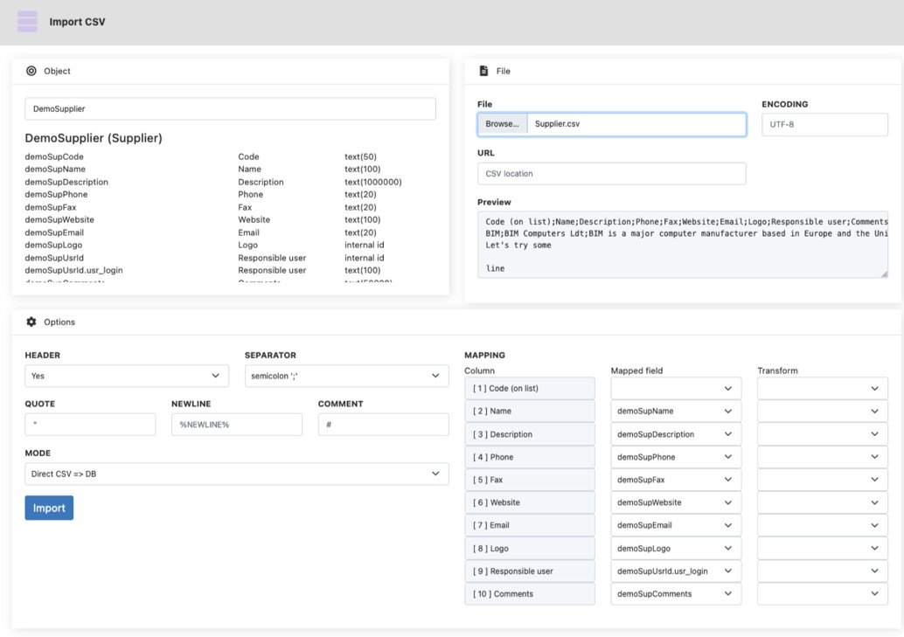

Data in / Data out
====================

This page serves as a summary of all different methods to :
- import or use external data (**data in**)
- export or expose internal data (**data out**)

Data in
---------------------------

### Importing data

#### Custom import

In a non-specific manner, it is possible to retrieve a file from an object / action / webservice and use Java's mechanisms to read and import the data.

#### Adapters 

An adapter is a tool that "adapts" the data from a file to the business data model. It typically reads a file (CSV, Excel, etc) line by line to integrate the data, or transform it in Simplicité's formalized XML format. Its advantages compared to a custom import is that Adapter provide additional tools and services : 
- helper Adapter classes for various formats : CSV, JSON, XML, etc  (cf [Package com.simplicite.util.integration](https://platform.simplicite.io/current/javadoc/com/simplicite/util/integration/package-summary.html))
- pre-built mechanism for line-by-line logging
- import supervision object with logs and stats

To date, the most usefull resource for this is the [CSV Adapter Tip&Trick](https://community.simplicite.io/t/csv-adapter-example/2110), which can be adapted to other type of formats.

#### Built-in adapters

There is a built-in CSV adapter with options like field mapping and tranformations. Its main limitation is that, by not understanding a specific business model, it is designed to import data for one business object at a time.

The other adapters are based on Simplicité's XML formalization and its JSON and YAML counterparts. It's pretty complete and that's how full datasets are imported, but are too complex for non technical profiles. As a Simplicité developer, it's very usefull to know how to use this XML format that allows for complex updates to the data.

### Using data

#### API calls

Data usage is generally done through consuming external APIs. Simplicité integrates several tools to make thoses calls, from basic to advanced:
- [Simplicité RestTool class](https://platform.simplicite.io/current/javadoc/com/simplicite/util/tools/RESTTool.html)
- [Unirest library](https://kong.github.io/unirest-java/#requests)
- [Apache HttpClient library](https://hc.apache.org/httpcomponents-client-4.5.x/index.html)

#### Service Objects

A service object (also known as remote object) draws the data from an API instead of the database. They aim at providing the same UI as normal objects, and must be configured in a similar way: an object with a template and attributes.

At the moment there are 4 built-in service objects that don't require any coding:
- Remote Simplicité Object: based on a Simplicité object in another instance
- LDAP Object
- SalesForce Objects
- OpenDataSoft Objects

As there are limited built-in service objects, developers are often required implement a **Custom Service Object** to code the object's API calls for basic CRUD operations by extending the [ObjectService class](https://platform.simplicite.io/current/javadoc/com/simplicite/util/ObjectService.html)

#### Select Objects (secondary database)

It is possible to declare secondary datasources, and then configure objects that will make requests on those datasources instead of the main one. This will give you full functionnality, except that obviously it will be impossible to make relationships between those objects as the platform will be unable to make `JOIN` requests between the datasources.

Data out
---------------------------

### Exporting data

#### Publications

Publications offer a standardized way to export data in any format. 

Please refer to the [publication tutorial lesson](https://docs.simplicite.io/lesson/tutorial/development/publication) and the publication examples in the [Tips and Tricks category in the forum](https://community.simplicite.io/t/tips-and-tricks-list/2112#integration-adapters-importing-data-publications-exporting-data-webservices-exposing-data-4)

### Exposing data

There is ample documentation about the different ways of exposing data. 

The built-in webservices are :
- [REST Services](https://docs.simplicite.io/lesson/docs/integration/rest-services) (described in a Swagger/OpenAPI formal in the module exports)
- [SOAP Services](https://docs.simplicite.io/lesson/docs/integration/soap-services)
- [Raw Services](https://docs.simplicite.io/lesson/docs/integration/raw-services)

It is also possible to write your own APIs through dedicated External Objects, as documented in [Custom Services](https://docs.simplicite.io/lesson/docs/integration/custom-services) and [this tip'n'trick](https://community.simplicite.io/t/custom-webservice-example/1970)

