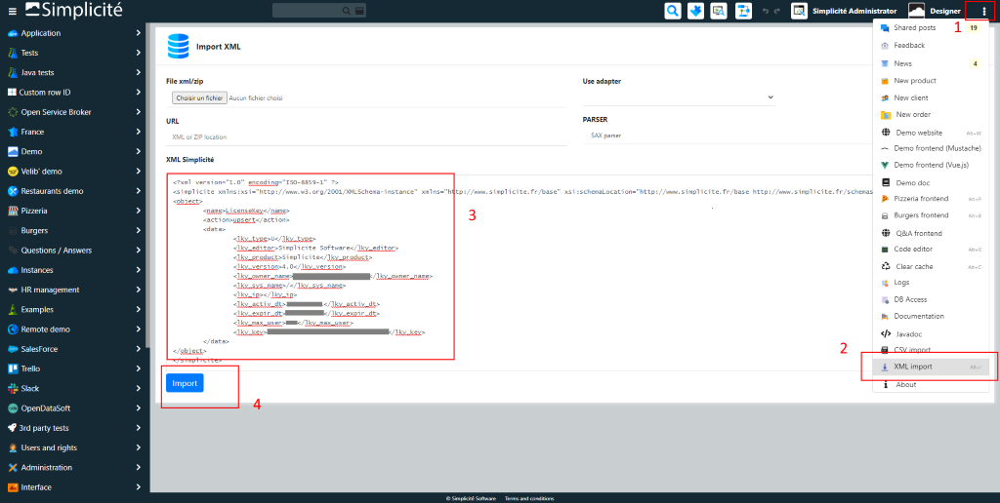

License key installation
========================

Different ways are available to install a license key.

Using the generic web UI
------------------------

### Using the _XML import_ page

- Connect to the generic web UI as `designer`, 
- Click on the _XML import_ shortcut,
- Upload your license key file (e.g. `license.xml`) or simply copy/paste the XML of the license key directly in the text area
- Click on the _Import_ button



### Using the _License key_ business object

- Connect to the generic web UI as `designer`, 
- Click on main menu: _Operation_ > _License key_,
- Create or update the license key record manually
- Or upload the license key file from the list button _Import license key_

Using a generic service
-----------------------

Call a service interface: I/O (preferred) or API
to create or update the license key record (see [integration interfaces](../02-integration/) for details).

Example using the I/O service interface:

```text
curl -u designer:mydesignerpassword --form service=xmlimport --form file=@/my/path/to/license.xml http(s)//myhost[:myport][/mycontextroot]/io

```

Using a server side ANT task
----------------------------

> **Note**: this is only applicable to legacy deployments in which you are using the instance template.
> You need to have the [Apache Ant](https://ant.apache.org/) tool installed.

In the root folder of the instance template, run the following command:

```text
ant [-Dservice.url=http(s)//myhost[:myport][/mycontextroot]/io] -Dfile=/my/path/to/license.xml xmlimport
```
