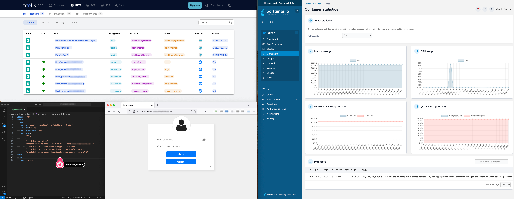
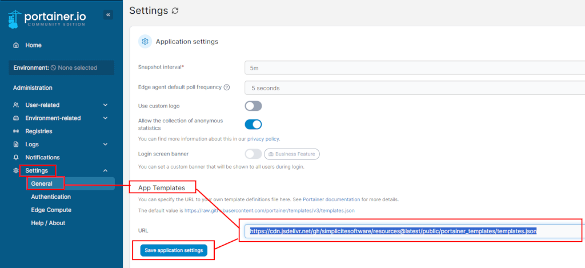

Simplicité with Portainer & Traefik
====================================

Portainer is a professional Docker cluster management tool that facilitates installation and operation of Docker containers. This lesson leverages its power to rapidly install Simplicité instances on a server, with the following objectives:

- **minimal manual configuration**
- SSL certificates auto-setup with Let's Encrypt
- HTTP -> HTTPS redirection
- Traefik's reverse proxy dashboard activated and available at `traefik.my.domain` behind `test / test` basic auth
- Portainer available at `portainer.my.domain`
- allow remote debugging through the proxy



## 1) Server deployement

Sizing of the server should be made acording to the needs, as always. Any up-to-date unix image should be able to run the containers.

<details>
<summary>Click to open</summary>

- in this example, we chose a medium-sized server 
    - 2 vCores
    - 50GiB storage
    - 250Mbps bandwidth
- for the image, we chose almalinux 9

</details>

## 2) Docker Install

Portainer needs docker as a requirement, so we'll install it after usual upgrades. Based on [docker CentOS install docs](https://docs.docker.com/engine/install/centos/) (adapted)

```sh
sudo timedatectl set-timezone Europe/Paris
sudo dnf update -y
sudo dnf config-manager --add-repo=https://download.docker.com/linux/centos/docker-ce.repo
sudo dnf install docker-ce docker-ce-cli containerd.io docker-buildx-plugin docker-compose-plugin
sudo systemctl start docker
sudo systemctl enable docker
sudo docker run hello-world # check everything is running smoothly
```

Portainer also needs SELinux disabled

```sh
sudo sed -i 's/SELINUX=enforcing/SELINUX=disabled/g' /etc/selinux/config
sudo reboot
```

**Note**: Optionaly a firewall should be configuerd on the host (or among the host) to allow only the relevant traffic.
Minimal configuration is to allow the HTTP port `80` and HTTPS port `443` (along with the SSH port `22` from legitimate origins) through this firewall.

## 3) Portainer install with lets encrypt and traefik

This is a modified version of the config given in Portainer's doc "[Deploying Portainer behind Traefik Proxy](https://docs.portainer.io/advanced/reverse-proxy/traefik)"

This config has to be copied at the home of your user and started with `sudo docker compose up -d`, after which you should be able to access `traefik.my.domain` and `portainer.my.domain`.

<details>
<summary>See config</summary>

> **Important**: you must create a local `acme.json` with `600` rights **prior** to starting this Docker compose configuration.

```yaml
services:
  traefik:
    container_name: traefik
    image: "traefik:latest"
    ports:
      - "80:80"
      - "443:443"
    networks:
      - proxy
    volumes:
      - "/var/run/docker.sock:/var/run/docker.sock:ro"
      - "./acme.json:/acme.json"
    command:
      - --api.insecure=true
      - --api.dashboard=true # to activate Traefik dashboard
      - --entrypoints.web.address=:80
      - --entrypoints.web.http.redirections.entrypoint.to=websecure
      - --entryPoints.web.http.redirections.entrypoint.scheme=https
      - --entrypoints.websecure.address=:443
      - --entrypoints.websecure.asdefault=true
      - --entrypoints.jpda.address=:8000 # to route JPDA traffic for remote debugging
      - --log.level=INFO
      - --accesslog=true
      - --providers.docker
      - --providers.docker.network=proxy
      - --providers.docker.exposedByDefault=false
      - --certificatesresolvers.leresolver.acme.httpchallenge=true
      - --certificatesresolvers.leresolver.acme.email=mail@my.domain #email for the generation of SSL certificates with Let's Encrypt. 
      - --certificatesresolvers.leresolver.acme.storage=./acme.json
      - --certificatesresolvers.leresolver.acme.httpchallenge.entrypoint=web
    labels:
      - traefik.enable=true
      - traefik.http.routers.mydashboard.rule=Host(`traefik.my.domain`) # adapt domain
      - traefik.http.routers.mydashboard.tls.certresolver=leresolver
      - traefik.http.routers.mydashboard.entrypoints=websecure
      - traefik.http.routers.mydashboard.service=api@internal
      - traefik.http.routers.mydashboard.middlewares=myauth
      - traefik.http.middlewares.myauth.basicauth.users=test:$$apr1$$H6uskkkW$$IgXLP6ewTrSuBkTrqE8wj/ # adapt basic auth
  portainer:
    image: portainer/portainer-ce:latest
    command: -H unix:///var/run/docker.sock
    restart: always
    networks:
      - proxy
    volumes:
      - /var/run/docker.sock:/var/run/docker.sock
      - portainer_data:/data
    labels:
      # Frontend
      - "traefik.enable=true"
      - "traefik.http.routers.frontend.rule=Host(`portainer.my.domain`)" # adapt domain
      - "traefik.http.routers.frontend.entrypoints=websecure"
      - "traefik.http.services.frontend.loadbalancer.server.port=9000"
      - "traefik.http.routers.frontend.service=frontend"
      - "traefik.http.routers.frontend.tls.certresolver=leresolver"
      # Edge
      - "traefik.http.routers.edge.rule=Host(`edge.my.domain`)" # adapt domain
      - "traefik.http.routers.edge.entrypoints=websecure"
      - "traefik.http.services.edge.loadbalancer.server.port=8000"
      - "traefik.http.routers.edge.service=edge"
      - "traefik.http.routers.edge.tls.certresolver=leresolver"
networks:
  proxy:
    name: proxy
volumes:
  portainer_data:
```

</details>

> The Traefik container and the Simplicité instances have to run in the same docker network, that's why we create a "proxy" network where we'll put all our containers.

## 4) Configure

- access `https://portainer.my.domain` **right after starting the service** (it's only configurable for a limited amout of time)
- create local environement
- create registry.simplicite.io registry, with authentication
- pull a Simplicité image

## 5) Start a Simplicité instance

This is the minimal configuration to get a working Simplicité (non persistent) instance. Create a "stack" (a docker compose deployement, in Portainer's semantics), and paste the following config. 

```yaml
services:
  test:
    image: registry.simplicite.io/platform:6-latest-light
    restart: unless-stopped
    container_name: test
    networks:
      - proxy
    labels:
      - "traefik.enable=true"
      - "traefik.http.routers.test.rule=Host(`test.my.domain`)"
      - "traefik.http.routers.test.entrypoints=websecure"
      - "traefik.http.routers.test.tls.certresolver=leresolver"
      - "traefik.http.services.test.loadbalancer.server.port=8443"
networks:
  proxy:
    name: proxy
```

To make it persistent add the following volumes to the above configuration:

```yaml
services:
  test:
    (...)
    volumes:
      - db:/usr/local/tomcat/webapps/ROOT/WEB-INF/db
      - dbdoc:/usr/local/tomcat/webapps/ROOT/WEB-INF/dbdoc
      - git:/usr/local/tomcat/webapps/ROOT/WEB-INF/git
(...)
volumes:
  db:
  dbdoc:
  git:
```

To enable remote JPDA debugging (port `8000`)  add the following environment variables and labels:

```yaml
services:
  test:
    (...)
    environment:
      (...)
      JPDA: "true"
      JPDA_SUSPEND: "<true|false>" # true to wait for debugger
    (...)
    labels:
      (...)
      - "traefik.tcp.routers.test.rule=HostSNI(`test.my.domain`)"
      - "traefik.tcp.routers.test.entrypoints=jpda"
      - "traefik.tcp.routers.test.tls.certresolver=leresolver"
      - "traefik.tcp.services.test.loadbalancer.server.port=8000"```
```

## 6) Configure stack templates

You can also configure Portainer to use our stack templates, to do so change the _App Templates_ URL in the settings using this URL: `https://cdn.jsdelivr.net/gh/simplicitesoftware/resources@latest/public/portainer_templates/templates.json`



Or manually configure custom templates using the `*.yml` present at [this location](https://cdn.jsdelivr.net/gh/simplicitesoftware/resources@latest/public/portainer_templates/).
