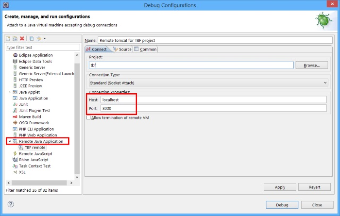

Remote debugging
================

Server side <span id="server"></span>
-------------------------------------

> **Warning**: starting your server in remote debug mode (JPDA with default socket connection mode) has a **very** significant negative
> impact on its performances. Make sure to do is only in development and to disable it when you don't use it.

### Docker <span id="docker"></span>

When using our standard images you can (re)start your container with JPDA enabled by adding
`-e JPDA=true -p <port, e.g. 8000 or 12345>:8000` to your `docker run` command.

See [this document](/lesson/docs/operation/docker) for details.

### Simplicit&eacute;&reg; Instances Manager (SIM) <span id="sim"></span>

When using a SIM server, to restart an instance in debug mode you have to stop Tomcat `sim tomcat-stop` and restart it in JPDA mode `sim tomcat-debug`.

The exposed JPDA port is specific to each instance (it is only openned when the instance is running in debug mode) and is available in the `JPDA_ADDRESS` environment variable.
 
### Tomcat <span id="tomcat"></span>

When using a "traditional" deployments of Tomcat 9.x servers you can (re)start Tomcat in JPDA mode by doing the following change
in the startup script `startup.sh` (the change is to add the keyword `jpda` before `start`):

```bash
(...)
exec "$PRGDIR"/"$EXECUTABLE" jpda start "$@"
```

By default the listening port is `8000` but you can change it to any port by setting the `JPDA_ADDRESS` environment variable
to another value:

```
JPDA_ADDRESS=12345
export JPDA_ADDRESS
```

Alternatively you can add following option to JVM arguments:

```
-agentlib:jdwp=transport=dt_socket,server=y,address=8000,suspend=n
```

Debugger side <span id="debugger"></span>
-----------------------------------------

The server listening port must be reachable from the local machine running the debugger. If we are talking about a remode instance,
this can be done by carefully opening this port thru the server firewall or by configuring a SSH tunner on this port which is a better approach.

For instance:

```bash
ssh -L 8000:localhost:12345 <user>@<server>
```

will make the remote `12345` port available locally on local port `8000`.

> **Note**: Such tunnels can also easily be configured using SSH GUIs clients like PuTTY.

Then you can configure a **remote debug configuration** in your IDE pointing to `localhost:8000`
(or directly on `<server>:12345` if you have chosen to open the remote port thru the server firewall).

Then , provided that you have a copy of your modules' code locally in the IDE you will be able to define
breakpoints, do step by step debugging, etc.

### VSCode <span id="vscode"></span>

Configure your `launch.json` like this:

```json
{
    "version": "0.2.0",
    "configurations": [
        {
            "type": "java",
            "name": "My instance",
            "request": "attach",
            "hostName": "<server>", (e.g. localhost or your server's hostname or IP address)
            "port": <port> (e.g. 8000 or 12345)
        },
        (...)
    ]
}
```

### Eclipse <span id="eclipse"></span>

Configure and launch a "Remote Java Application":


