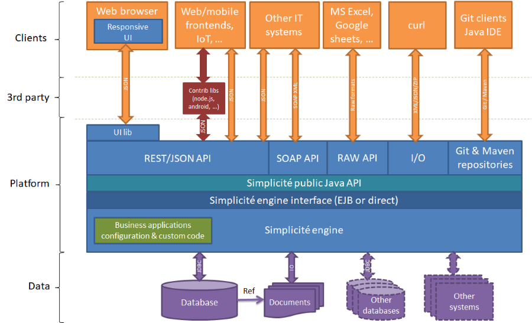
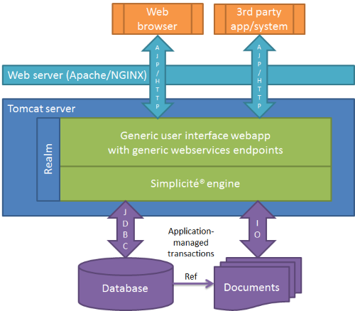
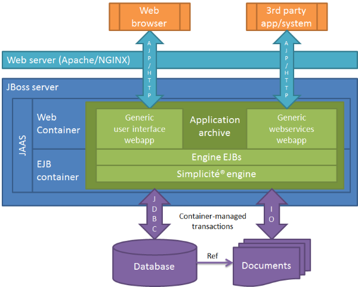
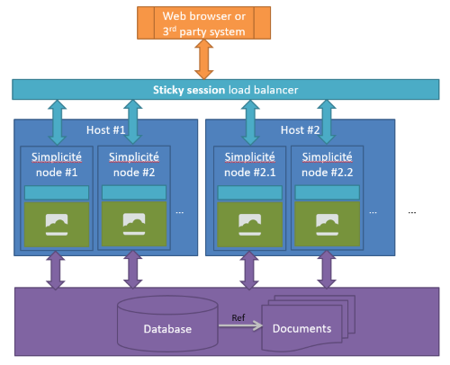

Architecture
============

Overview
--------

> **Note**: documents can be either stored on file storages (e.g. file system) with a path reference in the database or as binary content (BLOB) in the database

For more details on generic integration components (webservices, I/O interface, etc.) please refer to the documents referenced in the _Integration services_ section of [the documentation index](/lesson/docs/versions/index).
Some of these generic webservices are wrapped into generic libraries/APIs in various technologies, please refer to the documents referenced in the _APIs_ section of the document index.

Beyond these generic integration components, Simplicit&eacute; being a Java platform, any kind of integration that is possible in Java is possible with Simplicité.
Some examples are available in [this document](/lesson/docs/core/third-party-apis-examples) but many other third part public or private services integration can be implemented. 

Compliance
----------

Please refer to [this document](/lesson/docs/compliance) for details on compliant components (OS, application servers, database, browsers, ...).

Deployment modes
----------------

Exposing the application server thru a Apache/NGINX reverse proxy as described below is not mandatory but rather a good practice.

<h3 id="deployment-web">Web mode</h3>

In this mode the publication layers (UI and API) have direct access to Simplicité engine.

<h3 id="deployment-jee-webprofile">JEE web profile mode</h3>

In this mode the publication layers (UI and API) have access to an EJB lite-wrapped Simplicité engine.

<h3 id="deployment-jee-fullprofile">JEE full profile mode</h3>

In this mode the publication layers (UI and API) have access to an EJB wrapped Simplicité engine.

Clustering
----------

Simplicit&eacute; instances can be clustered to provide several nodes using the same database, the right approach for load balancing being a **sticky session** load balancing.

