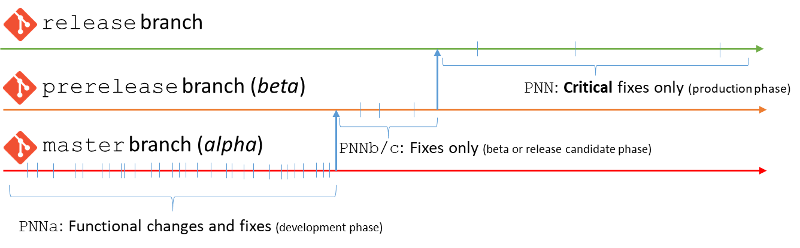

Versioning
===========

<h2 id="branches">Branches</h2>

The Simplicité platform is available on 3 active branches:

- The `release` branch which contains the current **stable** version of the platform.
- The `prerelease` branch which contains a potentially unstable **beta** or a **release candidate** of the next version of the platform.
- The `master` branch which contains the usually unstable current **development** (also called **alpha**) version of the platform.

The usage of these branches is as follows:

- The `release` branch is the **only** one to be used in **production**
- The `prerelease` branch should **only** be used for testing or validation purposes of the next version.
- The `master` branch should **never** be used except for very ponctual testing purposes.

Maintained previous minor and major versions have also dedicated branches (see bellow).

<h2 id="versions">Version numbers</h2>

Each version is identified with:

- a **major version number** (e.g. `5`)
- a **minor version version number** previously known as the "patch level" (e.g. `P02`)
- a revision

The minor version number is suffixed:

- by `a` (for "**A**lpha") on the `master` branch (e.g. `P04a`),
- by eiher `b` (for "**B**eta") or `c` (for "release **C**andidate) on the `prerelease` branch (e.g. `P03b`),
- no suffix on the `release` branch.

As of **major version 5** the "official" **full version number** is noted `m.p.r` where:

- `m` is the **major version number** (e.g. `5`)
- `p` is the numeric value of the **minor version number** (e.g. `2` for minor version `P02`)
- `r` is an incremental **revision** number increased each time a set of changes/fixes is pushed on the `release` branch.

> **Note**:
>
> - On the `prerelease` branch `r` is always `0` and suffixed by `-beta`
> - On the `master` branch `r` is always `0` and suffixed by `-alpha`.

<h2 id="releaseprocess">Release process</h2>

The **functional changes** (e.g. new features, refactored features, etc.) are **only** done on the `master` branch.
Some isolated minor features may also be backported to the `prerelease` and `release` branches.

Fixes are applied on **all** branches:

- Any fix on the `master` branch (critical, major or minor)
- Only major and critical fixes on the `prerelease` branch (only critical fixes during release candidate phase)
- Only critical fixes on the `release` branch

The usual delay between two release versions is between 3 and 6 months.

In the meantime the released version is amended by **revisions** which contains only fixes.
The delay between two revisions is variable (from few days to several weeks) because it depends on the identified defects
and other required fixes (e.g. vulnerable third party libs upgrades).

<h2 id="upgradepolicies">Upgrade policies</h2>

Each **revision** of the `release` branch **should** be upgraded as soon as made available (it may contain critical security fixes).
Upgrading to the next revision is **mandatory** and has absolutely **no impact** on your business application's configuraton or custom code.

A **minor version** is just a slightly more impacting revision which **may** require some minor refactoring of "atypical" custom code (e.g. custom code that is not using the Simplicité Java API).
The configuration remains fully compatible vs previous minor version.
Upgrading to the next minor version is **required** because, once release a new minor version, the previous minor version is only maintained during a short period
(see bellow for the **short term maintenance** strategy of minor versions)

A** major version** includes significant compatibility-breaking changes, including on the platform's technical components, that **will** requires impact analysis and potential refactoring on your custom code.
The configuration remains fully compatible vs previous major version except that some configuration concepts can become outdated.
Upgrading to the next major version is **recommended** as no further functional changes will be done on the previous major version
(see bellow for the **long term maintenance** strategy of major versions).

<h2 id="maintenance">Maintenance</h2>

<h3 id="shorttermmaintenance">Short term maintenance for minor versions</h3>

As of major version 5 each non final **minor version** becomes a **short term maintenance** branch which is forked from the `release` branch prior to releasing a new minor version.

The minimal duration for the short term maintenance period is **6 months** after a new minor version is released.
In some particular cases the short term maintenance period can be extended.

A short term maintenance branch **only** receives critical fixes.

<h3 id="longtermmaintenance">Long term maintenance for major versions</h3>

Each **major version** becomes a **long term maintenance** branch which is forked from the `release` branch prior to releasing a new major version.

The duration for the long term maintenance period is **3 years** after a new major version is released.

A long term maintenance branch **only** receives critical fixes.

### Maintenance timeline table

| Major/minor | Maintenance branch                                           | Maintenance end date                             |
|-------------|--------------------------------------------------------------|--------------------------------------------------|
| _minor_     | _`5.4` [release notes](../5/releasenote/releasenote-5.4.md)_ | _Alpha (development)_                            |
| _minor_     | `5.3` [release notes](../5/releasenote/releasenote-5.3.md)   | **Current release**                              |
| minor       | `5.2` [release notes](../5/releasenote/releasenote-5.2.md)   | _Short term_                                     |
| minor       | `5.1` [release notes](../5/releasenote/releasenote-5.1.md)   | _Expired short term_ (since October 31th, 2022)  |
| minor       | `5.0` [release notes](../5/releasenote/releasenote-5.0.md)   | _Expired short term_ (since September 30th, 2021 |
| major       | `4.0` [release notes](/lesson/docs/versions/index)           | _Long term_ (till January 15th, 2024)            |
| major       | `3.2` [release notes](/lesson/docs/versions/index)           | _Expired long term_                              |
| major       | `3.1` [release notes](/lesson/docs/versions/index)           | _Expired long term_                              |
| major       | `3.0` [release notes](/lesson/docs/versions/index)           | _Expired long term_                              |

<h3 id="gitbranchesanddockertags">Instance templates Git branches and Docker images tags table</h3>

| Version                   | Instance templates Git branches | Docker images tags                                                              |
|:-------------------------:|-------------------------------------|---------------------------------------------------------------------------------|
| _5.4 (alpha)_             | _`master[-light]`_                  | _`5-alpha[-light]`_                                                             |
| **5.3** (current release) | `release[-light]`                   | `5.3[-light]`, `5.3.x` (*)                                                      |
| 5.2                       | `5.2[-light]`                       | `5.2[-light]`, `5.2.x`                                                          |
| 5.1                       | `5.1[-light]`                       | `5.1[-light]`, `5.1.x`                                                          |
| 5.0                       | `5.0[-light]`                       | `5.0[-light]`, `5.1.x`                                                          |
| 4.0                       | `4.0[-light]`                       | `4.0[-light]` (*)                                                               |
| 3.x                       | `3.x`                               | `3.x`                                                                           |

In **bold** the ones you should be using.

(*) The use of the "latest" Docker images tags (e.g. `latest`, `5-latest`, `5`) is discouraged unless you are willing to be always pointing to the latest minor release.