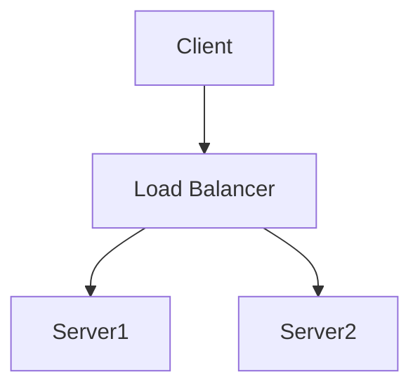

<!-- <script type="module">
	import mermaid from 'https://cdn.jsdelivr.net/npm/mermaid@10/dist/mermaid.esm.min.mjs';
</script>
 -->
# test html
<pre class="mermaid">
graph LR
	A --- B
	B-->C[fa:fa-ban forbidden]
	B-->D(fa:fa-spinner);
</pre>
# test markdown

```mermaid
	sequenceDiagram
    Alice ->> Bob: Hello Bob, how are you?
    Bob-->>John: How about you John?
    Bob--x Alice: I am good thanks!
    Bob-x John: I am good thanks!
    Note right of John: Bob thinks a long<br/>long time, so long<br/>that the text does<br/>not fit on a row.

    Bob-->Alice: Checking with John...
    Alice->John: Yes... John, how are you?
  ```
  ```mermaid
	  graph TB
	    sq[Square shape] --> ci((Circle shape))
	
	    subgraph A
	        od>Odd shape]-- Two line<br/>edge comment --> ro
	        di{Diamond with <br/> line break} -.-> ro(Rounded<br>square<br>shape)
	        di==>ro2(Rounded square shape)
	    end
	
	    %% Notice that no text in shape are added here instead that is appended further down
	    e --> od3>Really long text with linebreak<br>in an Odd shape]
	
	    %% Comments after double percent signs
	    e((Inner / circle<br>and some odd <br>special characters)) --> f(,.?!+-*ز)
	
	    cyr[Cyrillic]-->cyr2((Circle shape Начало));
	
	     classDef green fill:#9f6,stroke:#333,stroke-width:2px;
	     classDef orange fill:#f96,stroke:#333,stroke-width:4px;
	     class sq,e green
	     class di orange
  ```
  ```mermaid
	  sequenceDiagram
	    participant web as Web Browser
	    participant blog as Blog Service
	    participant account as Account Service
	    participant mail as Mail Service
	    participant db as Storage
	
	    Note over web,db: The user must be logged in to submit blog posts
	    web->>+account: Logs in using credentials
	    account->>db: Query stored accounts
	    db->>account: Respond with query result
	
	    alt Credentials not found
	        account->>web: Invalid credentials
	    else Credentials found
	        account->>-web: Successfully logged in
	
	        Note over web,db: When the user is authenticated, they can now submit new posts
	        web->>+blog: Submit new post
	        blog->>db: Store post data
	
	        par Notifications
	            blog--)mail: Send mail to blog subscribers
	            blog--)db: Store in-site notifications
	        and Response
	            blog-->>-web: Successfully posted
	        end
	    end
   ```