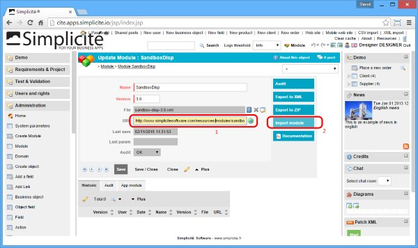

Version 3.0 maintenance 20 release note
=======================================

Changes
-------

### New HTTPS call APIs

New APIs have been added to `HTTPTool` to help calling HTTPS URLs, the first one takes username and password parameters for HTTP basic authentication,
the other takes a Java keystore (as stream) for SSL client authentication using certificates.

### New API web services endpoints

New API endpoints for REST/SOAP/RAW and JSON web services are now available in the generic web UI webapp:

```plaintext
/api/rest/*
/api/soap/*
/api/raw/*
/api/json/*
```

Unlike the I/O endpoint (`/io`) that uses integration credentials and unlike the other web services endpoints that use server's authentication,
these API endpoints are using token-based authentication with explicit login and logout.

The AJAX lib has been updated to be able to use these endpoints (as the new `"api"` webservices gateway type).

These endpoints makes the webservices gateway webapp useless unless you need advanced, server-managed, authentication mechanisms.

### Remote data sources

It is now possible to easily configure business objects pointing on remote datasources:

- Simplicité (refactored to use the new API endpoint)
- OpenDataSoft&reg; open data datasets (refactored to align the configuration principles of other remote datasources)
- SalesForce&reg; business objects.

### Description of configuration items as Markdow

The _Description_ fields present on configuration items objects have been updated to long string with markdown
rendering. This will allow to generate formatted functional documentation.

In this version, it has been done on the following objects:

- `SystemParam`, note that the value field rendering has been set to `TEXT` to allow better text formatting (using ACE editor in plain text mode).

In next versions the principle will be applied to other configuration objects.

### Refactored content and resources JSPs as servlets

The `PUB_content.jsp` and `PUB_resource.jsp` JSPs have been refactored as `/content` and `/resource` servlets for better compatibility.

The JSPs have been left for backward compatibility but they now just forward the request to the servlets.

### Module from URL

It is now possible to get a module package (either as ZIP or as XML) from an URL.

As long as the URL field is set the file is downloaded and stored locally as the local module file **each time** the module is saved.

This is, for instance, the case when clicking on the _Import module_ action button, which triggers a save prior to its execution.



### PDF publication header and footer as resource

It is now possible to use disposition-level image resources for header and footer images used in PDF pubications:

- `MODULE_HEADER` and `MODULE_FOOTER` for module documentations
- `CROSSTAB_HEADER` and `CROSSTAB_FOOTER` for pivot tables publications
- `TIMESHEET_HEADER` and `TIMESHEET_FOOTER` for time sheet publications

If these resources do not exists the legacy content resources are used instead.

Fixes
-----

- Fixed encoding problems when calling URLs that does not use the same encoding as the platform
- Fixed various encoding-related problems with UTF-8