Version 6.1 release note
========================

> **Warning**: This release note corresponds to a **RELEASE CANDIDATE** final beta stage platform.

Compatibility breaking changes <span id="compatbreakingchanges"></span>
-----------------------------------------------------------------------

- All deprecated methods from V3 and V4 have been removed
	- the legacy methods were already marked as deprecated in the logs a long time ago,
	- and had to be modified in V5.
	
- No more internal EJB support to access the database:
	- Nothing to do when Simplicité is deployed on Tomcat,
	- This feature is no more used since Simplicité V3 (transaction support with XA services),
	- The webapp connects the database thru a monitored connections pool (JDBC),
	- APIs use internal cache to guarantee high performance while optimizing memory.

- Removed wrapper for Rhino hooks implementation:
	- Rhino has been removed for hook implementation since V6.0
	- Classes `ScriptedObjectDB`, `ScriptedProcessus`, `ScriptedDisposition`, `ScriptedExternalObject` and `ScriptedPlatformHooks` has been removed from platform
	- if necessary to be easily replaced by their primary class: `ObjectDB`, `Processus`, `Disposition`, `ExternalObject` and `PlatformHooks`

- The 3rd party Unirest lib v3 has been upgraded to v4 (core) which means you will have to modify
  all the import statements in your java code from `kong.unirest.*` to `kong.unirest.core.*`.

Core changes <span id="changes"></span>
---------------------------------------

- A single permission supports multiple profiles/groups to factorize rights rules

- Added a new platform hook `customErrorResponse` to override, if needed, some case of error responses.
  Typical usage would be for external objects to generate custom error pages/data for authentication errors.

- Added various JSON schemas for validation of JSON/YAML settings, etc.

- Added `AuditTool.checkDeadLinks` to detect dead links in logs and generate a SQL patch thru audit tool:

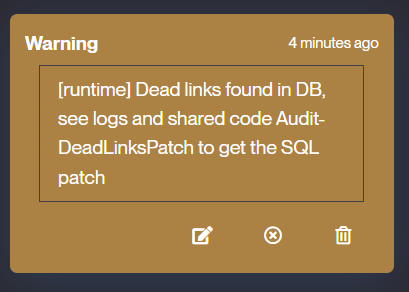
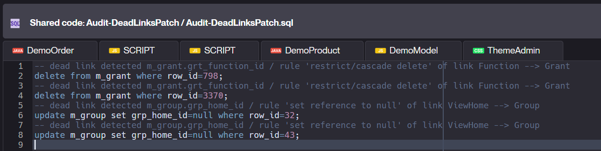


UI changes <span id="uichanges"></span>
---------------------------------------

- Added support for declaring a custom monospace font on a theme.
  Note that theme-level fonts are now using dedicated CSS variables instead of a generated `font-family` styles:
	- `--simplicite-font` for the main font 
	- `--simplicite-font-mono` for the monospace font 

- Added new **experimental** custom HTML tags to ease usage of standard UI components within custom pages/widgets:

- New state-model navbar
	- The related list of values can have a rendering
	- Each status needs to specify its role: milestone, optional, exception or hidden
	- 3 styles exist (pure CSS):
		- breadcrumb / arrows / metro-line
		- with 3 options: step counter / visited date / user login
	- Visited steps are based on the history table
	- Current step, optional and exception roles can have their own style
	- Non visited milestones (from list of values) are displayed after the visited ones

Examples based on the demo:

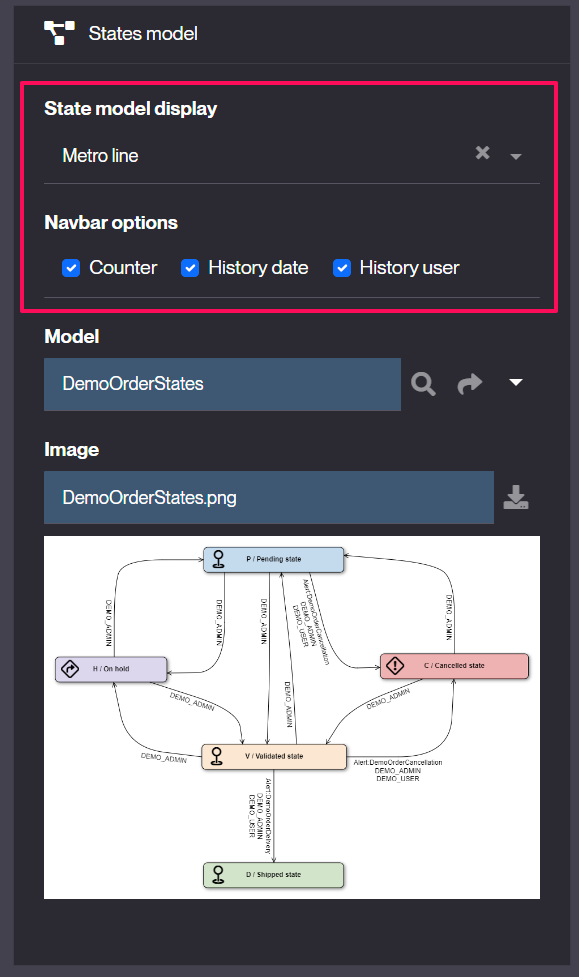

breadcrumb with links

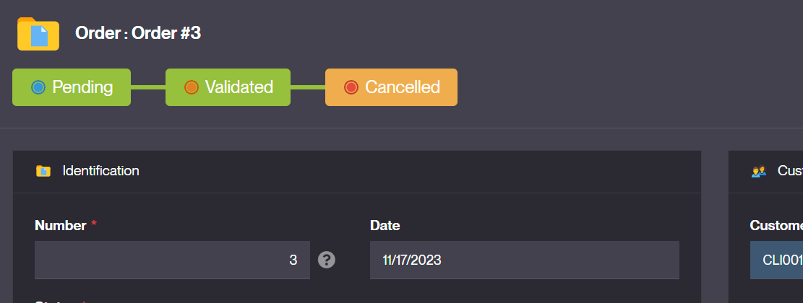


breadcrumb with arrows

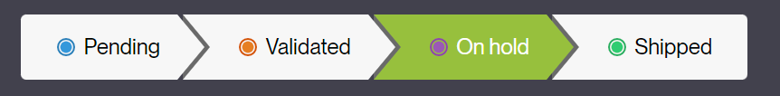

metro line style

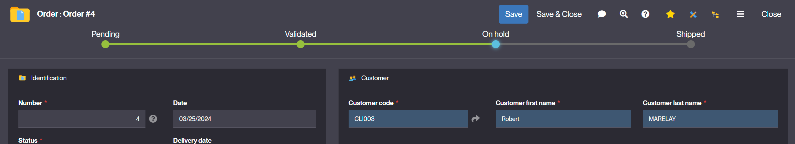

metro line with 3 options: counter + user + date

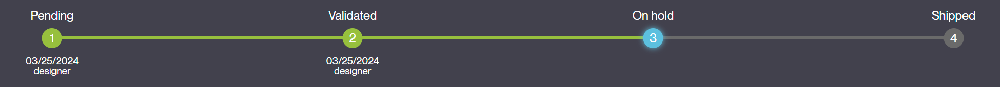

- The `states-navbar` can be displayed anywhere on form with the template editor to edit options

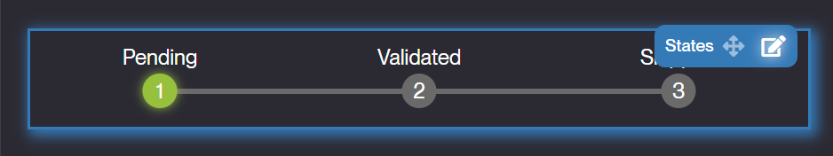

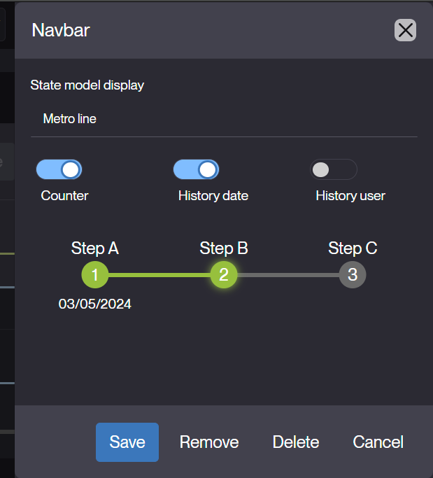

- New dialog options:
	- `fullscreen`: to show the dialog in 100% of the container
	- `scrollable`: true by default to scroll the dialog body (false to scroll the page)
	
- `Field updatable` property is now a enum-multi to support the new option editable `by list cell`:

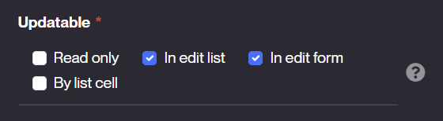

Result:

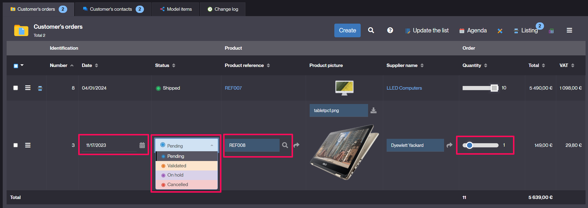

- List template to display rows without common table/tr/td
	- Define a HTML template with mapped fields and actions
	- Applies to dedicated context (main list, panel, datamap or ref picker)
	- Associate the template to the `List template` of business object

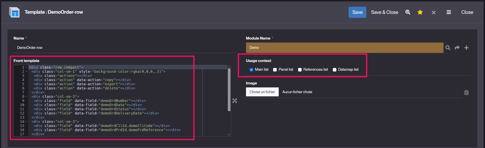

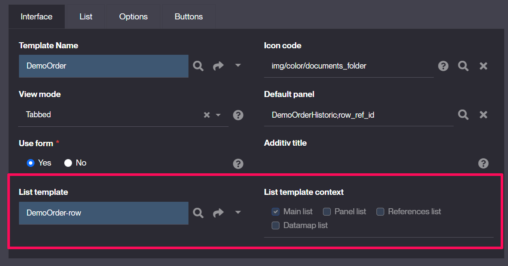

Result:

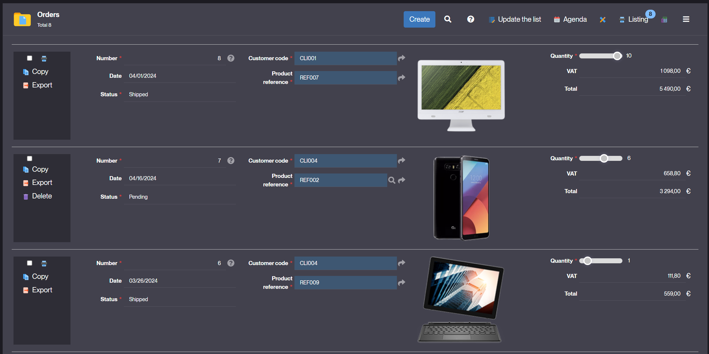

- New hook `isFieldUpdatableByListCell`
	- to specify when a field is editable by cell
	- by default the method checks if the field is updatable as follow:

```java
/**
 * Checks if the field is updatable by list cell
 * @param f object field
 * @return true if the field can be changed in a list cell
 */
public boolean isFieldUpdatableByListCell(ObjectField f) {
	return f!=null
		&& f.isUpdatableByListCell() // Defined as updatable by cell ?
		&& !isReadOnly() // not a read only mode ?
		&& !isReadOnlyFields() // not a final status with read-only fields ?
		&& !getName().endsWith(Globals.HIST_SUFFIX); // not a history object
}
```

- New hook `isFieldUpdatableByListCell` example
  - the hook allows to limit some instances or user's profiles:

```java
public boolean isFieldUpdatableByListCell(ObjectField f) {
	return super.isFieldUpdatableByListCell(f) 
		&& isPanelInstance()
		&& getGrant().hasResponsibility("APP_MANAGER");
}
```

- Allows update on simple referenced fields (not userkey) thru the parent list or form
	- Set referenced field to be updatable in the object field definition
	- Saving parent will also save updated referenced objects
	
Example: set the Stock of Product updatable thru the Order (by form, edit list and/or cell)

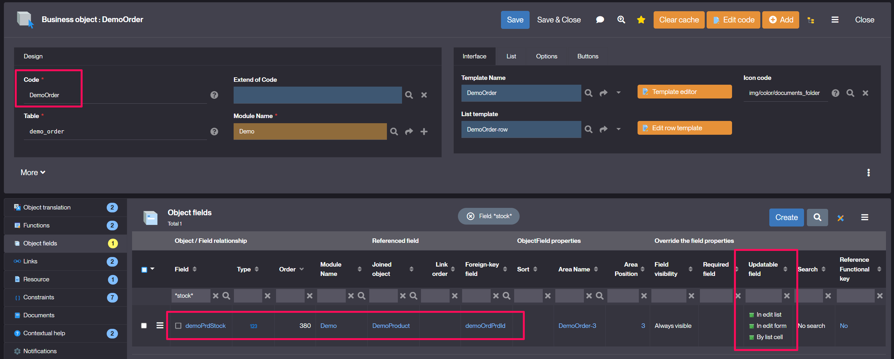

The Stock will be updatable directly from one Order of the Product (within the form/list/cell):

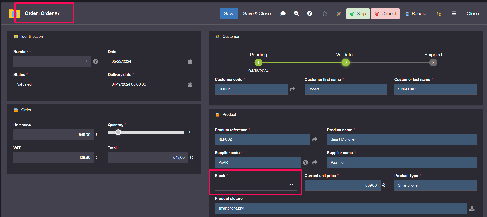

- Instance name of view's item has been updated to isolate concurrent access on same object within several sub-views

```
<home|panel>_ajax_<objectName>_<viewName>_<itemPosition>
ex: home_ajax_DemoOrder_DemoHome_2
```

### 6.1.0 (2024-06-01) <span id="version-6.1.0"></span>

- Initial release for minor version 6.1. See above for details.

### 6.1.1 (UNRELEASED) <span id="version-6.1.1"></span>

- Added parameter `CRON_LOCK_OWNER` to force only one node (endpoint URL) to get the `CRON_LOCK` (no ping/no failover when the parameter is set)
- Fixed label alignment in a search dialog on XS devise
