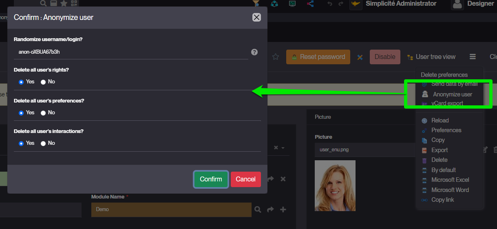
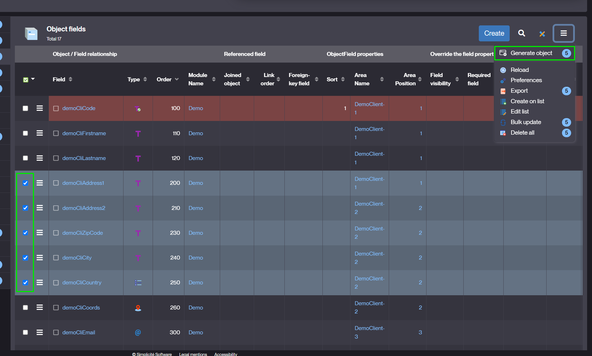
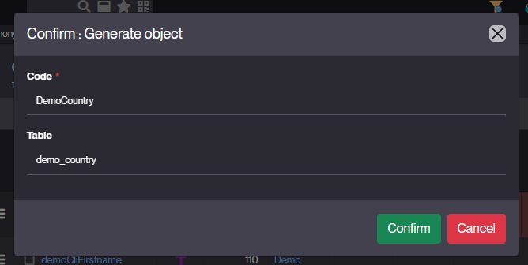
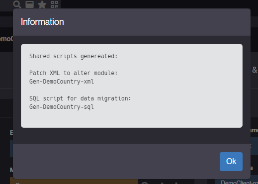
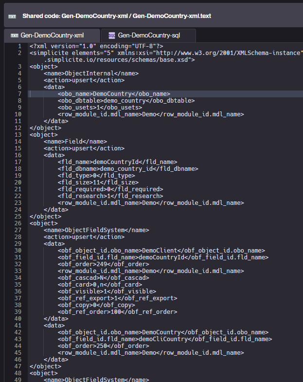
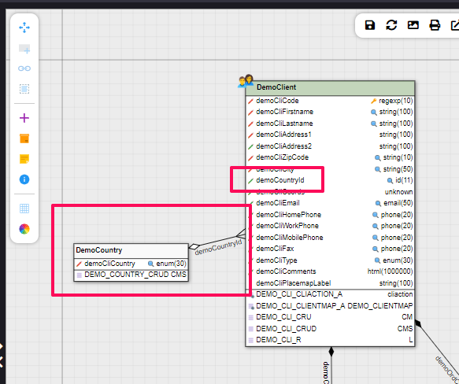
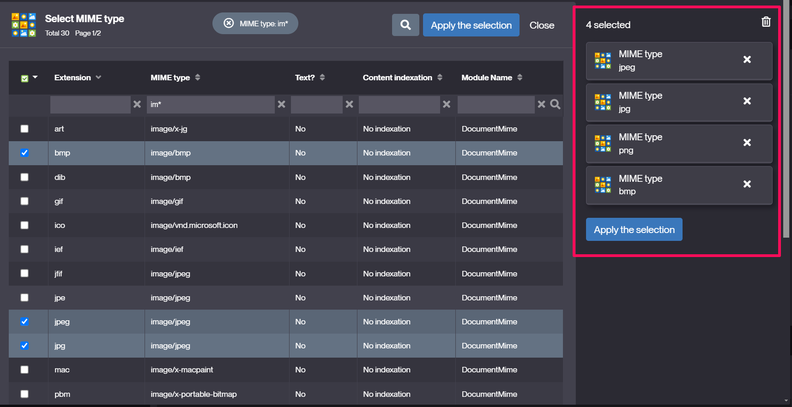

Version 6.2 release note
========================

> **Warning**: This release note corresponds to the **next** minor version which is still in **ALPHA** stage and thus will be regularly amendend.
> <br/>**ALPHA** stage means it is **not yet suitable** for production

Technical documentation <span id="doc"></span>
----------------------------------------------

All the technical documentation is available from the [plaform website](https://platform.simplicite.io), in particular:

- the [JavaDoc](https://platform.simplicite.io/6.2/javadoc/)
- the [JSDoc](https://platform.simplicite.io/6.2/jsdoc/)

Compatibility breaking changes <span id="compatbreakingchanges"></span>
-----------------------------------------------------------------------

- `Bootstrap V4` and `datetimepicker V4` have been removed, the UI runs now exclusively with bootstrap5 engine (since Simplicité V5)
- `Fullcalendar V3` has been removed, it is strongly recommended to use `FULLCALENDAR_VERSION=5`
- `Cordova` hybrid app for mobile device is no more supported, engine only uses the responsive UI directly in a browser and the WebPush feature
- The 3rd party **PDFBox** lib v2 has been upgraded to v3 which means you will have to refactor any potential direct use of this library.


Deprecated features to be removed in the next releases <span id="deprecation"></span>
----------------------------------------------------------------------------------------

- iText has been deprecated, and will be removed in Simplicité 7.0
	- `PDFTool` methods have been deprecated, we recommend migrating to PDF generation through [HTMLToPDFTool](https://platform.simplicite.io/current/javadoc/com/simplicite/util/tools/HTMLToPDFTool.html) or [PDFBox](https://pdfbox.apache.org/). 
	- In case you need to continue the use of iText, you will as always be able to integrate it as a third-party library, but we recommend buying a licence and using an up-to-date version due to [the licensing and security matters associated with iText 2.1.7](https://kb.itextpdf.com/it5kb/can-itext-2-1-7-itextsharp-4-1-6-or-earlier-be-use).
	- The native PDF exports (lists and module documentation) have been migrated to PDFBox. 

Core changes <span id="changes"></span>
---------------------------------------

- New action to anonymize a user
	- with options to sanitize the user (infos, rights, preferences and social interactions)
	- extendable with a new PlatformHooks `anonymizeUser`


	
```java
/**
 * Anonymize a user
 * @param login user login to sanitize
 * @param rights true to delete all user's responsibilities
 * @param prefs true to delete all user's preferences (user filters, searches, parameters)
 * @param social true to delete all interactions (social, alert, notif)
 * @param randomizedLogin optional value to randomize the login everywhere in DB (timestamps, sessions history, redolog...)
 */
@Override
public Message anonymizeUser(String login, boolean rights, boolean prefs, boolean social, String randomizedLogin) {
	// sanitize the user infos, rights, preferences and social interactions
	Message m = super.anonymizeUser(login, rights, prefs, social, randomizedLogin);
	if (m.isOk()) {
		// add custom anonymization here in your business objects...
	}
	else {
		// denied
	}
	return m;
}
```

- Backend message always in a JSON format, no more formatted message with hashtags "#"
	- APIs `Message.formatXXX` will now return JSON messages
	- JSONs are serialized to String to be compatible with returns of java hook (pre/postValidate, pre/postSave...)
	- Legacy format with "#" is still supported but deprecated (i.e. `code:text#level#field`).
	- It is strongly recommended to change/use one of the `Message.formatXXX` to format a message (on validate, save...)

```json
{
	code: "MY_ERROR_CODE", // static TEXT to be translated on UI
	text: "optional additional text in user language",
	field: "myField", // optional related field on UI
	level: "ERROR", // TEXT, INFO, WARNING, ERROR
	actions: [{ action definition }...], // optional list of call to actions
	params: { suggest: "Suggested value" } // optional suggestion of syntax
}
```

- New shared script type to apply `XML patches`

- New action to **generate object**: 
	- a referenced object (0,1) or an aggregated object (0,n) from existing object fields
	- designer selects some fields from the object-fields panel
	- and sets the linked object name, prefix and table
	- then choose the user-key for the new object
	- the action generates 2 shared scripts: a patch XML and SQL to migrate the business model and the data
	- when XML is applied, the designer must complete the generated object (user-key, rights, user menu...)
	- the SQL script can be applied in several instances (dev, test, prod...)
		- populate the new table with distinct values from existing records
		- update the new foreign keys to/from the new table

1) Select fields and click on "Generate object"



2) Set the link properties and confirm



3) Generate the patches

Example after generating a reference table from distinct countries of customers:





4) Apply them to get the object with migrated data

Designer must finalize the configuration of the generated object.




- Cascade deletions will always call `pre/postDelete` hooks (no more parameter `DELETE_CHILD_HOOK=no`)

- Added automatic convertion to PDF for a text publication template file (e.g. HTML, plain text, ...) with forced MIME type set to PDF

- Added `minimal` value for `USE_HEALTH` system parameter to restrict healcheck to monitoring-only data (no information on JVM, server, OS, ...)
- Changed ping and healthcheck to return a `503` instead of a `500` in case of database unavailability
- Added a new `customPingResponse` platfom hook to customise the `/ping` JSON response, e.g.:

```java
@Override
public JSONObject customPingResponse(String status, String error) {
	return new JSONObject()
		.put("myCustomStatus", "The status is: " + ("OK".equals(status) ? "All good" : "Houston we have a problem"))
		.put("myCustomError", Tool.isEmpty(error) ? null : "The error is: " + error);
}
```

- Added new tags for publication templates:
	- `[SYSPARAM:<parameter name>]` for substituting a system parameter
	- `[LABEL:<object name>:<-|+>]` for substituting singular (`-`) or plural (`+`) object label

- New instances of object during a `DataLink` synchronization:
	- Needs a dedicated user for datalink API to isolate those instances in objects pool
	- Allows distinct rules in hooks:
		- `isDataLinkInstance() && isBatchInstance()`: detect a pull from a host (cron job: bulk resync)
		- `isDataLinkInstance() && isWebServiceInstance()`: detect a push to hosts (REST/PUT: single record)

UI changes <span id="uichanges"></span>
---------------------------------------

- The `Call to action` of backend message is now implemented in the alert dialog
	- a backend action can now return other call-to-actions
	- actions to call must be granted to user 
	- with the type hidden to avoid direct access thru list or form

- New `hasChangedFields` to determine the global `hasChanged` flag on form:
	- the property `hasChanged` has been improved so that it only triggers if a field has actually been modified (different from the base value)
	- for example, if the user changes a field twice and returns to its original value, the dialog "quit without saving" will no longer appear.

- It is now possible - and recommended - to implement a `ResponsiveExternalObject` Javascript script as a **Javascript class** extending `Simplicite.UI.ExternalObject`
with an override of the `render` class function, e.g.:

```javascript
class MyExtObj extends Simplicite.UI.ExternalObject {
	async render(params, data) {
		$('#myextobj').html('Hello world!');
	}
}
```

- New UI tabs options for tabbed areas:
	- tabs positioning on top/left/right/bottom
	- allows to hide all tab labels (to display only icons)
	- configurable on template editor


- New UX in object multi-selection:
	- Added a preview of selected items on the right side of dialog
	- Allows to do several searches without losing previous selections
	- Allows to easily remove all or each item
	

