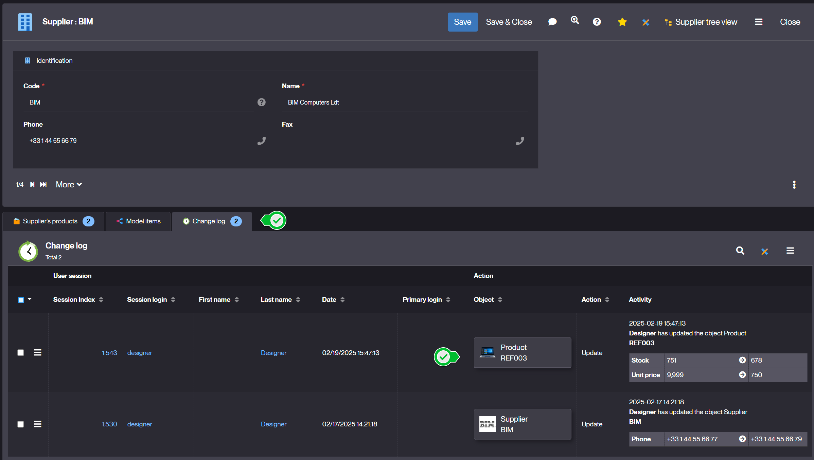

Version 6.3 release note
========================

> **Warning**: This release note corresponds to a **future** minor version which is still in **ALPHA** stage and thus in active developpement.
> <br/>**ALPHA** stage means it is **absolutely not yet suitable** for production

Technical documentation <span id="doc"></span>
----------------------------------------------

All the technical documentation is available from the [platform website](https://platform.simplicite.io), in particular:

- the [JavaDoc](https://platform.simplicite.io/6.3/javadoc/)
- the [JSDoc](https://platform.simplicite.io/6.3/jsdoc/)

Compatibility breaking changes <span id="compatbreakingchanges"></span>
-----------------------------------------------------------------------

- Nothing so far...

Deprecated features to be removed in the next releases <span id="deprecation"></span>
----------------------------------------------------------------------------------------

- Nothing so far...

Core changes <span id="changes"></span>
---------------------------------------

- Server side event: new servlet `/ui/sse` (asynchronous) to push messages from server to clients thru https

Example to bind a `myEvent` message:

1) Server side:

```java
ServerSideEvent.push("myEvent", new JSONObject().put("info","hello"), userId);
```

userId: null to notify all registered clients or a specific user.

2) Client side: simply add an event listener on `ui.ready`

```javascript
$ui.sse.addEventListener("myEvent", e => {
	let d = JSON.parse(e.data);
	console.log("myEvent message: " + d.info + " at time = " + d.time);
});
```

- Predefined server side events (work in progress)
	- `ping`: simple ping thru SSE
	- `close`: close the SSE connection
	- `reset`: reopen the SSE connection
	- `sysparam`: new system parameter flag to push changes from `grant.setParameter("MYPARAM","value")` to client in `$ui.sysparams.MYPARAM="value"`
	- `objparam`: push an object parameter to UI in `obj.locals.MYPARAM`
	- `enumCounters`: refresh counters in menu when enum or status has changed during save

UI changes <span id="uichanges"></span>
---------------------------------------

- Retrieve redologs of child object into the parent `Change log` panel

Example: Product updates are visible in the Supplier `Change log` panel



