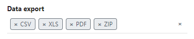
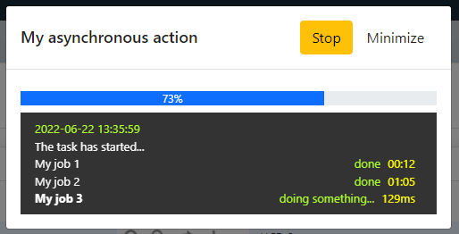
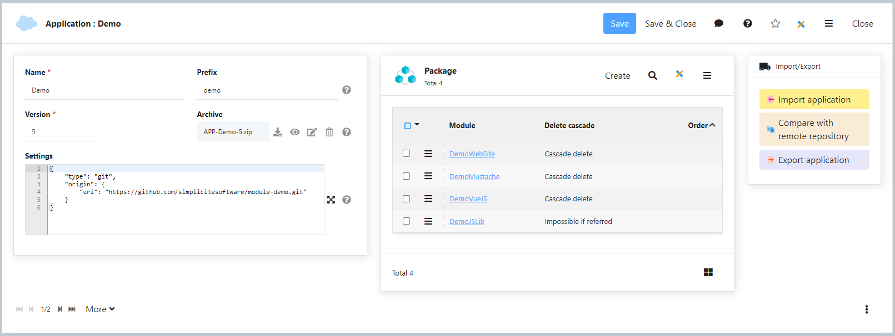
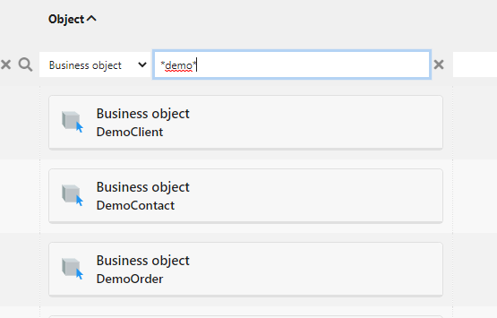
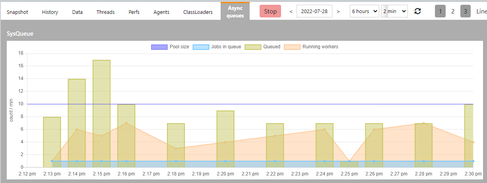
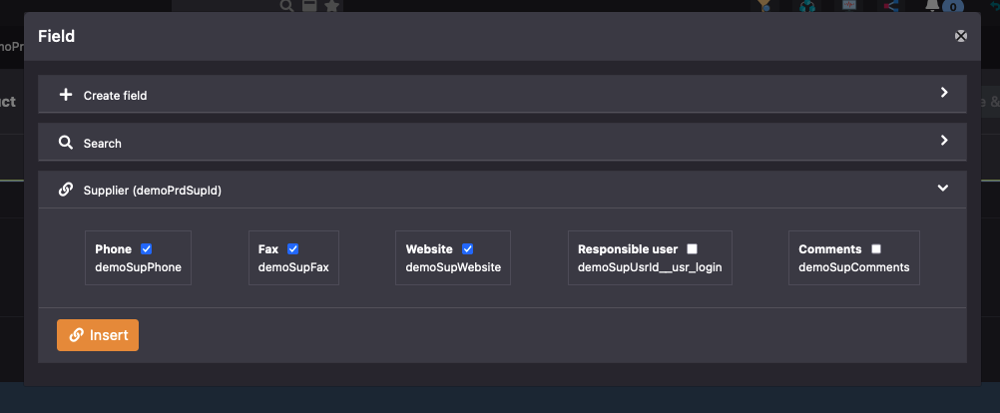
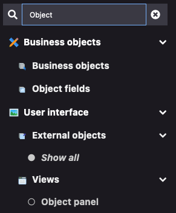

Version 6.0 release note
========================

> **Warning**: This release note corresponds to a testing **BETA** stage platform, it will still be regularly amended

Compatibility breaking changes <span id="compatbreakingchanges"></span>
-----------------------------------------------------------------------

### JVM compliance

The target JVM compliance level for version 6 is 17 (LTS) even if it is still compiled with a JDK 11.

The platform is thus supposed to be on any JVM >= 17 (LTS or not) and should not be run on any older JVM anymore.

If you are using our Docker images (see bellow) you can safely use JVM 17 level syntax and features in your Java code
as we won't provide images with a JVM older than 17.

### Docker images

The Docker images for version 6 are built on an **AlmaLinux 9** OS base (vs a legacy CentOS 7 OS base for previous major versions' images).
The JVM variants are only for the **recent** Java LTS versions: 17 and 21 (default).

By default they are also using the plain `simplicite` user (vs the privileged `root` user for previous major versions' images).

Any customization of our images should thus be verified and refactored if needed.

### Deprecated repository objects

Deprecated objects:
	- `ShortCutGroup`
	- `PrintTemplateGroup`
	- `CrosstabGroup`
	- `ConstraintGroup`
	- `ModelTemplateGroup`
	- `Function` for `Domain` and `ObjectExternal`

All previous rights are migrated automatically to the new `Permission` object with this release.
- After migration your modules will have to be reexported to use the Permission object.
- Next release will delete deprecated objects, they are only hidden is this release.

### Hooks deprecation

- `PlatformHooks.isMenuEnable` has to be refactored to `isMenuItemEnabled` with more parameters.

### Ajax

- All synchronous Ajax calls have been deprecated for a while, they are now no more supported by the UI components.

### Meta-object virtual link based on `row_metaobject_id`

The internal additional field `row_metaobject_id` has been removed, the meta-object field support the link itself (thru a refSearchSpec):
	- it allows several meta-object fields on a same object (previous versions only support one meta-object per object)
	- the related Link is named `<child object>;<meta-object field name>` instead of `<object>;row_metaobject_id>`
	- inlined panel in template has to be refactored with the new link name:
		- from `<div class="area" data-area="MyPanelObject;row_metaobject_id>"></div>"`
		- to `<div class="area" data-area="MyPanelObject;myMetaObjectField>"></div>"`
	- the syntax is now more consistent with foreign-keys

### Translation refactored

- All `Translation` objects has a new field `tsl_object` to address any translatable entity.
- And `tsl_id` and `tsl_type` are not used anymore.
- The related legacy field `obo_delspec` is now hidden and deprecated

### Other compatibility breaking changes

- The platform hook `customStartPage` now throws exceptions.
  If you have implemented this hook you need to add `throws Exception` to the method declaration.

- The group `APP_DESIGNER` has been removed, the system only uses `ADMIN` or `DESIGNER`

- The `BarcodeTool`, `QRCodeTool` (and the new `DatamatrixTool`) takes now a resolution in DPI instead
  of a size argument for their image generation methods.

Core changes <span id="changes"></span>
---------------------------------------

- New hook to limit user's access to menu item 
	- `isMenuItemEnabled` with more parameters to limit access for status, enum or activity
	- `isMenuEnable` is deprecated but still used in this release

```java
public boolean isMenuItemEnabled(Grant g, MenuItem item,
	ObjectField field, MenuItem.State state, EnumItem enumItem, Activity activity);
```

- Unified new business object `Permission` 
	- to replace old granted groups of `Shortcut`, `Crosstab`, `PrintTemplate`, `ConstraintGroup`, `ModelTemplateGroup`
	- new feature to authorize or restrict groups for `PlaceMap`, `TreeView`, `Search`, `Agenda` and `Timesheet`
	- use `Permission` to grant `External object` and `Domain` (Function is now dedicated to business objects only)

- Added permissions to override default **object field** access per group
	- allows to override 3 properties: Visible | Updatable | Required
	- applied if one group belongs to user's responsibilities


- Object `Export` definition has been updated to enum multiple 
	- to specify allowed medias
	- older value "true" is mapped with "All" medias for upward compatibility



- Full export supports links thru meta objects (ex: to export Permissions with a parent object)

- `Map` with new unified object field `map_object`:
	- replace map_object_id for internal and external objects
	- replace map_process_id for business processes
	- allows new access to views and sub-domains


- Asynchronous action launched by the UI with **tracking**

	- The method signature can get a new parameter to implement the tracking
	- The back-end logs the progression
	- The front-end displays a modal dialog with the running tasks, durations and optionally a progress bar
	- The tracker can be stoppable, minifiable or closeable

Example 

```java
/** Asynchronous action launched by the UI */
public String myAction(Action action, AsyncTracker tracker) {
	try {
		// Already running ?
		if (tracker.isRunning())
			return null;

		// Can close the dialog on UI
		tracker.setCloseable(true);
		// Can minify the dialog on UI
		tracker.setMinifiable(true);
		// Not minimized on startup
		tracker.setMinified(false);	
		// STOP button on UI
		tracker.setStoppable(true);
		// 0%
		tracker.setProgress(0);
		// limit tasks size in memory
		tracker.setDepth(50);

		// Start the tracking
		tracker.start();
		tracker.add("MyAction has started");

		// Track the job 1
		tracker.push("Job 1");
		// ...
		tracker.message("doing something in job 1");
		// ...
		tracker.message("doing something else in job 1");
		tracker.error("something wrong");
		// ...
		tracker.pop("done");
		
		// 20%
		tracker.setProgress(20);

		// Check running periodically
		if (!tracker.isRunning())
			return null;

		// 30%
		tracker.setProgress(30);

		// Track the job 2
		tracker.push("Job 2");
		// ...
		tracker.pop("done");

		// ...
	}
	catch (Exception e) {
		// Assign the error on current task
		tracker.error(e.getMessage());
	}
	finally {
		// Stop tracking
		tracker.stop();
	}
	return null; // UI will displays a dialog with the tracking data
}
```

- Synchronous action with **tracking** of one internal asynchronous Job

```java
/** Synchronous action launched by the UI with internal asynchronous Job */
public String myAction(Action action, AsyncTracker tracker) {
	// Already running ?
	if (tracker.isRunning())
		return null;
	tracker.start();
			
	JobQueue.push("myJob", new Runnable() {
		@Override
		public void run() {
			try {
				tracker.add("MyAction has started");
				tracker.push("Job 1");
				// ...
				tracker.message("doing something in job 1");
				// ...
				tracker.pop("job 1 done");
				// ...
			}
			catch (InterruptedException e) {
				tracker.message("Interrupted");
				Thread.currentThread().interrupt();
			}
			catch (Exception e) {
				// Assign the error on current task
				tracker.error(e.getMessage());
			}
			finally {
				tracker.stop();
			}
		}
	});
	return null; // UI will displays a dialog with the tracking data
}
```

Modal dialog during execution:



Minified toast at bottom with current task only:


- New action on business object to generate skeletons of resources `STYLES` + `CLASS`
- New serializable class `JSONObjectSerial` and `JSONArraySerial` to be used in serializable parameters of ObjectDB and Grant

- New **`Application`** to package modules
	- Inherited from `Module` with type 'Application': the top module of the hierarchy
	- Added an order on hierarchy
	- New export to group all modules in a same maven project

Example with the Demo and its dependencies as one big Application:



Export:


Import:


- Added a **type of View** to separate thru inheritance:
	- `Simple view` : standalone usage / menu
	- `Object panel` : view with function and constraint to be added in the object form
	- `Domain home` : home view of a business domain
	- `Home page` : granted home page to groups/users with theme and scope
	
Meta-model with 4 new objects:


Example of the new Home view:


- New filter syntax for meta-object field to search in indexes: `<object name>#<user key filter>`

```java
// All users with 'martin' in the name
getField("myObjectField").setFilter("User#%martin%");
// All indexed objects with user-key starting with '12345'
getField("myObjectField").setFilter("%#12345%");
// Explicit User with row_id = 12
getField("myObjectField").setFilter("User:12");
```



- New configuration object **`ActionQueue`** in settings:
	- Replace the single pool of workers of previous versions
	- Separate system and application threads:
		- `AppQueue`: new default queue for all asynchronous actions
		- `SysQueue`: new system queue for internal asynchronous actions
	- Allows to create specific queues for simple jobs or bulk updates with a min/max pool of workers
	- Allows to assign a queue to any asynchronous `Action` or any `Crontab`
	- Allows to push a job by code to a queue
	  `JobQueue.push("queueName", "my job name", oneRunnable, Thread.NORM_PRIORITY)`
	- The default queue is `AppQueue` if not specified
	- One history is displayed with sizes of queue and running workers in time (last 1000 metrics per queue)


- New monitoring panel with async queues metrics



- Added 2 properties on `External object`
	- nature: Basic, Responsive, Web-page, Web-service... with associated code snippet in Java
	- UI widget: allows to import the object as a UI component in views


- **Permalink** to expose user-friendly URL:
	- designer can set a permalink to override technical deeplink or tiny URL (without internal row_id)
	- a permalink uses a kebab-case syntax and is wrapped thru the new servlet `/ui/l/<permalink URI>`
	- the authent mechanism is respected before accessing the permalink if the user is not yet connected
	- currently supported on: 
		- `View`: direct access to a view or dashboard, ex: `/orders/sales-overview`
		- `Preset search`: direct access to a filtered/sorted object, ex: `/orders/list-of-last-pending-status`
		- `External object`: direct access to an external object page, ex with parameters: `/ext-page-name?status=pending&client=CLI0001`
	- business object form: the permalink is based on record data
		- with dynamic tokens in URI: `[USERKEY]`, `[VALUE:field]`, `[DATE]`, `[ROWID]`
		- a new column `row_permalink` is created in the DB table to store the calculated permalink per row on save
		- example: `/orders/order-[VALUE:demoOrdNumber]-created-[DATE]`

- Asynchronous Data export of module with tracking and progression


- new object hook `fieldEncryptDB` to encrypt/decrypt data into DB

```java
private String getKey() {
	// ZZZ set as a system parameter (make sure to configure it as "private") ZZZ
	//return getGrant().getParameter("MY_ENCRYPTION_KEY");
	// or
	// ZZZ pass this to the JVM by -Dmy.encryption.key=...
	//return System.getProperty("my.encryption.key");
	// or
	// ZZZ set this in the JVM environment
	return System.getEnv("MY_ENCRYPTION_KEY");
	// etc.
}

/**
 * Encrypt or decrypt the field value
 * @param f    Object Field
 * @param value Field value (crypted or decrypted)
 * @param encrypt true to encrypt the value, false to decrypt
 * @param context create/update to encrypt, select/redolog to decrypt
 * @return crypted or decrypted value
 */
public String fieldEncryptDB(ObjectField f, String value, boolean encrypt, String context) {
	if (f.getName().equals("mySensitiveField")) {
		return encrypt 
			? EncryptionTool.encrypt(value, getKey())
			: EncryptionTool.decrypt(value, getKey());
	}
	return super.fieldEncryptDB(f, value, encrypt, context);
}
```

- Hook `fieldCompletion` with current values from UI:
	- Values are set in the tmp instance of object to keep the main object with DB values
	- Useful to get current UI values in hook to limit the completion depending on another fields

```java
@Override
public List<String> fieldCompletion(String input, String query, String context) {
	// 'this' in the tmp instance with current UI values
	String value = getFieldValue("anotherField");
	// Search something with value and query ...
	return result;
}
```

- Markdown module rewrite in JAVA (Documentation menu)

- `Object fields` panel has a new reflexive link to group referenced fields per foreign-keys
	- `obf_joined_id` is the reflexive link used by UI to group fields in a tree on list
	- `obf_ref_field_id` is still supported by the object loader to build the fields hierarchy (but will be removed in v6.1)
	


- Added `isExportTimestamp` and `setExportTimestamp` to allow timestamp export in CSV

- Robustness of hook calls:
	- Prevents infinite loop/stack overflow, ex: doing a save() in the postSave on a same instance
	- Tracks hook duration: log a warning after 2s by default
	- Allows to trace hooks and action method calls (in/out and time)
	- New log event `HOOK` at level INFO by default
	- New hooks `hookBegin`, `hookEnd`, `methodBegin`, `methodEnd` to customize behavior:

```java
@Override
public void postLoad() {
	// no trace (the default)
	traceHooks(false, false);
	// trace only implemented hooks (during test)
	traceHooks(true, true);
	// trace all hooks (verbose only for training)
	traceHooks(true, false);
}

@Override
protected void hookBegin(String hook, int maxTime, int maxStack) throws HookException {
	// postUpdate may be long because of ...
	if ("postUpdate".equals(hook))
		maxTime = 10000; // warning after 10s in ms

	// default duration is 2s by default
	// default stack is set 20 to stop infinite calls loop => HookException 
	super.hookBegin(hook, maxTime, maxStack);
}

@Override
protected long hookEnd(String hook) {
	long time = super.hookEnd(hook);
	// do something if postUpdate is too long
	if (time>10000 && "postUpdate".equals(hook)) {
		// notify the supervisor...
	}
	return time;
}

// Same for Action method
@Override
protected void methodBegin(String method, int maxTime, int maxStack) throws HookException {
	super.methodBegin(method, maxTime, maxStack);
}
@Override
protected long methodEnd(String method) {
	return super.methodEnd(method);
}
```

- Assisted DBDOC migration to import/export BLOBs
	- launched from the Documents list
	- async process with UI progression


UI changes <span id="uichanges"></span>
---------------------------------------

- The modeler can display the Meta-object Links
	- designer must specify which target objects will be drawn
	- with one template Link per target object with the origin set to object with the meta-object field
- Object Modeler with permission links


- New class `Simplicite.UI.BusinessObject` with all front hooks
	- Use the `CLASS` resource by object to define new hooks
	- New hooks support inheritance logic
	- Older hooks are used for compatibility reason (from `SCRIPT` resource) but do not support inheritance
	- `Simplicite.UI.BusinessObject` extends `Simplicite.Ajax.BusinessObject`: means that default Ajax function can be overriden on front (search, get, update...)
	- See the jsdoc of `Simplicite.UI.BusinessObject` to get the list of new hooks

Example:

```javascript
// Resource "CLASS" of object A
Simplicite.UI.BusinessObjects.A = class extends Simplicite.UI.BusinessObject {
	constructor(app, name, inst) {
		super(app, name, inst); // construct the Simplicite.Ajax.BusinessObject
		console.log("[A].constructor");
	}
	// Front hook when form is displayed
	onLoadForm(ctn, obj, params) {
		console.log("[A].onLoadForm");
	}
};

// Resource "CLASS" of object A2 (extends A)
Simplicite.UI.BusinessObjects.A2 = class extends Simplicite.UI.BusinessObjects.A {
	constructor(app, name, inst) {
		super(app, name, inst); // call A constructor first
		console.log("[A2].constructor");
	}
	// Override search (Promise with ajax call)
	search(filters, params) {
		console.log("[A2].search");
		return super.search(filters, params);
	}
	// Front hook when form is displayed
	onLoadForm(ctn, obj, params) {
		super.onLoadForm(ctn, obj, p); // call parent implementation
		console.log("[A2].onLoadForm");
	}
};
```

- `ActionGroup` to display actions in a dropdown button on list or form


- Improved `UserSession`: added remote address and user agent

- New **list tab** on object definition :
	- with 2 new properties **minifiable** and **minified**
	- to separate all List properties and simplify other tabs


- New domains for the designer menu:
	- Project: packaging settings with applications, modules, app-store...
	- Settings: technical settings with system parameters, license key, crontab, adapters...
	- User interaction: with news, user's feedback, social posts...
	- Translations menu has been moved into User interface
	- Web and Social domains have been removed

- New `View` template editor based on grid-stack rendering:
	- Fluid drag&drop to move and resize areas
	- Allows to drag&drop menu item in template to generate one object list (with specific filters and ordering)
	- Allows to import crosstab with specific options (rows/columns/values, grouping, filters...)
	- Allows to import chart with specific options (pie, bar, lines...)
	- Allows to import external object marked as UI widget


- Maintains current scroll-y of object form/list

- Object Fields can now be added to an Object's template in bulk



- Added new QRCode/barcode scanner rendering for short text and URL fields:


- Extended syntax for field type server-side validation: can now be a fully qualified static method class name
- Added EAN13 and EAN8 field type with server-side validation

- UI form's HTML text input type are now set to `number`, `tel`, `email` or `url` instead of plain `text` depending on corresponding configured field type

- Renamed webapp manifest from `manifest.json` to `simplicite.webmanifest`

- Added a minimalistic duplicates detection action on business objects (e.g. useful after changing the functional key fields)


- Added Web Content Accessibility from WCAG 2.1
	- More aria-label, tabindex, focus-visible...
	- New access keys for mouse free users
	- Mostly backported in v5.3
	- [Documentation](https://docs.simplicite.io/lesson/docs/ui/wcag)

- Added search bar on menu (set `MENU_SEARCHABLE` system parameter to `yes` / `no` to display / hide) :



- Updated Search item on view:
	- Allows to define the item without a predefined search, only with the object name
	- `Home` instance of object can display its predefined-search bar in header (as the main instance)

- Added search bar on object forms:
	- Allows to focus and highlight a field in the object's form
	- Displayed on all objects by default
	- Is configured with the "Search on form" configuration field
