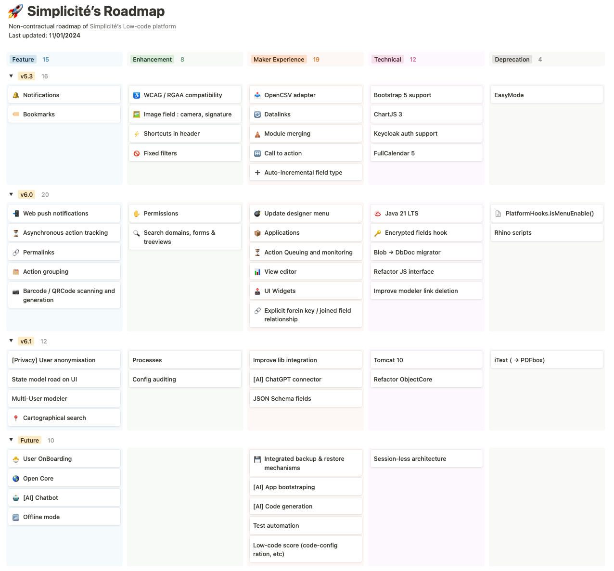

  <iframe 
    src="https://simplicite.notion.site/6c1ec0ab3df249c489782b20625761fd" 
    style="position: absolute; top: 0; left: 0; width: 100%; height: 100%; border: none;" 
    onerror="this.style.display='none'; this.nextElementSibling.style.display='block';">
  </iframe>
  

Usefull links
- [Roadmap site](https://simplicite.notion.site/6c1ec0ab3df249c489782b20625761fd) on Notion
- Request a Feature [on the forum](https://community.simplicite.io/c/feature-request/46)
