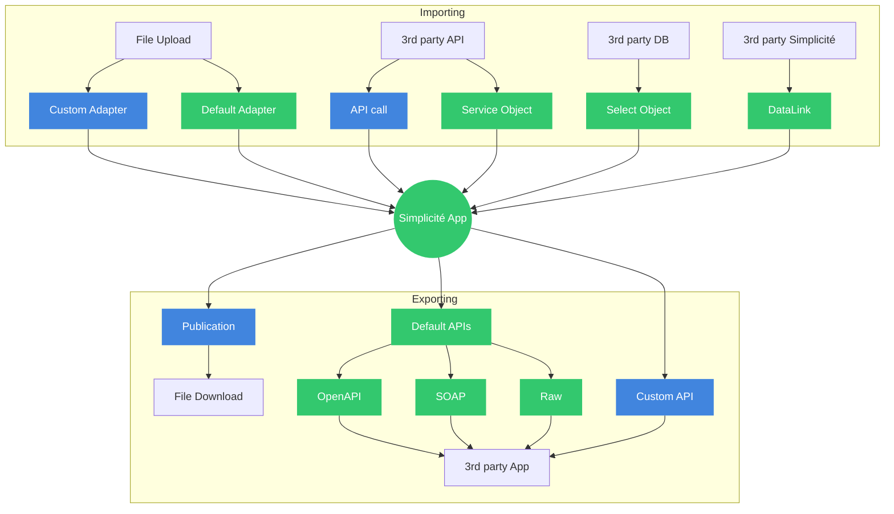

https://mermaid.live/edit

```mermaid
flowchart TD
    A[File Upload]
    B[Custom Adapter]:::custom
    K[Default Adapter]:::sim
    C((Simplicité App)):::sim
    D[3rd party API]
    E[API call]:::custom
    F[Service Object]:::sim
    G[3rd party DB]
    H[Select Object]:::sim
    I[3rd party Simplicité]
    J[DataLink]:::sim
    M[Publication]:::custom
    N[File Download]
    O[Default APIs]:::sim
    P[OpenAPI]:::sim
    Q[SOAP]:::sim
    R[Raw]:::sim
    S[Custom API]:::custom
    T[3rd party App]
    subgraph Importing
        A-->B
        A-->K
        D-->E
        D-->F
        G-->H
        I-->J
    end
        B-->C
        K-->C
        E-->C
        F-->C
        H-->C
        J-->C
        C-->M
        C-->O
        C-->S
    subgraph Exporting
        M-->N
        O-->P-->T
        O-->Q-->T
        O-->R-->T
        S-->T
    end
    classDef sim fill:#33c86e,stroke-width:0,color:#fff;
    classDef custom fill:#4185de,stroke-width:0,color:#fff;
```